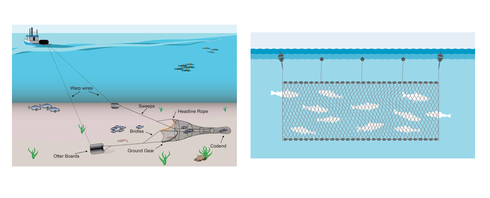

```{r, warning=FALSE, message=FALSE}
library(mosaic)
library(DT)
library(pander)
library(car)
library(tidyverse)

# Record your data from your own mini experiment in Excel.
# Save the data as a .csv file in the Data folder of the Statistics-Notebook.
data <- read.csv("C://Users//Alex//Documents//GitHub//IntStats//Statistics-Notebook-master//Analyses//ANOVA//SalmonandSeaTroutNets1952-2022.csv")
data <- data %>% filter(Method %in% 
                          c("Fixed Engine: Retained","Net and Coble: Retained"),
                        !Region %in% "Orkney")
# Read in the data
#someNameYouWant <- read_csv("../../Data/whatYouNamedYourDataGoesHere.csv") 
```

## Background

Today's analysis will be performed using the "Salmon Catch (1952-2022)" dataset originated from Scotland, with the purpose to find insight on what affects the number of fish catches fisherman yields according to variables such as region and catching method. In this case, the fishing methods “Net and Coble" and "Fixed Engine” will be put to the test, to see if the __Fishing Method__ affects the fish caught. It's __Important__ to understand, that “Net and Coble" refers to a boat in motion with nets and coble attached and the "Fixed Engine” refers to an stationary fishing net for clarification (refer to the background picture for vizuals).

The Kaggle dataset traces back to dates prior to AI tools to avoid the chance the data being artificially constructed. 



## Hypothesis

Today's analysis will utilize a two-way ANOVA with the variable __Fishing Method__, __Region__ to study their interactions. With the aim to find if there are significant results to reject any of nulls stated:

Does the type of __Fishing Method__ affect the average number of catches? 

$$
H_0: \mu_\text{Fixed Engine} = \mu_\text{Net and Coble}=\mu \\
H_a: \mu_\text{Fixed Engine} \neq \mu_\text{Net and Coble}
$$
Does the __Region__ affect the average number of catches? 

$$
H_0: \text{All region mean catches are same} \\
H_a: \text{At least one region mean of catches is not same}
$$
Does the effect of __Region__ change the different type of __Fishing Method__?

$$
H_0: \text{The effect of Region is the same for all types of catching Methods} \\
H_a: \text{The effect of Region is not the same for all types of catching Methods}
$$
$$
\text{A significance level of α=0.05 will be used for this study.}
$$

## Two-way ANOVA Analysis

Computing the Two-way ANOVA yields the following results:

```{r}
w.aov <- aov(Wild.MSW.number ~ Method + Region + Method:Region,data = data)
pander(summary(w.aov))
```

All three tests in the ANOVA produced p-values far below our 0.05 cutoff (7.268×10⁻⁵³, essentially 0 for "Region" & "Method:Region"), confirming that both the fishing Method and the geographical Region independently affect catch counts. In addition, the significant interaction between  "Method:Region" indicates that the impact of a given __Fishing Method__ varies depending on the __Region__ in which it’s applied. (The zeros reported for Region and Method:Region simply reflect extremely small p-values rounded down to 0)

## Diagnostic Plots

Because the diagnostic plots reveal some concerning patterns, the validity of this ANOVA is debatable. In the Residuals vs. Fitted Values plot, there’s noticeable dispersion in the early fitted values, and the Q–Q plot exhibits pronounced skewness and unequal spread. Such behavior isn’t surprising—fish catches can be extremely erratic, with many zero-catch days punctuated by occasional large hauls. Although this variability may reflect a natural feature of the data rather than a flaw in the model, it does undermine the strict assumptions of ANOVA. Therefore, we’ll proceed with these results but attach a clear warning: __Don’t consider the findings fully valid__.

```{r, warning=FALSE}
par(mfrow=c(1,2))
plot(w.aov, which=1:2, pch=16)
```

## Graphical Summaries & Conclusions

The following graphics emphasize the results of each of the three hypothesis tests.

### Method

A side‑by‑side bar chart and summary table make it clear why __Method__ matters so much: the “Net and Coble” approach captured 316 fish in total, whereas the “Fixed Engine” technique accounted for just 180. That gap—an increase of roughly 175% in total catches—drives the extremely low p‑value (7.268 × 10⁻⁵³), confirming that choice of method has a profound effect on average haul size.

```{r, warning=FALSE}
ggplot(data, aes(x=Method, y=Wild.MSW.number, group=1)) +
  geom_point(color="cyan") +
scale_y_continuous(breaks = seq(0,20000,2000)) +
  stat_summary(fun="mean", geom="line") +
  labs(title="Fishing with \"Net and Coble\" yields more catches", 
       x="Fishing Method Type", 
       y="Number of Fish Catches") +
  theme_bw()
```
 

```{r, fig.align='center'}
data %>%
  group_by(Method) %>%
  summarise(`Mean Fish Catches`=mean(Wild.MSW.number)) %>%
  pander(caption="Mean Fish Catche according to Method Type")
```

## Region

A breakdown by location highlights the dramatic disparity in catch rates across regions. On average, anglers in the East land about 873.3 fish, whereas those on the West Coast manage only 28.7—a more than a 30x difference. Such a vast regional gap underpins the virtually zero p‑value for Region, underscoring that where you fish plays a decisive role in haul size. 

```{r, fig.width= 8}
ggplot(data, aes(x=Region, y=Wild.MSW.number, group=1)) +
  geom_point(color="steelblue") +
  stat_summary(fun="mean", geom="line") +
  scale_y_continuous(breaks = seq(0,20000,1000)) +
  labs(title="The East Region has a higher number of fish catches", 
       x="Scotland Fishing Region", 
       y="Number of Fish Caught") +
  theme_bw()
```

```{r}
data %>%
  group_by(Region) %>%
  summarise(`Mean Fish Catches`=mean(Wild.MSW.number)) %>%
  pander(caption="Mean Fish Catches according to Region")
```

## Method Choice Depending on Region

Preferences for fishing techniques vary markedly by region. In most areas, the choice between Net and Coble versus Fixed Engine yields very different catch rates—but in a few locales like the Clyde Coast and West Coast, method makes little difference. Take the East Coast, for instance: boats using the Net and Coble pull in an average of 1,406 fish, whereas those relying on Fixed Engine average just 77. Such stark contrasts across regions drive the interaction’s p‑value down to essentially zero, confirming that the effect of Method on catch numbers depends strongly on Region. 

```{r, fig.width=10.5, fig.height=5, warning=FALSE}
ggplot(data, aes(x=Region, y=Wild.MSW.number, group=Method, color=Method)) +
  geom_point() +
  stat_summary(fun="mean", geom="line") +
  scale_y_continuous(breaks = seq(0,20000,2000)) +
  labs(title="", 
       x="Scotland Fishing Region", 
       y="Number of Fish Caught") +
  theme_bw()
```

```{r}
data %>%
  group_by(Method, Region) %>%
  summarise(ave=mean(Wild.MSW.number), .groups="drop") %>%
  spread(Method, ave) %>%
  pander(caption="Mean Warp Breaks according to Wool Type (A,B) and Tension Level (Low, Medium, High)")
```

## Interpretation

It's recommended Choosing an productive __Region__ such as "East" to increase the likelihood of catching fish. While Also taking into consideration the most effective __Method__ of fishing in that __Region__ to optimize catchings. Our pick of choice for your next fishing trip would be 

## Credit/References

The Analysis abstained from the use of ChatBot assitant tools. Guide and inspiration was based on the course's guide "Statistics Notebook" using the "warpbreaks" example for reference.

[Kaggle Dataset Source](https://www.kaggle.com/datasets/mikhail1681/salmon-catch-statistics-for-scotland-19522022)


```{=html}
<!-- Instructions:

Perform your own mini experiment using two factors that each have at least two levels. Analyze your data using a two-way ANOVA.

Studying reaction time is recommended because the data is quickly collected.

While you should use the warpbreaks example analyses as your guide on how to properly complete this analysis, you should also be creative in your final delivery of this analysis. If you copy the format and approach of the example analyses, be sure to give credit in your document to these example analyses. You could write something like, "This work is modeled after the [warpbreaks](https://byuistats.github.io/Statistics-Notebook/Analyses/ANOVA/Examples/warpbreaksTwoWayANOVA.html) analysis." Whatever you do, DO NOT use any of the written statements from the example analyses in your analysis unless you quote them directly and give credit. Using someone else's writing as your own without giving credit to the original author is plagiarism and is an Honor Code Violation. So do your own work. Plus, the more you try to write things in your own words, the more you will learn. Also, note that there aren't really any "rules" about exactly how your document should be organized. So be creative and organize your file in a way that makes sense to you, but still has all important elements.

-->
```


