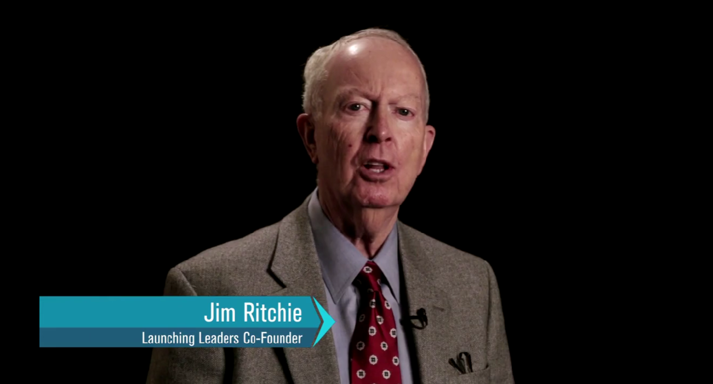

&nbsp;

## The Seven Habits
In the seven habits, "Begin with the End in Mind" resonates with me. As Jim Ritchie writes, Covey’s leaders knew where the end zone was and could imagine themselves in it with the football just making the winning touchdown. These are people who have the ability to look a long way off, to visualize what it means to them that victory might be possible.

I personally get caught up in doing a task every day and not realizing whether it is in progress toward my longer-term goals; this habit is easy for me to understand. This is where starting with the end of every task, be it an annual review, a monthly goal, a weekly quest, or a daily task, helps me make sure each piece of knowledge I have is focused upon the purpose. Ritchie defined this as having an approach to what victory means and how it will feel or taste, and that changes work from being something you do to making progress for a goal.

## Passion and Purpose
The seven habits impart a sense of passion and purpose to life, as they are based on the concept that private victory comes before public victory. As Ritchie states, if you’ve mastered habits one, two, and three be proactive, begin with the end in mind, and put first things first then you’re practicing a private victory. This means that when we have the reins and the preparation around what’s really happening in our intimate lives, then we can approach that world with confidence.

It is our self-care and integrity that we need. If you cannot trust yourself that you aren’t prepared in your private life, then you can’t venture headlong into the marketplace. In order for it to occur in action with other people, we have to get an internal underpinning.

## Public Victory
We now have private victory achieved from habits 1 to 3 and can move on from habit 1 to 3 to what Covey termed a "public victory" from habits 4 to 6. When we are at work thinking win-win, reaching first to understand, then to be understood, and to create synergy, Ritchie says, we engage the world with an intent to help. This is the essence of how we can build a synergistic workplace where everyone can come together to share a win when we hear others and assist them in our victory as well.

Trust is central to this equation; if we can trust ourselves, we multiply a hundred times the blessings of being trusted in the marketplace.

## Continuous Renewal
So habit seven, sharpen the saw, confirms that we can hold onto each moment of passion and purpose. As Ritchie points out, we must take breaks along the way to regroup, recharge, eat, sleep, read, exercise, study, and listen to prepare ourselves for the next step.

This process of continuous renewal coupled with Emerson’s idea that “that which we persist in doing becomes easier, not that the nature of the task has changed but our ability to do has increased,” tells us that by adhering to these habits we are creating a better capacity to make better choices and be more effective in the things we do and need to do.