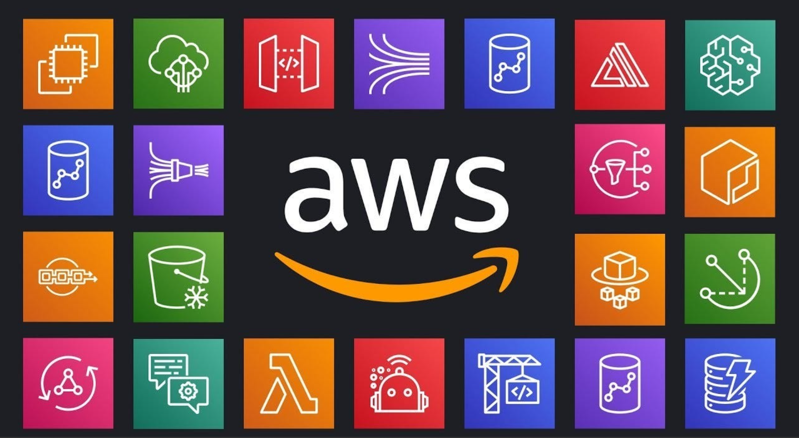

## Introduction

The growth of data has completely changed how we approach machine learning. What used to be small, local experiments on laptops now involves massive datasets, scalable pipelines, and distributed computing. Cloud platforms have become the foundation for modern data science, and among them, AWS stands out for its flexibility and reach.

When I first started learning about machine learning, I focused mainly on models. I thought performance was all about better algorithms and fine-tuning. It took me a while to realize that the real challenge was not just building models but managing data, scaling workloads, and deploying solutions efficiently. That realization led me straight into the world of cloud computing and big data.

## Understanding Cloud Computing for Machine Learning

Cloud computing gives us something that traditional local setups cannot: elastic resources. Instead of worrying about limited hardware, you can launch powerful virtual machines, train models on large instances, and shut them down when finished. This pay-as-you-go model is ideal for experimentation and production.

AWS provides services that simplify every stage of the machine learning workflow. You can store raw data in Amazon S3 and train models using SageMaker, since everything is integrated, secure, and scalable. It lets data professionals focus on business solutions rather than infrastructure headaches.

Cloud computing also supports collaboration. Teams across regions can access the same datasets, notebooks, and environments. This makes it possible to work on large-scale machine learning projects without being tied to a single machine or network.

## The Role of Big Data

Machine learning models are only as good as the data they are trained on. Big data allows models to learn from bigger, more complex datasets, which leads to more accurate predictions. The challenge, however, is handling and processing that data efficiently.

Using these tools together transforms data from scattered sources into a clean, ready-to-use format. Once the data is prepared, it becomes much easier to train robust machine learning models.

## Building Machine Learning Models on AWS

AWS SageMaker is one of the most valuable tools for deploying and managing machine learning models. It provides prebuilt environments for data exploration, training, and deployment. You can start with built-in algorithms or use your own code with frameworks such as TensorFlow, PyTorch, or Scikit-learn.

The biggest advantage is scalability. Training a large model locally could take days, but SageMaker can distribute the workload across multiple GPU or CPU instances and finish in a fraction of the time. Once trained, the model can be deployed directly as an endpoint for real-time predictions.

Beyond SageMaker, AWS services such as Lambda and API Gateway can help automate workflows and serve models to users. This creates a smooth pipeline from data ingestion to prediction.

## The Real Value

Learning to use AWS for big data and machine learning taught me an important lesson. The best models are not just accurate but also practical. They need to handle real-world data volumes, integrate with other systems, and scale as demand grows. Cloud computing makes that possible.

For professionals in data science or analytics, understanding AWS is no longer optional. It bridges the gap between theory and production. Employers value not only your ability to build models but also your understanding of infrastructure and deployment.

## Final Thoughts

Cloud computing and big data are redefining what is possible in machine learning. AWS gives us the tools to handle enormous datasets, train complex models, and deploy them globally with ease. It turns abstract ideas into real, working systems that impact business and research.

If you are serious about machine learning, invest time in learning how to use the cloud. Explore S3 for data storage, EMR for processing, and SageMaker for training and deployment. These tools work together to create a powerful ecosystem that can take your models from concept to production.

AWS is not just a platform. It is a bridge between data and intelligence, helping us move from experimentation to impact.