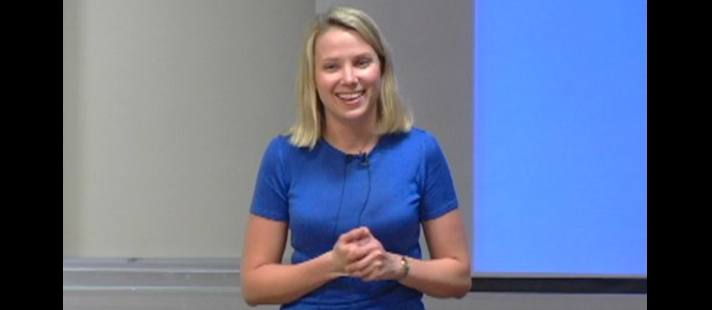
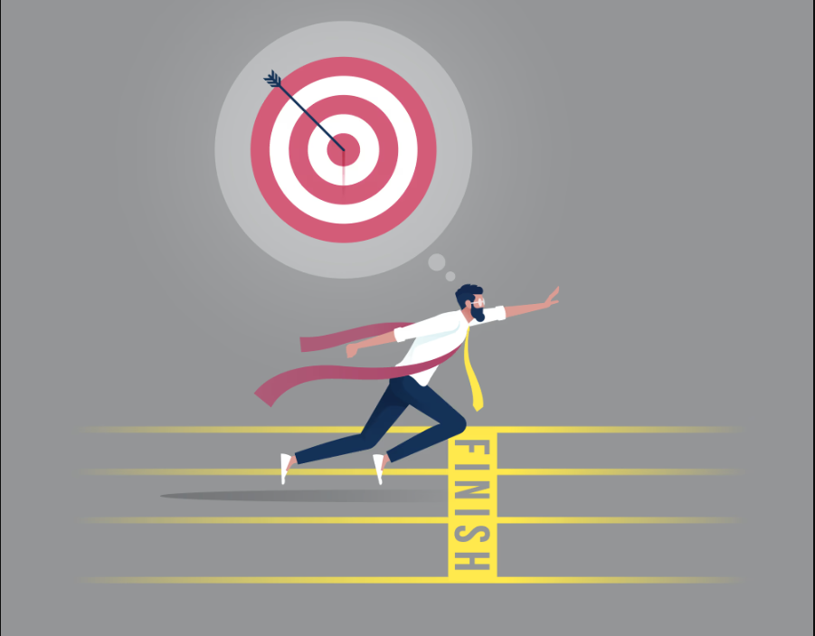

&nbsp;

## Introduction
I liked this week's readings and videos, their truly compelling accounts of what it sounds like to take on a new life of purpose, self-awareness, and ambition. While each source approached the subject from a different perspective, they collectively painted a unified picture: greatness is at hand for ordinary people who know themselves, believe in something larger, and refuse to put a ceiling on their potential.

## Insights from the "Your Emotional Fingerprint" Video
I discovered from the Your Emotional Fingerprint video that the majority of us flit through life not knowing what drives our hearts. Woody Woodward's framework provided a very enlightening introduction to my thoughts by Jim Ritchie. The notion that we each imbibe seven fundamental emotional attributes that influence everything from our hobbies and relationships to our career decisions is both basic and rich.

## The Cherokee Parable of the Two Wolves
I was especially struck by a Cherokee parable about the two wolves. I remember the story well: “The one you feed” is such a short, sweet phrase but a powerful reality. It drove home the idea that development isn’t a passive process; it’s about making deliberate decisions and choosing which thoughts, behaviors, and feelings we will nurture each day.

## The Importance of Internal Validation
I liked that you emphasized internal validation, too. The notion that when you stop relying on the approval of others to feel worthy, your freedom and vitality actually kick in is profound.

## Taylor Richards’ Inspiring Journey
I found Taylor Richards’ story in Think Big very motivating on a practical level. The thing that struck me most was that his expectations kept growing in real time. Initially, he aimed to make the top 100 and ended up 6th in North America. This progression seemed to represent a metaphor for life. Often, we don’t realize how competent we are until we are deep into going far beyond our expectations. His assertion that the act of being great is “no harder to do than it is to be good” forced me to reflect on where I have been living in mediocrity simply due to the development of habits or fears.

## The Power of Creativity at Google
Marissa Mayer’s presentation on Google’s 20% time was a great reassurance that creativity flourishes when we are trusted with some freedom. The fact that half of Google’s product launches occurred without any structure reflects the idea that passion-driven work can be more productive than obligation-driven work. This principle holds true well beyond a tech company; it applies everywhere.

## Looking Ahead
The way I think about my own goals and learning is evolving. In the future, I cannot wait to learn what my own "emotional fingerprint" will actually look like and to figure out what motivates me. I want to embrace the Think Big mindset in areas where I have been “playing it safe,” and I intend to dedicate extra, intentional time, my version of 20% time, to chase the goals and ideas that truly thrill me.