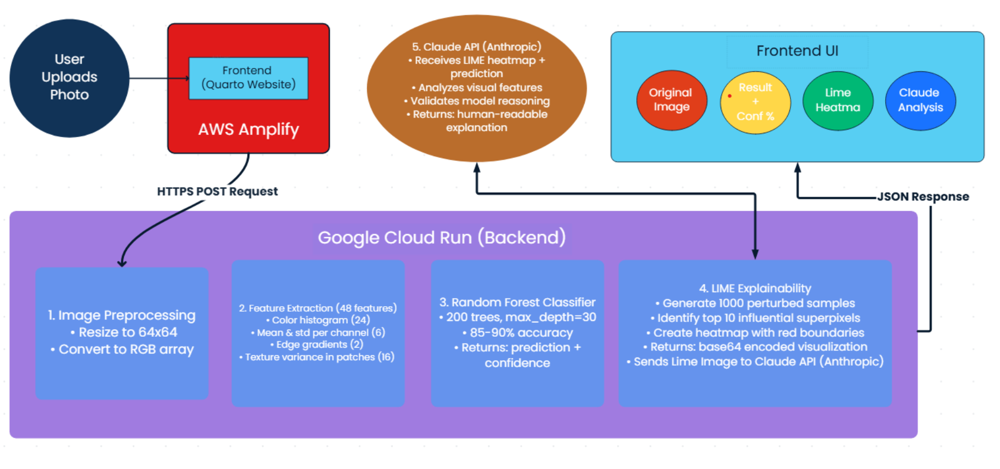

&nbsp;

## Introduction

When I first learned machine learning, my attention was on models. Accuracy numbers, loss curves, and tuning parameters dominated my thinking. I thought the hardest part was picking the right algorithm and getting the best metrics. Over time, real projects taught me otherwise. A model by itself rarely produces value. The true impact of machine learning comes when the model is part of a complete system that ingests data, serves predictions, explains decisions, and is maintained over time.

That shift in perspective changed how I approach every project I touch.

## Beyond the Model

A trained model in a notebook is academic. End-to-end machine learning means thinking about the full lifecycle of a system. It means considering how data will be collected and cleaned, how the backend will process inputs efficiently, how results will be returned reliably, and how users will interpret those results. These are practical problems that do not show up in textbooks, yet they determine whether a project is useful in the real world.

Working end-to-end forces you to face constraints. Latency matters. Scalability matters. Failure handling matters. These realities push you to design systems that are robust instead of systems that only look good in controlled experiments.

## Integration Is the Real Challenge

What I learned early on is that the hardest part is not an individual component. It is making everything work together. Frontend interfaces, backend services, cloud resources, and explainability tools must be integrated so they complement one another. A model can be accurate but useless if the pipeline is slow or outputs are incomprehensible. Small choices in one area influence outcomes elsewhere, and trade offs are inevitable.

Building integrated systems mirrors how machine learning is used in industry. It moves the work from theory to engineering and forces you to think about maintenance, observability, and collaboration across teams.

## Explainability and Trust

Predictions without explanation are hard to trust. Including explanation mechanisms in a system turns opaque outputs into actionable information. Visual explanations, textual summaries, and validation steps help users understand why a model made a decision. This not only helps non-technical stakeholders but also aids debugging and model improvement.

Explainability changes evaluation. Success becomes a combination of performance and interpretability. Models are judged not only by accuracy but by whether their reasoning aligns with domain knowledge and real-world constraints.

## Production Changes Perspective

Deploying a model to production alters everything you care about. Resource limits, cost, performance, and error handling move from optional concerns to primary design considerations. You begin optimizing for reliability and maintainability. Cloud platforms and serverless approaches let you experiment with real deployments while keeping operational overhead reasonable. Through deployment you learn how models behave under load and how users interact with predictions.

This practical exposure is critical for anyone who wants to work on applied machine learning. It teaches you to think beyond idealized experiments and to build systems that deliver sustained value.

## Final Thoughts

End-to-end machine learning applications connect models to real outcomes. They shift the focus from isolated performance metrics to systems that are useful, explainable, and resilient. If you are learning machine learning, do not stop at the model. Learn how to build the surrounding systems that make models meaningful. That is where the real learning happens and where real opportunity begins.