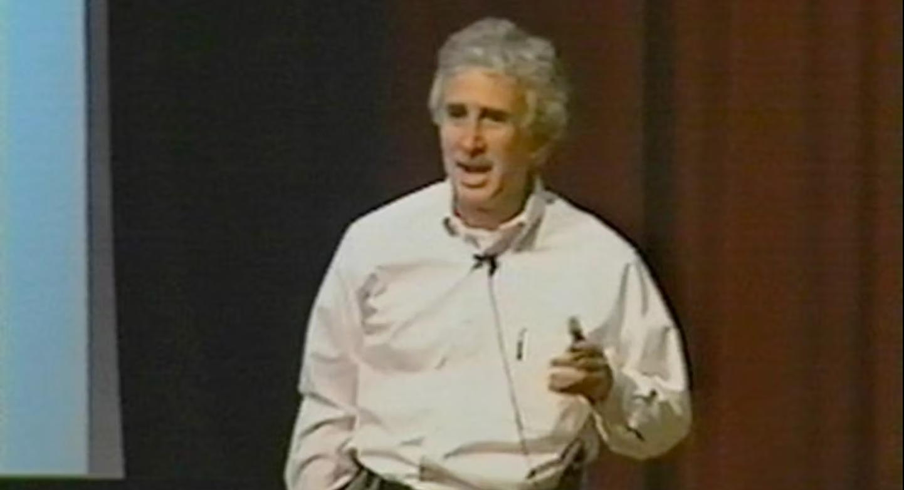
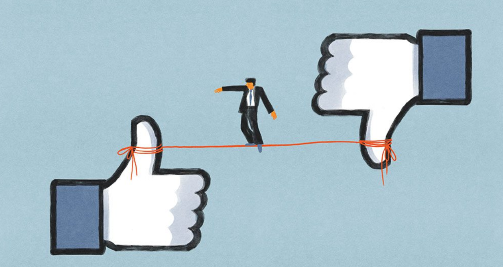

&nbsp;

## Discipleship Leadership Lessons
Leadership is usually associated with titles, authority, and power. The readings and videos from this week's study gave me another perspective. True leadership, based on the teachings of these materials, leads from discipleship, character, and service.

## Trustworthiness
One of the most surprising ideas came from Guy Kawasaki's lecture on trustworthiness. He referred to two categories of people: "bakers" and "eaters." Eaters view the world as zero-sum; whatever they can get for themselves from it, someone else loses. Bakers, on the other hand, see the world as an opportunity to make more and bigger pies. Great leaders are bakers. They default to “yes” and always ask how they can help this person, rather than how this person can help them. That modest mind shift is at the core of servant leadership.

## Continuous Learning
Carly Fiorina reiterated this by saying that capability is not about skills or experience, but a matter of constantly finding new ways to learn. Leaders who ask questions, take risks, and embrace new perspectives are vibrant and effective. Stop learning, and you are paralyzed.

## Workplace Ethics
Frank Levinson added an extra point: hire nice people. Workplace ethics isn’t simply about obeying rules; it’s about being genuinely concerned with each other and treating customers as you would want to be treated.

## Striving for Greatness
I am reminded from the lesson of Jim Ritchie from "Good to Great" that good is the enemy of great. It’s so easy to sink into comfortable goodness and never, ever push to reach that one level of greatness. Great leaders are humble yet driven-Level 5 leaders who put the right people first.

## Conclusion
Discipleship leadership is to lead people to higher ground, not by rule but by example, love, and selfless service.