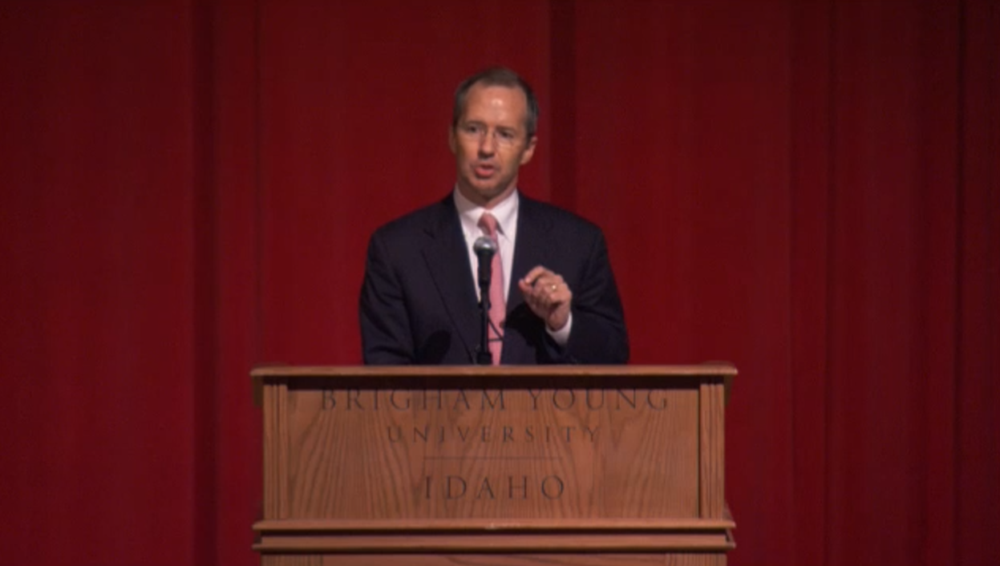

&nbsp;

## Incredible Insight in "A Hero’s Journey"
The most incredible insight in "A Hero’s Journey" is paradox: it is about you and not about you at all at the heart of your entrepreneurial journey. That discovery is what makes us different, and it happens to be also something that you do joyously, with your gifts. Because then you do your part for that which is far bigger than you, and everything in the world.

## Re-conceptualizing Entrepreneurship
This re-conceptualizes entrepreneurship as no longer selfish business of wealth accumulation; it is a vocation that transforms the world as well as the entrepreneur. The speech gives a framework for your calling that is above and beyond the advice one receives in their job.

## Overlap Between Key Aspects
That is the area the speech hits home when you mention the overlap between three aspects: God-given talents, deep contentment, and addressing an important need in the world.

## Insightful Exercise
The exercise of asking five people what you do much better than the average person is especially insightful since we often overlook our naturally gifted innate gifts, especially since we take them for granted. Identifying those “flow” moments when you don’t sense time shows you what’s truly engaging you at the deepest level.

## The Reversal Over Time
But what strikes me most strongly is the reversal that occurs over time. Students arrive looking to make money and then realize learning how to learn is what matters most. Years later, they learn that learning how to live a life filled with meaning was what really changed them. This development would indicate that our expectations shift with age and the major concerns only become discernible with perspective.

## Important Questions at the End of Life
Three questions that are still important at the end of life are: “Have I brought something that’s meaningful? Was I a good person? Who did I love, and who loved me?” These questions cut through all the noise in business statistics and ask what actually lives on for people.

## Shifting Fears
Last but not least, it is a strong insight that our main fear shifts from failure to wasted potential. The speech warns that we will see it later on and understand better that we had a fear of the wrong things.

## The Most Expensive Mistake
Yet here are some times when this is the most expensive mistake people have ever made. The true horror isn't not getting it right in building a business; it's reaching the age of 60 and realizing that you never set out to fulfill your calling at all!

