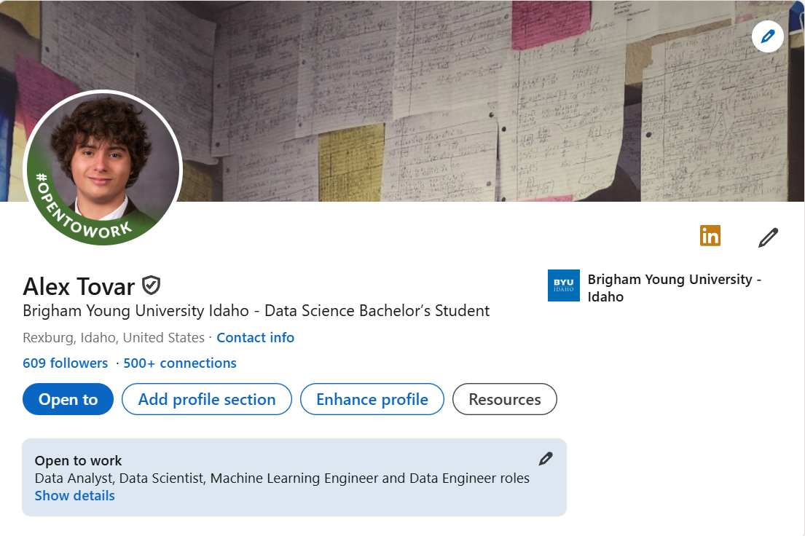

&nbsp;

## Breaking In the Market Is Challenging.

For incoming college graduates the market is tough going. Layoffs have sent waves through the applicant pool, graduate schools have become more competitive as students try to get ahead; and the belief that AI can replace entry-level workers has plagued the industry. In a place like this, it’s often easy to feel unnoticed. That’s why I developed the talent to stand out, to be among those professionals who were in the industry.

## Take the First Step. 

I had no plan, when I first started trying to break into data science. Everybody seemed to have more experience, better portfolios, advanced degrees. I knew I had to learn, from people who already are with the game, if I was going to get noticed in the industry. So in the summer of 2025, I contacted hundreds of professionals on LinkedIn. At the end of the game, I’d done over 500 connection requests.

## Cold Connections: 

Learning. At first, I felt a bit uncomfortable about it. Sending cold messages to strangers online is difficult. I was afraid I’d cause people to tune me out, or they would think I was just a waste of their time, if I weren’t as inexperienced. But I learned fast to kick things off well and the university alumni I talked to were also an early adopter. My messages were simple:

”Hi [Name], Hello, my name is Alex J. Tovar, Data Science guy too. I would love to invest in this relationship and grow our LinkedIn profiles together. Let’s connect!”. Short message, but it demonstrates a shared interest in data science and invites the contacts as an investment in the company that might serve the two parties. If it is good, then why not accept it? This is the mental bargaining that goes into every reach message.

## Small Numbers, Big Impact. 

From those hundreds of connections, only a tiny fraction responded but that few became super useful. A few offered to hop on Zoom or a phone call, to relay their stories or take some advice and get on board with the conversation. I learned what hiring managers really look for, how data teams are structured and how roles mesh information I would never even dreamt I would have come across in a course description or job posting. One thing which came out of these conversations was the power of active networking. Collecting connections for the sake of numbers can be quite easy, but what really matters is building good ones. A small number of genuine partnerships will take you far beyond the thousand shallow ones.

## From talks to chances. 

At times, that connection would take the form of a casual chit chat that eventually bled into a brief mentoring session. Other times all it did was a one-time conversation that showed me a new viewpoint. And, yes, in some cases those relationships opened the path to interviews and opportunities. But the biggest reward wasn’t the job prospects it was the confidence that I was no longer working through this on my own.

## What Networking Really Means.

Networking isn’t about getting something from someone; it’s about learning from them. It can be about being interested, listening closely and mutual respect. Data scientists, of course, and people really across the board thrive when they blend technical expertise with good people. If I could recommend one piece of advice to novices, I would say this: don’t wait until you’re “qualified” to go out. The best time to connect is now. What will get through to you is not all of a sudden your problems have changed; just curiosity and a willingness to listen.

## Final Thoughts. 

From data science, I learned that opportunities are often presented to us in surprising ways. But those opportunities rarely come your way without putting oneself out there. So write your message and hit the “Connect” button and start developing relationships that will follow you outside of school.