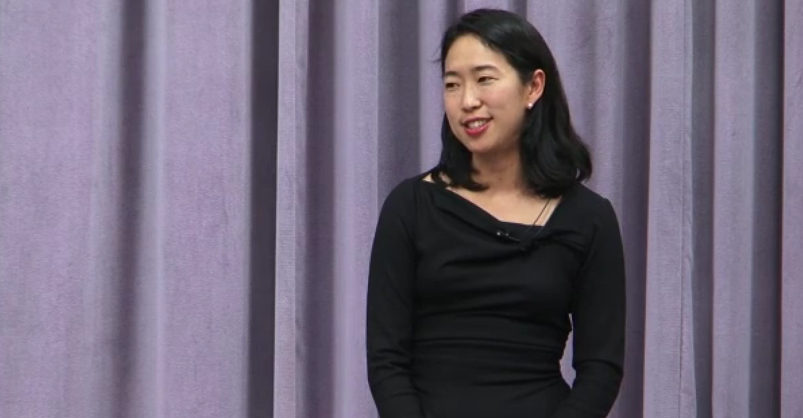
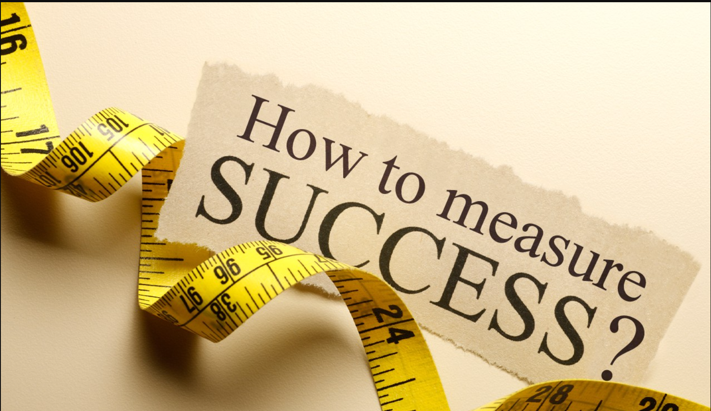

&nbsp;

## Reflection on Stephen Gibson's "Attitude on Money"
Before I read Stephen Gibson's Attitude on Money, I had never pondered where my perception about money came from. Gibson’s opening metaphor of prescription glasses (and filters) really worked for me because it showed me that most of my assumptions about money came from home rather than from an independent conclusion.

## Eye-Opening Insights
That's eye-opening and motivating because we can look at and change those filters. The open fact of the people is that my understanding of money has been one of a lie to keep out (so-called) many in the public eye, suggesting that genuine good people don’t invest in money. Gibson does exactly that. His comment that even the President of the Church had to think carefully about where to have money to build temples and the Perpetual Education Fund shifted my thinking completely.

## Rethinking Money
Money does not defeat a good life. It is a tool that is used depending upon who is using it and not in the interest of good. If you look at money, not thinking won’t solve your problems with it. You may simply believe that if circumstances require it for what you're going through, you will manage just in a more or less independent manner.

## Financial Self-Reliance
Gibson argues that people who think ahead financially are far more likely to achieve self-reliance. These form a coherent template for how to tie financial success to character rather than the existence of their differences.

## The Importance of Generosity
Most resonant was the understanding of generosity as an ongoing process that you can’t start when very rich; generosity is something you have as a habit while very poor, as Jon Huntsman exemplifies. In a way, it forced me to give when I have very little and not to think about being rich in some future place in terms of the comfort I could offer.