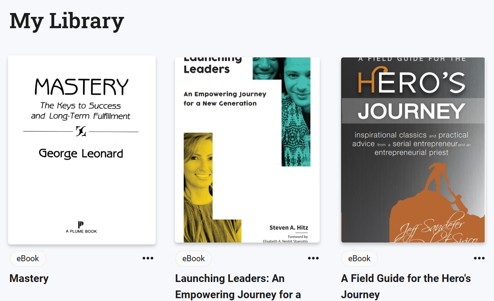

&nbsp;

## Introduction.

Hey, my name is Alex, and I started my entrepreneurial career by taking “Intro to Entrepreneurship” here at BYU-I. Although daunting at first, I’ve become more confident that I can succeed not only in class, but also in business and life. Today’s blog will cover what I’ve learned this week from readings and videos, and what I’m looking forward to learning and experiencing from the course.

## Getting Started.

To start, I’ve been assigned three books: “A Field Guide for the Hero's Journey”, “Mastery”, and “Launching Leaders: An Empowering Journey for a New Generation (Christian Edition).” All books offer valuable advice on various aspects of managing and launching a business.

## Book Insights.

For example, “Launching New Leaders.” Gives a unique approach on how to be a leader and a devoted Christian at the same time. Combining scriptures from the Bible with reputable experiences from professionals, and tips to tackle different problems. For example, framing problems to focus and gain a different perspective on your behavior and the problem itself. Implying to exclude all the unnecessary bluff in your life and simplify and target what matters. As well as taking difficult events in your life and making them great lessons on what truly matters in life and what doesn’t.

## Course Insights

This week I also covered my goals in life, by being tasked to list 50 goals. It gave a perspective into myself and what I really want to accomplish, such as starting a consulting firm, learning lots of analytical tools, and even doing a handstand push-up. The task emphasizes the importance of finding what I truly want and how to define it. For example, starting a consulting firm would require me to acquire an LLC, investigate consulting insurance, and design a logo. In the end, I learned that entrepreneurship and life goals are very vast, and I look forward to being organized to tackle every problem.