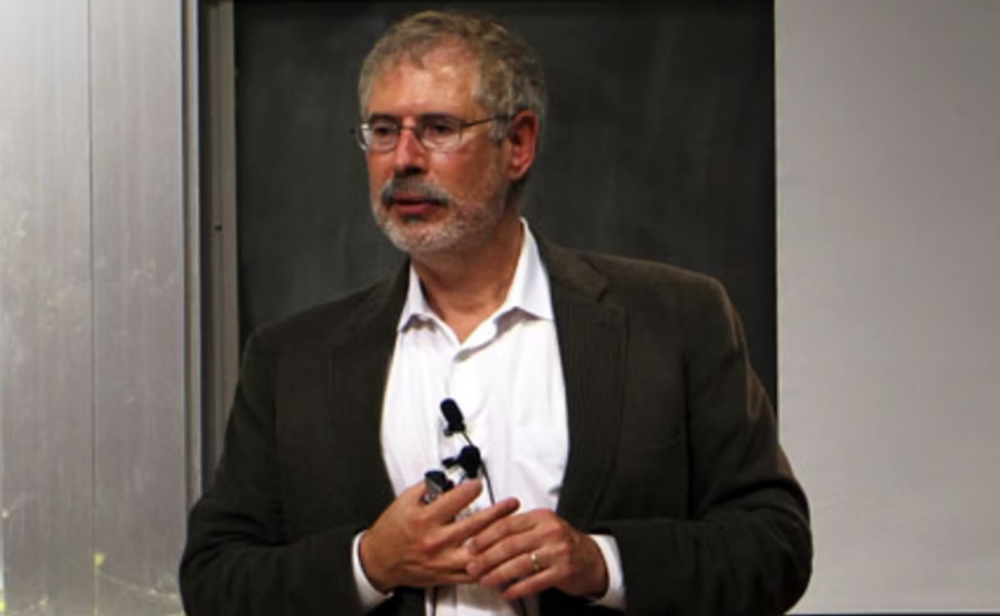

## Three Entrepreneurs That I Learned From And Why That Changes Me
Thoughts on identity, time, and what it really means to create something enduring. I wasn’t hoping to come away questioning anything from sitting through three entrepreneurship talks: Wences Casares, Jan Newman, and Steve Blank. I figured I’d gather up a few tips and go. Instead, each speaker landed on something I never quite got the words down before.

## Wences Casares
Casares hit me first. Entrepreneurship isn’t a career choice, he said; it’s an identity with which you’re stuck. The very first time I heard that, it clicked. How many times I attempted to “take a break” from thinking about ideas, and I would outline a new concept on a napkin? He's right. You don't choose this. And strangely, it is freeing to accept that. But his greater challenge was about monogamy, the proposition that enduring value lies in staying with something for thirty years, not jumping from one activity to another. I found that quite uncomfortable in the best possible way. It raised the question for me: am I building, or just starting?

## Jan Newman
Newman put the conversation on the switch. He wasn’t speaking of business strategy; he was speaking about what gets quietly crushed when life gets busy. Family. Faith. The things you keep saying you’ll return again to “when things slow down.” His calculus teacher’s line stopped me in my tracks cold: The Lord does not need your company. He needs your home teaching. Legacy is not created in boardrooms. It’s shaped at the dinner table, in the small moments of turning up for the people who count most.

## Steve Blank
Blank drove it home with practical honesty. He didn’t act like an easy-to-balance solution of balance is an easy one; he said his solution was some amount of smoke and mirrors. But his central point wasn’t an empty statement: when you don’t make rules intentionally, the startup takes everything.

## Conclusion
What’s exciting about these lessons is that they re-contextualize the direction I’m moving toward. The road ahead is not only building companies; it’s building a life worthy of pride and esteem decades from now. It is, of course, a rare commodity to know your pitfalls in advance. And one I plan to use.