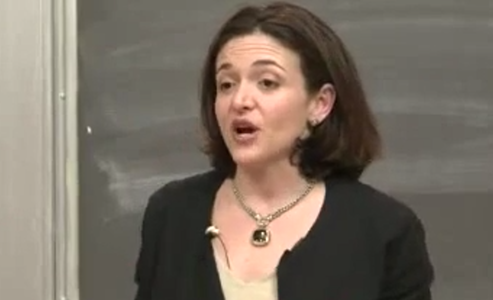

&nbsp;

## What is a Business For?
Virtue, Integrity, and the Economy. Handy reminds us that markets can’t run just on rules but on truth and trust. Corporate scandals over executive behavior and abuse of stock options didn’t just hurt the company, but it was what it represents: whether it’s people that were being used in production in a world of wealth exchange, people are working up and down by money. Trust, he says, is “broken china: never quite right.” A Gallup poll he cites told him that 90% of Americans believed corporate leaders could not be trusted. When that cynicism seeps in, businesses stop investing, the capital drains away and capitalism’s wealth engine fails. Virtue and integrity are not cheap concepts of business; they are fundamental pillars of reality.

## Real Justification for Business
Profit is not the objective that a business is there for; it’s the means. He recalls an inspiring analogy from the world: if you are meant to live to eat but if you only live to eat, you get gross. Likewise, a business that is only into profit has confused the means for the end. What should be the heart of what the business is doing with the rest of its profit that helps create the income from which they can build the future rather than what they cannot make themselves out of? Would someone else never invent us if they didn’t exist? It has been made to feel worthless.

## I Agree With Two Solutions
Handy’s call to see employees as members rather than costs resonates strongly. This sort of writing about people as expenses has been solved so poorly that it’s essentially dehumanizing and an intellectually backward strategy, especially in a knowledge economy, where humans are the key asset. Second, it echoes what the W12 Change-Maker materials told you: for business to be proactive about sustainability and why those are the things it does very well at that, with Merck and Unilever just showing people that they care for them and profit at the same time. One theme across Handy, Elder Gay’s consecration talk, and Sandberg’s mission-driven perspective is always present: the best businesses that really do come from service to others and not from extracting from them. That kind of entrepreneur I want to be.