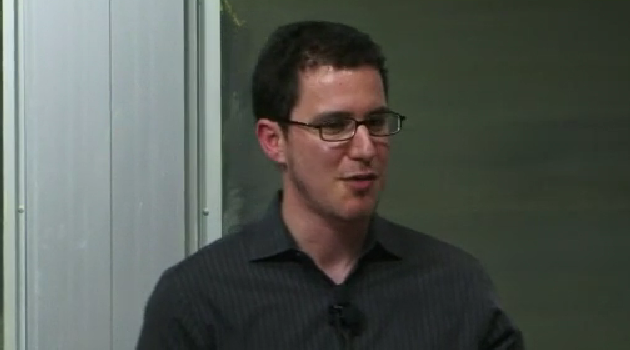

&nbsp;

## Persistance
Reading these lessons was a reminder to me that entrepreneurship is not limited to business strategy. Entrepreneurship is about fighting through adversity and not losing faith. Jeffrey R. Holland’s account of the broken-down car struck a nerve. That young father, stranded twice in the same place with his whole family and all their belongings, encountered a moment very many entrepreneurs know all too well: when everything feels like it’s falling apart and the destination seems out of reach.

His message, “Don’t you quit. You keep walking,” brings together the essence of what my material-based learning was made up of. Success is not having a perfectly well-defined plan or avoiding a breakdown; you continue to progress even in the face of feeling that progress is unattainable.

## Practical Depth
David Carrington gave me some practical depth in this vein. His focus on making sure "I think backwards" and not settling for the obvious solution pushes me to dig harder. What really impressed me was his decision during the Dale Earnhardt tragedy to stand firm in the face of ethical pricing when he could have mined the sadness of loss. It was in that moment that something vital emerged: lasting success lies in integrity, not exploitation.

His diagnosis of cancer also made him reconsider balance, which is precisely the lesson I learned when I lived through this experience: sometimes our biggest roadblocks lead us to where we’re supposed to be.

## The Five Whys
Eric Ries’s “Five Whys” was brilliant. It taught me that superficial solutions seldom work for real problems. Behind every technical failure, there is a human or systemic problem. This style of proportional investment, dedicating just one hour to each problem at each tier of difficulty rather than nothing or everything seems revolutionary and real. All the while, I'm interested in applying it to actual practice.

I wish I could really have that moment where “random thinking” yields a surprising solution, practice the idea of asking five whys when things go wrong, and, most importantly, cultivate the faith to keep going when my car fails at mile 34 on a 2,600-mile trip.

## Conclusion
These stories taught me that entrepreneurship calls it equal parts creativity, ethics, perseverance, and faith, and that we are more than the destination that is shaped by our journey.
