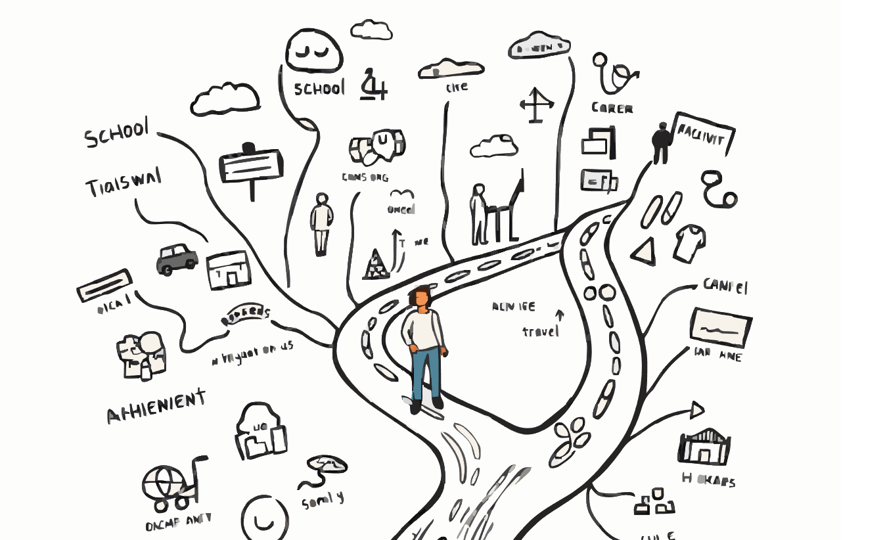

## Achieved by sheer will and purpose

Randy Pausch's last lecture reflections. Randy Pausch realized many of his childhood dreams not by any luck or magic but by his perseverance and resolve to not allow adversity to be the limit of his own capacity. He preached that "brick walls are there for a reason: they let us prove how badly we want things." He didn’t take rejection from Disney Imagineering as a final obstacle but as a temporary setback. He was a lifelong fan of rejection; he knew that it is just part of the story and that if you push at it, doors to things you once thought you had no access to will open for you.

## The importance of dreams

What he is showing is that even dreaming things through can require vision, but also the ability to push through disappointment. There is a thing that I entirely believe: dreaming is crucial to life. Dreams teach us how to live; they take what we do each day from the tiniest step to a path toward all that is. When we have no dreams, we are easily lost in life’s activities and drift through life without thought about it. Pausch's life illustrates this beautifully: his dream during childhood to build up Disney-like experiences that were not only real but structured his educational decisions, professional experiences, and creative projects were no accident.

## Dreams as a roadmap

Dreams provide us with the “why” behind our actions, which is especially crucial when we all feel like we can’t muster up some motivation. One of my childhood dreams was for me to have a business that actually helps people solve real problems; namely, to have my own consulting firm, which turns struggling businesses into profitable ones. I feel I can fulfill this dream, as right now I am building the base. I’m learning in my new classes how to take ambitious aspirations and distill them down into manageable plans for me to follow up on: obtain an LLC, comprehend insurance standards, and become analytical.

## Life lessons

As Pausch said, it's not so much the destination as the "how to lead your life." My commitment to ongoing learning, seeing failures as learning experiences, and staying focused on the things that really matter means I'm poised to realize this dream. Pausch’s talk consolidated concepts from this week’s readings on framing problems and simplifying focus. It echoes his philosophy that "experience is what you get when you don't get what you want," which is perfectly aligned with creating lessons out of hardships. This is exactly the mindset that I look forward to putting into practice for the challenges and trials of entrepreneurship, as I know they will ultimately be a chance to show how badly I want to succeed.