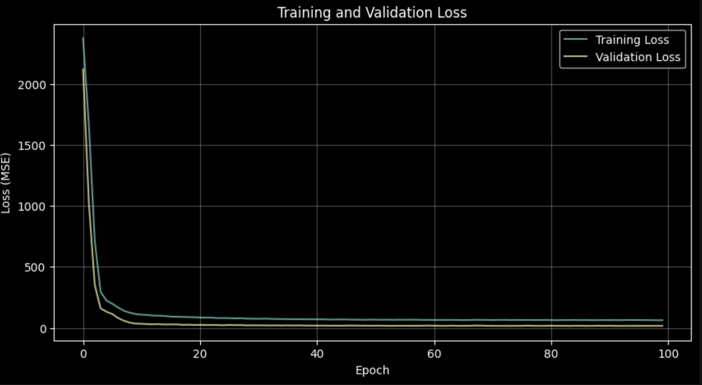
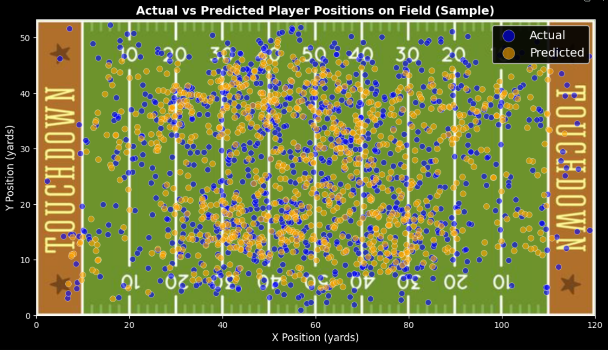
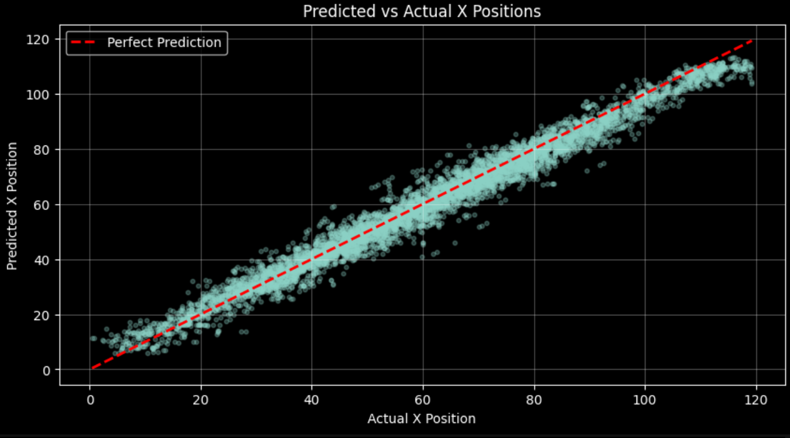
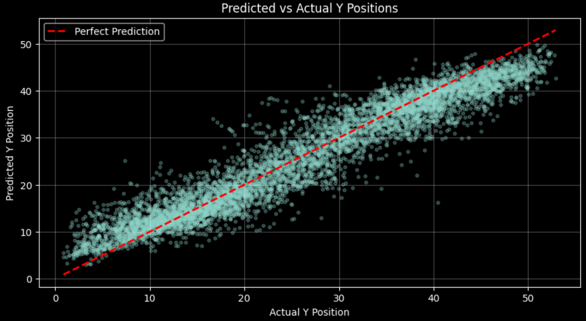
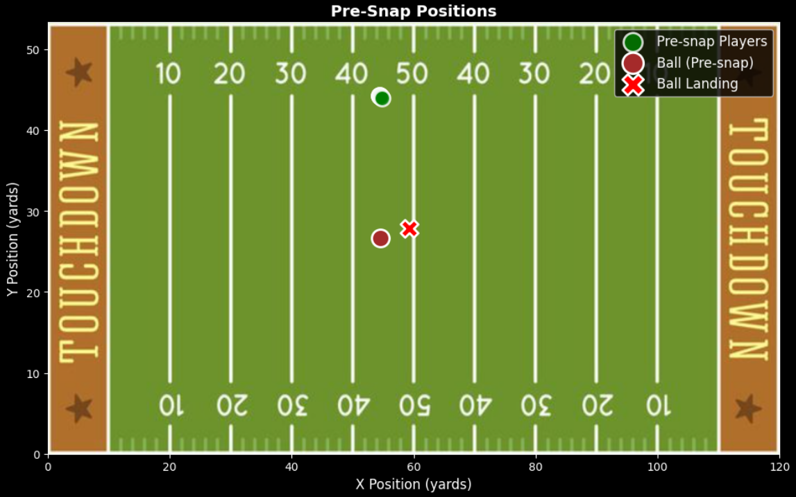
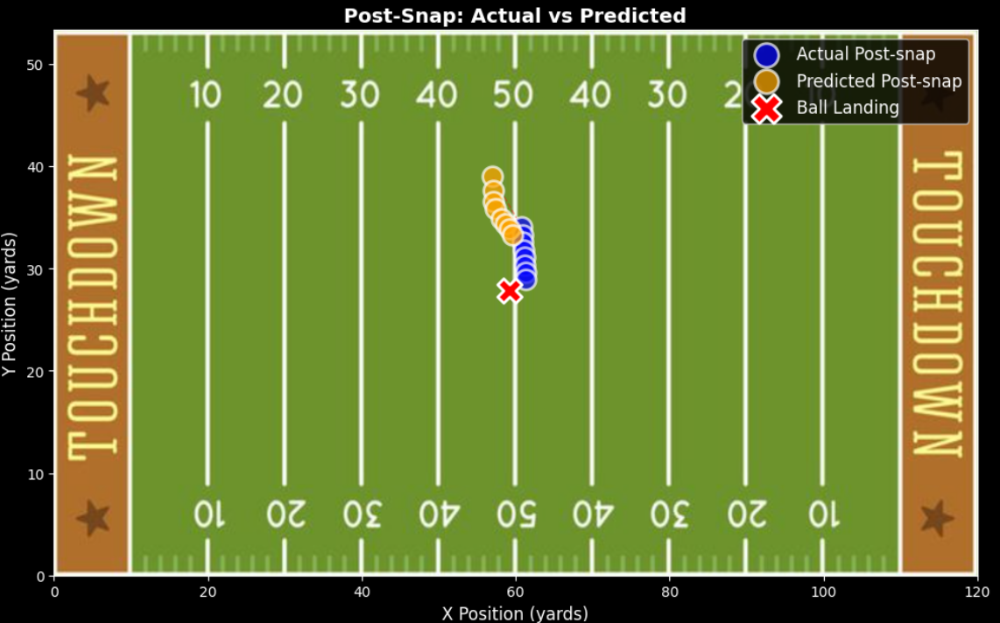
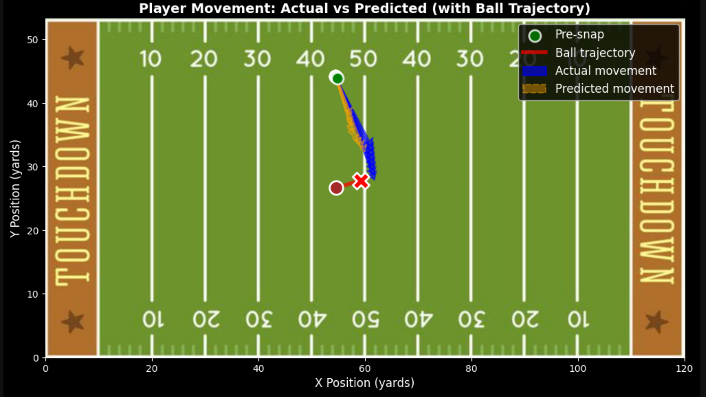
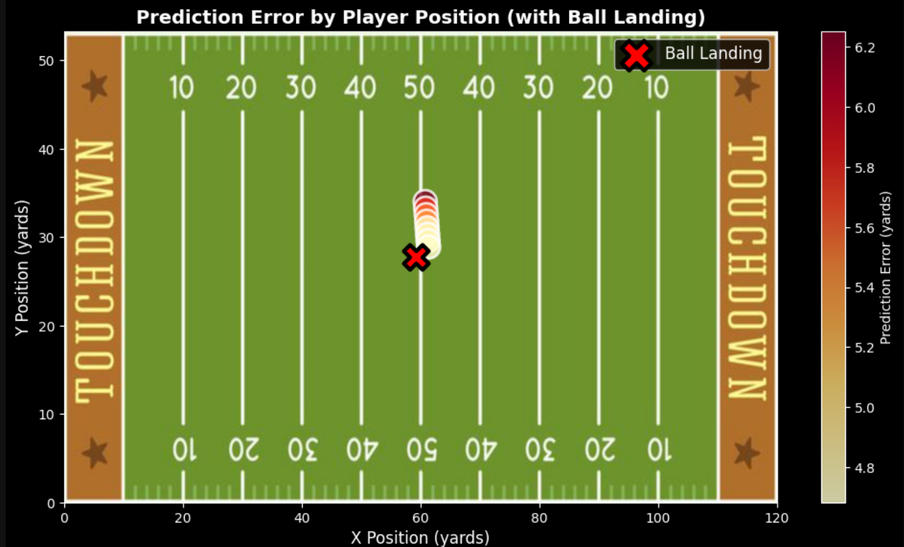
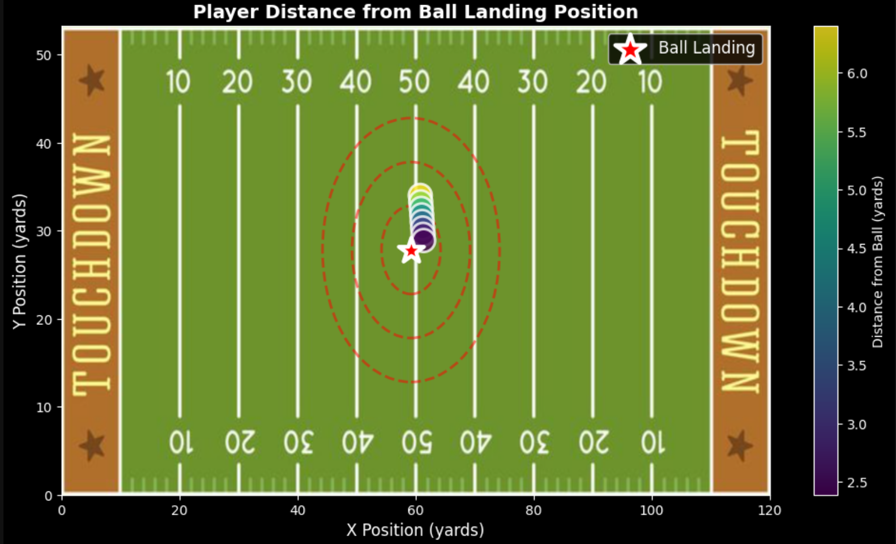

```{r setup, include=FALSE}
knitr::opts_chunk$set(echo = TRUE, warning = FALSE, message = FALSE)
```

<style>
h1, h2, h3, h4, h5, h6 {
  text-align: center;
}
</style>

&nbsp;


# Background

We will examine the NFL Big Data Bowl 2026 competition that encourages contestants to anticipate movements of players during pass plays while the ball is in the air. The idea is to enable the NFL to understand dynamic player positioning—from the moment when a quarterback releases the ball to the point at which it is caught or is ruled incomplete. This analysis has broad applications in several areas:

- **Coaching Strategy**: Defensive position optimization and coverage scheme development
- **Player Evaluation**: Understanding how a receiver tracks the ball and how a defender responds to a threat presented by an aerial shot
- **Broadcasting**: Prediction graphics and improved game analysis for viewers in real time
- **Analytics Teams**: Play design iterations and employee personnel decisions
- **Sports Analytics**: Higher level metrics for assessing individual performance and situational awareness

The competition dataset includes passing plays from the 2023 NFL season, which kept the ball suspended in the air for at least 0.5 seconds apart from deflected passes, throwaways, and passes with unknown targeted receivers, as defined by the data. Each play is recorded at 10 frames per second and the model has to predict (x, y) coordinates for each player at each of the frames of time while the ball is airborne.

A feedforward neural network-based deep learning model was proposed to predict game positions for players by pre-snap positioning, player movement parameters, and ball trajectory data. Both x and y dimensions average Mean Absolute Error of approximately 3 yards, which is good prediction that can be also used as a real-time decision-making help and help later post-game analysis.

---

# Methodology

Our methodology consisted of data preparation, feature engineering, model development, and performance evaluation.

Analysis was performed with Week 1 2023 NFL season data, total 285,714 input rows (all players covered over all pre-throw frames) and 32,088 output rows (all players represented ball-in-air frames only). The data were divided with a random set of seeds (80-20 train-validation ratio) for reproducibility.

We designed a feature set of 9 variables to account for player position and movement:

**Positional Features:**

- Pre-snap X position (0-120 yards along the field)
- Pre-Snap Y position (0-53.3 yards across the field width)
- Absolute yardline number (field position context)

**Movement Characteristics:**

- Speed (yards per second)
- Acceleration (yards per second²)
- Movement direction (degrees)
- Orientation/body angle (degrees)

**Ball Trajectory Features:**

- Ball landing X coordinate
- Ball landing Y coordinate

The most obvious limitation to our existing feature set is the lack of categorical features such as player role (targeted receiver, defensive coverage, passer, etc.), player side (offense/defense), and position designations. Such features would allow for the model to distinguish behavioral patterns across types of players and would identify an active candidate to enhance this performance as revealed in our case study analysis.

## Model Architecture

We first tried the Random Forest Regression method with two different models: one for X-coordinate prediction and the other for Y-coordinate prediction. We changed from this to a multivariate neural network architecture that jointly predicts both coordinates (e.g., diagonal trajectories where both dimensions change together) following faculty guidance.

Our last model is a Feedforward Neural Network (Multi-Layer Perceptron) with the architecture:

- **Input Layer**: 9 features
- **Hidden Layer 1**: 256 neurons with ReLU activation, Batch Normalization, and 30% Dropout
- **Hidden Layer 2**: 128 neurons with ReLU, Batch Normalization, 30% Dropout
- **Hidden Layer 3**: 64 neurons with ReLU activation and 20% Dropout
- **Hidden Layer 4**: 32 neurons using ReLU, 20% Dropout
- **Output Layer**: 2 neurons (x_pos, y_pos predictions)

The model features 46,754 trainable parameters and was optimized with an Adam optimizer with a learning rate of 0.001. In order to avoid overfitting and enhance generalization, we applied a few regularization procedures, these include:

- Dropout regularization (20-30% to the different layers)
- Batch Normalization for training to stabilize
- StandardScaler normalized input features (essentially useful for performance of neural networks)
- Early stopping with 15-epoch patience to stop training when validation loss flattens out
- Learning rate scheduling (ReduceLROnPlateau) to dynamically update learning rate and vary learning rate as training progresses
- Model checkpointing to save the best-performing model when the validation loss improves

Training was done in a 512-size batch for up to a maximum of 100 epochs using early stopping to accelerate convergence without overfitting.

<center>

</center>

## Performance Evaluation

For model performance, we used different regression metrics to measure average error as well as model fit quality. Finally, we performed detailed case study analysis after a single play (Game ID: 2023091000, Play ID: 1240) and analyzed prediction accuracy in-depth, in order to trace systematic features in model behaviors.

## Key Visualizations

Case study analysis provided visualizations which represent individual play based performance of the model:

**Predicted vs Actual X & Y Positions**: The visualization overlays real positions of players (blue) on predicted positions (orange) on the background of the football field as red dashed lines in the image to show the difference in actual versus predicted position for each individual. The landing positions are indicated with a red X indicating that the model systematically predicts poorly at predicting player motion toward the ball, indicating that the model averages behavior across all player types without player role information from the player data; instead of recognizing which types of players have aggressively tracked the ball through the targeted receivers.

<center>



</center>

&nbsp;

**Pre-Snap and Post-Snap Comparison**: A comparison of Pre-Snap and Post-Snap formations (left) with recorded and predicted locations (right) when a match is in progress and shows how players transition from initial positioning to their positions in flight of the ball.

<center>


</center>

&nbsp;

**Movement Vectors**: It shows player trajectories, where blue arrows show the players' actual movement and orange dashed arrows represent predicted movement of the players, from pre-snap to post-snap position. The red line is the ball trajectory from line of scrimmage to landing position.

<center>


</center>

&nbsp;

**Error Heatmap by Position**: The players are color-coded according to value of prediction errors with the use of a yellow-orange-red colormap where spatial order of prediction error could be observed along the field.

<center>

</center>

---

# Discussion Responses

## 1. Problem Type

I propose a supervised regression problem based on tabular data, which will then be processed further. The target variables player X and Y coordinates are continuous numbers, thus regression model is the best machine learning model. The model is trained on historical labeled data comprising known input features (pre-snap positions, movement attributes, ball trajectory) and output targets (observed position after snap). This enables the neural network to detect intricate non-linear relationships between player starting condition and the state of each player after ball flight.

This is especially important considering the fact that the problem is multivariate. Instead of treating X and Y predictions as independent problems, our neural network architectures collaboratively predict both coordinates together. This design choice allows the model to discover diagonal movements contain correlating transformations in both dimensions, describing realistic physics associated with player movements better than two independent univariate models.

## 2. Model Architecture Choice

The decision to use a feedforward neural network instead of the early Random Forest method was motivated by the necessity to model multivariate output. Although Random Forest Regression has good performance on tabular data, it involved training a pair of models: one for X-coordinate prediction and one to predict Y-coordinate features. This method treats the two spatial dimensions as independent problems, ignoring the correlation between them.

The output neurons in a neural network architecture can be found in two and, thus, when in space, the model learns joint representations of player movement. For instance, the X and Y coordinates of a receiver running up to the ball from a diagonal parallel changes side by side (or up to an adjacent direction). A neural network has shared hidden layers that can model these interdependencies, learning that some movement patterns involve certain X-Y coordinate combination and will not be captured by individual models.

Neural networks also outperform in learning non-linear relationships through activation functions and deep layer structures. Player movement in football is highly non-linear—players speed, turn, turn, respond to the movement of the ball in ways that linear models or tree-based approaches may fail to accurately capture. The 4-layer architecture with ReLU activations provide enough representational capabilities that the complex spatial-temporal dynamics can be considered.

The regularizations used (dropout, batch normalization, early stopping) enable the model to generalize to unseen plays rather than to memorize training examples despite its complexity. The high validation performance (R² of 0.974 for X and 0.910 for Y) indicates that the model has learned useful patterns and does not overfit to training noise.

## 3. Model Confidence Metrics

We assessed this model (or using its predictive power) by evaluating its dependability and precision through the use of three related scales: MAE, RMSE, and R².

**Mean Absolute Error** is an intuitive test of average predictive accuracy. Regarding X-position predictions, the MAE is 3.07 yards where the model's X-coordinate predictions deviate from actual positions in all instances by an average of about 3 yards. For Y-position predictions, the MAE is 3.05 yards. These numbers carry significant weight in a dynamic environment like football plays where the player may make the jump down 10-15 yards or more in every single pass play so 3-yard errors suggest good predictive power. In practical terms, this precision is adequate for many analytical purposes, giving coaches a window into overall position trends and broadcasters the data they need to provide real-time projections of real-time position.

**Root Mean Squared Error** prioritizes larger mistakes over MAE due to the squaring operation, making it especially helpful for determining if the model produces occasional blundering. RMSE = 4.02 yards at X-position and 3.95 yards at Y-position. The small difference between MAE and RMSE (approximately one yard) indicates that the model's errors are reasonably consistent, no extreme outliers or catastrophic errors in the prediction. If model errors were to occur extensively, we might see a much larger difference between RMSE and MAE.

**R² Score** represents the percentage of variance in the target variable explained with a model. The R² of 0.974 (for X-position) means that we have an extremely good model fit and is explaining 97.4% of the variance in player X-coordinates. For Y-position, with an R² of 0.910, 91.0% of the variance is accounted for. The lower Y-position R² still indicates lateral movement (side-to-side across the field) is harder to predict than downfield movement—but still good. That makes intuitive sense—downfield movement is primarily determined by the direction of the ball's forward drive, while lateral movement involves more complex decisions of route running and individual tendencies in players.

To provide further context to the data we provide a case study of one play (Game ID: 2023091000 and Play ID: 1240) on a specific play can help understand these metrics as well. This play comprised 8 observations from the player-frame area with a mean Euclidean error of 5.26 yards and maximum error of 6.25 yards for this play. The analysis also showed that a systematic trend was there: the model consistently underpredicts forward motion toward the ball landing position. Players in the example were 3.78 yards closer to the ball than the model predicted on average in the case study, with the actual average distance being 4.20 yards and the predicted distance being 7.98 yards.

This systematic bias indicated that the model does not contain more information than a player role wise. The model simply gives an overall average for all players in terms of behavior without characteristics distinguishing between the receiver and defensive side of the cover on-the-field versus defensive coverage or between various other route runners. As such, the targeted receivers aggressively follow the ball and end up on the landing, while others can move away or stay still. By averaging these disparate behaviors, the model generates conservative predictions that lose sight of the ball-tracking intensity of key players.

However, there are strong metrics for model confidence and this is a limitation. The low MAE (average errors are sub-3 yards), moderate RMSE (there are few extreme errors), and very high R² (more than 90% of variance) score indicates that this model effectively accounts for the basic play dynamics of play by play players during pass plays. For virtually all critical applications—whether evaluating defensive tactics, designing plays, or creating broadcast graphics—this degree of precision yields actionable insights.

## 4. Limitations and Future Improvements

Our model has strong predictability but there are several limitations with room for a promising design enhancements.

**Missing Categorical Features**: The greatest weakness of the model is the lack of player position information. We do not consider if a player is the receiver at play in the target, defensive coverage, passer or other runner running route. The case study analysis revealed that players display significantly different patterns according to the role, with certain receivers converging aggressively of receivers to the ball landing position and some players either moving away and leaving, remaining close to their pre-snap position. In this way however, the role-based movement patterns are not learned for any specific player type and the model averages out to all player types to an optimal prediction (e.g. in the case of player_role), and eventually results in systematic underprediction of any ball tracking behavior. Player_role, Player_side (offense/defense), specific position designations (QB, WR, CB, S, LB) should be included as categorical features in future versions as well (should be encoded in the neural network (more advanced) as embeddings with deep positions and that each category must be abstracted to represent their interaction with play characteristics in a meaningful way).

**Training Data Limited**: Our model is only trained on Week 1 of the 2023 season. The 2023 whole competition dataset has 18 weeks worth of training data (approximately 5.1 million input and 580,000 output rows). More samples of different game scenarios, weather, team strategies, patterns of player behavior, etc. would be possible by expanding to the entire dataset. This higher volume of data would enhance the model's capacity on generic generalization and prevent the model from overfitting to game situations that were present only from Week 1.

**Architecture Implications**: In our feedforward neural network, spatial relationships are largely captured, however, it does not model player movement (the time-sequence of player movements) explicitly. Playing football happens over time and the players react to how the ball travels and to other players positions dynamically. A Recurrent Neural Network (RNN) or Long Short-Term Memory (LSTM) could model these interrelated temporal dependencies in which it can learn how player velocities evolve in different frame by frame from what it would be as an independent learning model, instead of treating every frame as a single prediction. Or, a Transformer-based architecture was proposed to model player attention mechanisms that capture how defenders respond against receivers and receivers to defenders.

**Feature Engineering Opportunities**: In addition to missing more categorical features, we can engineer some more predictive features include:

- Relative positions (distance and angle away from each player to the ball landing position)
- Ball motion vectors projected
- Time until that ball was actually delivered
- Interaction parameters (e.g., speed × distance to the ball)
- Historical player-specific tendencies (average routes run, typical speeds)

**Ensemble Methods**: The combination of multiple models, such as our neural network with gradient boosting machines or other different architectures neural networks, leads it to a more stable prediction with ensemble averaging. Different models could perform quite well at different aspects of the prediction task and together may reduce overall error.

**Insights from the Single-Play Case Study**: Not every frame presented a comparable number of prediction errors. Errors rose in distance to the ball (6.25 yards) before decreasing (4.68 yards) as the player took his approach to land. These patterns indicate that there is a strong predictive signal from proximity of the ball. Future models should include distance-to-ball as an explicit variable, or use it for estimating weights differently on frames.

**Evaluation Metrics for Competition**: For competition, although our metrics in validation are impressive, we take the competition's holdout test set (Weeks 14-18 of the 2025 season). The test data is for future games in which different teams could be constituted, have different strategies, and play different environments. Examining leaderboard performance also will offer invaluable insights on the generalizability of our model beyond the 2023 season data used to train the model.

---

# Conclusion

What we did is show how deep learning is able to predict positional positions on NFL pass plays with significant accuracy based on a case study. Our feedforward network captures around 3-yard average errors in the X and Y dimensions and accounts for more than 90% of the variance in player movements. The multivariate architecture is capable of capturing the jointality of spatial motion and enhancing the independent modeling approach of our Random Forest base.

The close case study analysis offered both the good and bad sides of the model. However, the system consistently underestimates aggressive ball-tracking action without any role information of players in our feature selection. This knowledge points to a strong avenue for improvement, as introducing categorical features that differentiate between receivers at play, defenders, and other players would allow the model to learn movement patterns for its role and drastically reduce prediction bias.

In conclusion, further research might include expanding the training dataset of 18 weeks, including the absence of categorical features (e.g., player_role, player_side, position), and to investigate methods which explicitly model temporal sequences (LSTM/RNN) or inter-player effects (Transformer attention). Furthermore, ensemble strategies combining various modeling methodologies might be promising for increase in robustness and accuracy.

By improving player position predictions, this research contributes to the NFL's broader goal of advancing player understanding of dynamics between players, helping coaches improve tactics, broadcasters better interact with fans and analysts develop better models for player evaluation. Our model's performance thus far forms a strong baseline to push it further for fine-tuning and submission for a competition.

---

# Appendix: Model Performance Metrics
```{r metrics-table, echo=FALSE}
# Create performance metrics table
metrics <- data.frame(
  Metric = c("MAE", "RMSE", "R²"),
  X_Position = c(3.069777, 4.022989, 0.974399),
  Y_Position = c(3.053675, 3.952069, 0.910319)
)

knitr::kable(metrics, 
             caption = "Model Performance Metrics",
             col.names = c("Metric", "X Position", "Y Position"),
             align = 'c')
```
```{r case-study-metrics, echo=FALSE}
# Case study metrics
case_metrics <- data.frame(
  Metric = c("Game ID", "Play ID", "Number of Players/Frames", 
             "Ball Landing X", "Ball Landing Y", 
             "Mean X Error", "Mean Y Error", 
             "Mean Euclidean Error", "Max Euclidean Error"),
  Value = c("2023091000", "1240", "8", 
            "59.23 yards", "27.81 yards",
            "3.06 yards", "4.22 yards",
            "5.26 yards", "6.25 yards")
)

knitr::kable(case_metrics,
             caption = "Case Study: Single Play Analysis",
             col.names = c("Metric", "Value"),
             align = 'l')
```

---

<center>
**End of Executive Case Summary**
</center>