# Introduction

In this assignment, you will practice regression analysis including:

  * Plotting bivariate data with a regression line
  * Calculating and interpreting the correlation coefficient, r
  * Fitting a linear regression analysis
  * Verifying if a linear model is model is adequate:
    * Checking for linearity (scatterplot)
    * Checking for constant variance (`plot(lm_output, which=1)`)
    * Checking for normality of residuals (`qqPlot(lm_output$residuals)`)
    


::: {.cell}

```{.r .cell-code}
library(tidyverse)
library(mosaic)
library(rio)
library(car)
```
:::


# Car Prices and Mileage

<p align="center">

</p>


You are interested in purchasing an all wheel drive Acura MDX for those slick Rexburg winters.  You found what you think is a good deal for on a low-mileage 2020 model but you'd like to be sure.  You go on Autotrader.com and randomly select 23 Acura MDX's and collect Price and Mileage information.

Load the data and use R to answer the questions below.  


::: {.cell}

```{.r .cell-code}
cars <- import('https://github.com/byuistats/Math221D_Cannon/raw/master/Data/acuraMDX_price_vs_mileage.csv')
```
:::


Before you begin:

__What is the response/dependent variable?__
Price

__What is the explanatory variable__

Mileage
__What do you think is the nature of the relationship between the two?__
The more milage a MDX has, the lower its price will be.

__How strong do you think the relationship is?__
Very strong


## Plot the Data and calculate r


::: {.cell}

```{.r .cell-code}
plot(cars$`MDX Price`, cars$Mileage)
```

::: {.cell-output-display}
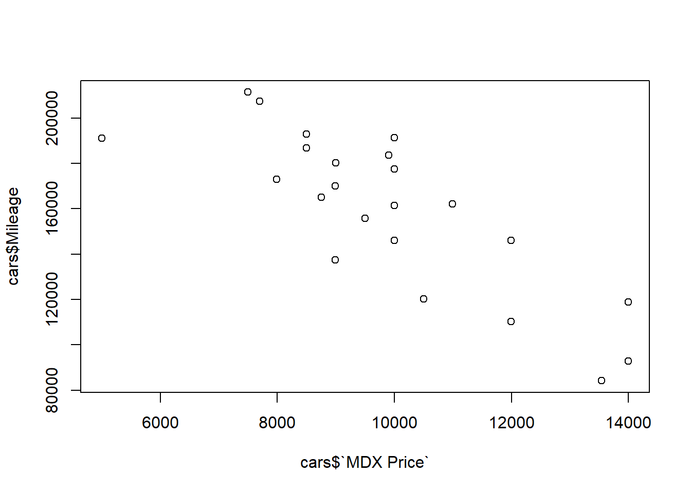{width=672}
:::

```{.r .cell-code}
cor(`MDX Price` ~ cars$Mileage, data = cars)
```

::: {.cell-output .cell-output-stdout}

```
[1] -0.8185192
```


:::
:::


__Does the relationship look linear?__
Yes for the most part, with some variance

__What is the correlation coefficient, r?__
-0.8185192

__What does this r show?__
There is an strong linear and negative relationship among MDX Price and Milage.

## Fit a Linear Regression Model


::: {.cell}

```{.r .cell-code}
lm_output <- lm(cars$`MDX Price` ~ cars$Mileage)
summary(lm_output)
```

::: {.cell-output .cell-output-stdout}

```

Call:
lm(formula = cars$`MDX Price` ~ cars$Mileage)

Residuals:
    Min      1Q  Median      3Q     Max 
-3282.9  -562.4   170.8   893.5  2068.6 

Coefficients:
               Estimate Std. Error t value Pr(>|t|)    
(Intercept)   1.793e+04  1.261e+03  14.218 3.01e-12 ***
cars$Mileage -5.051e-02  7.736e-03  -6.529 1.81e-06 ***
---
Signif. codes:  0 '***' 0.001 '**' 0.01 '*' 0.05 '.' 0.1 ' ' 1

Residual standard error: 1274 on 21 degrees of freedom
Multiple R-squared:   0.67,	Adjusted R-squared:  0.6543 
F-statistic: 42.63 on 1 and 21 DF,  p-value: 1.813e-06
```


:::
:::


Add the regression line to your chart:


::: {.cell}

```{.r .cell-code}
# Sometimes you have to run the whole chunk with plot() and the abline() together:

plot(cars$`MDX Price` ~ cars$Mileage)
abline(lm_output$coefficients)
```

::: {.cell-output-display}
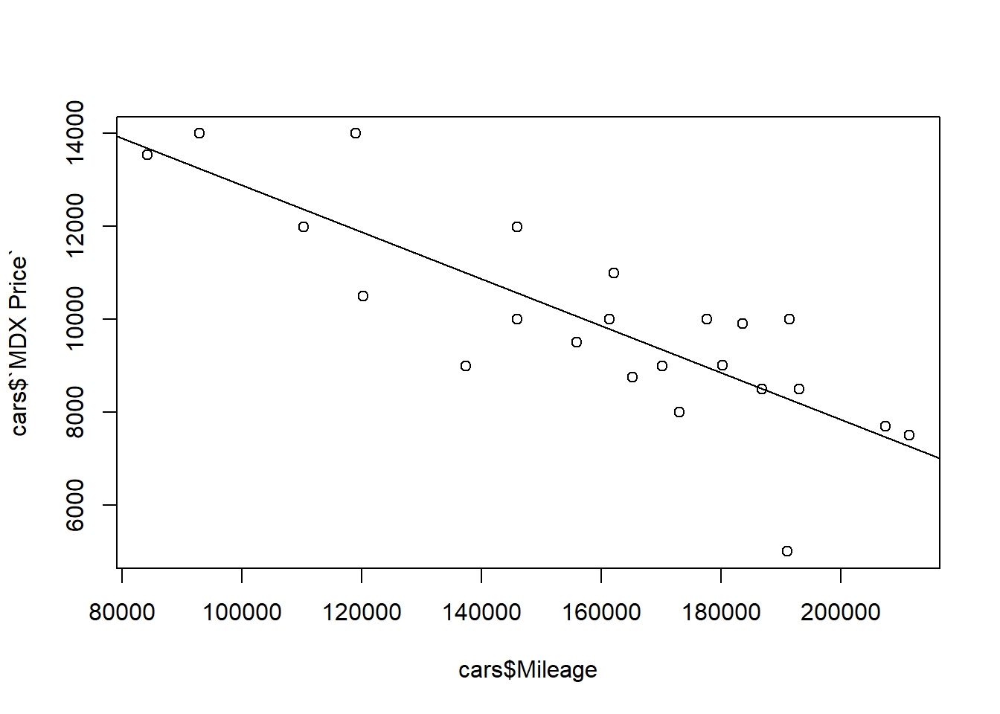{width=672}
:::
:::


__What is the slope of the regression line, and what does it mean?__
Is negative, impliying there is a negative relationship among both variables


::: {.cell}

```{.r .cell-code}
summary(lm_output)
```

::: {.cell-output .cell-output-stdout}

```

Call:
lm(formula = cars$`MDX Price` ~ cars$Mileage)

Residuals:
    Min      1Q  Median      3Q     Max 
-3282.9  -562.4   170.8   893.5  2068.6 

Coefficients:
               Estimate Std. Error t value Pr(>|t|)    
(Intercept)   1.793e+04  1.261e+03  14.218 3.01e-12 ***
cars$Mileage -5.051e-02  7.736e-03  -6.529 1.81e-06 ***
---
Signif. codes:  0 '***' 0.001 '**' 0.01 '*' 0.05 '.' 0.1 ' ' 1

Residual standard error: 1274 on 21 degrees of freedom
Multiple R-squared:   0.67,	Adjusted R-squared:  0.6543 
F-statistic: 42.63 on 1 and 21 DF,  p-value: 1.813e-06
```


:::
:::


__What is the intercept and what does it mean?__
the expected value of the dependent variable (Y) when all independent variables (X) are zero.

__What is your p-value?__
1.813e-06

__What is your conclusion?__
The p-value is significant at a 0.05 alpha, thus there is enough evidence to reject the null and believe there is an correlation between the variables.

__What is the confidence interval for the slope?__


::: {.cell}

```{.r .cell-code}
confint(lm_output, level = 0.95)
```

::: {.cell-output .cell-output-stdout}

```
                     2.5 %        97.5 %
(Intercept)   1.531030e+04  2.055629e+04
cars$Mileage -6.659524e-02 -3.442092e-02
```


:::
:::


Interpret the confidence interval.
95% confident that the true population slope is whitin(-6.659524e-02 -3.442092e-02)

## Check Model Requirements

Check the normality of the residuals:


::: {.cell}

```{.r .cell-code}
qqPlot(lm_output$residuals)
```

::: {.cell-output-display}
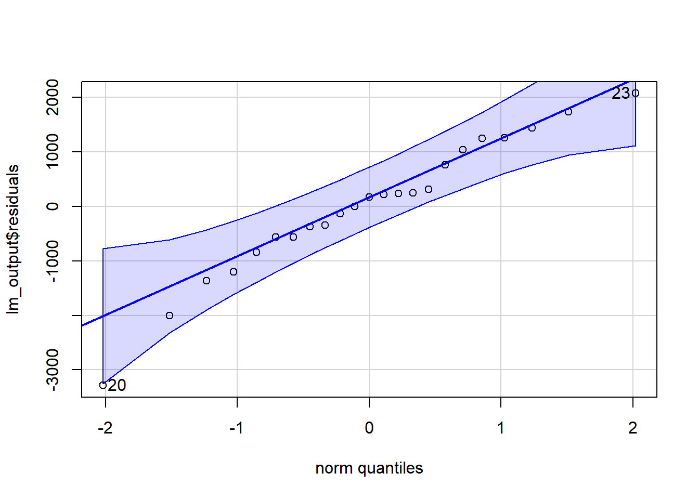{width=672}
:::

::: {.cell-output .cell-output-stdout}

```
[1] 20 23
```


:::
:::


Check for constant variance (Residual by Predicted plot):


::: {.cell}

```{.r .cell-code}
plot(lm_output, which = 1)
```

::: {.cell-output-display}
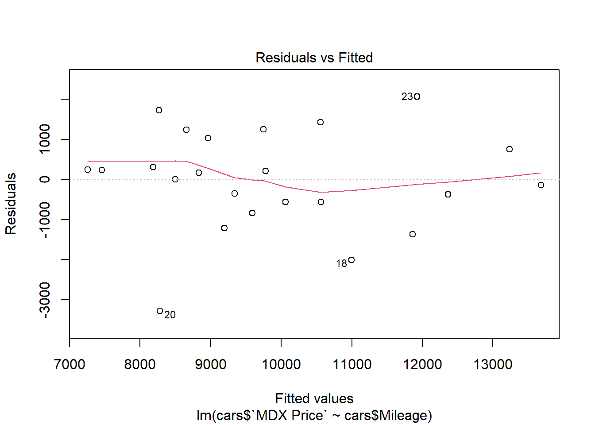{width=672}
:::
:::


Lastly, the car you're interested in buying has around 100,000 miles and costs $11,200.  Could this be considered a good deal?  Why?

Because the mileage is low compared to its average price.

# Manatee Deaths and Motorboat Registrations in Florida
<p align="center">

</p>

Florida is a fabulous place for experiencing wildlife and recreation.  Unfortunately, sometimes those two activities conflict.

Researchers collected over 30 years of data about water craft registrations (motor and non-motor boats) and manatee deaths.  The goal of the research is to evaluate the relationship between boat registrations and manatee deaths.

Before you begin:

__What is the response/dependent variable?__
manatee deaths
__What is the explanatory variable__
boat registrations
__What do you think is the nature of the relationship between the two?__
The more boat registrations there are, the more manatee deaths will appear
__How strong do you think the relationship is?__
very strong

Load the data:


::: {.cell}

```{.r .cell-code}
manatees <- import('https://github.com/byuistats/Math221D_Cannon/raw/master/Data/manatees.csv')
View(manatees)
```
:::


## Plot the Data and calculate r


::: {.cell}

```{.r .cell-code}
plot(manatees$`Power Boats (in 1000's)` ~ manatees$Manatees)
```

::: {.cell-output-display}
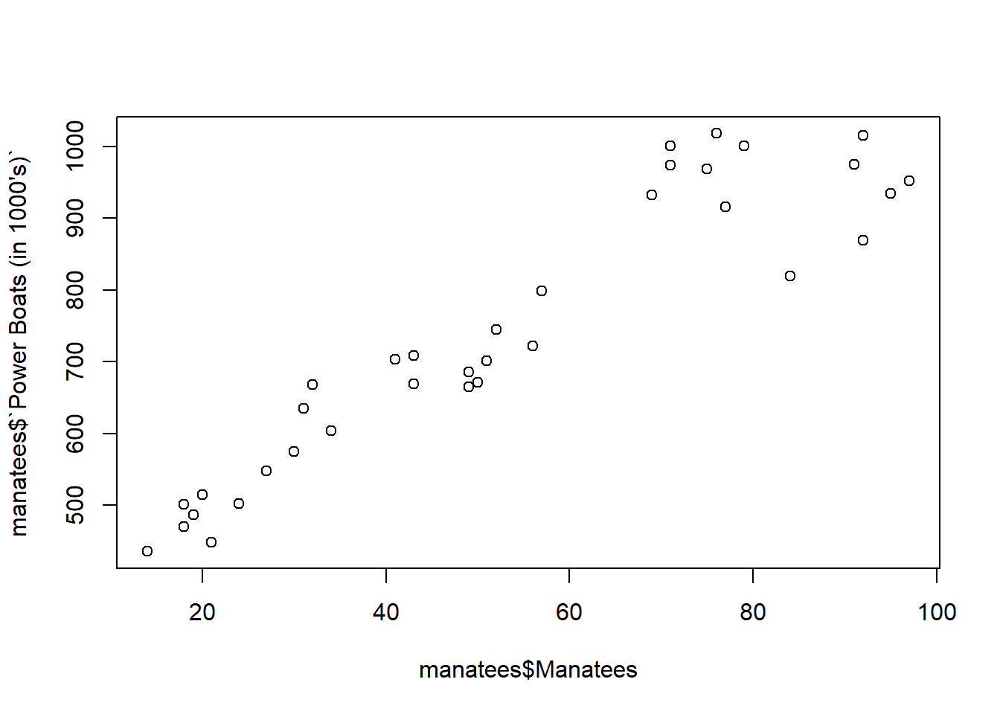{width=672}
:::

```{.r .cell-code}
cor(manatees$`Power Boats (in 1000's)` ~ manatees$Manatees)
```

::: {.cell-output .cell-output-stdout}

```
[1] 0.9376368
```


:::
:::


__Does the relationship look linear?__
Yes
__What is the correlation coefficient, r?__
0.9376368
__What does this r show?__
There is a strong positive relationship between Power Boats (in 1000's) and manatees

## Fit a Linear Regression Model


::: {.cell}

```{.r .cell-code}
mlm_model <- lm(manatees$Manatees ~ manatees$`Power Boats (in 1000's)`)
```
:::


Add the regression line to your chart:


::: {.cell}

```{.r .cell-code}
# Sometimes you have to do the plot() and the abline() in one chunk and run the whole thing:
plot(manatees$Manatees ~ manatees$`Power Boats (in 1000's)`)
abline(mlm_model$coefficients)
```

::: {.cell-output-display}
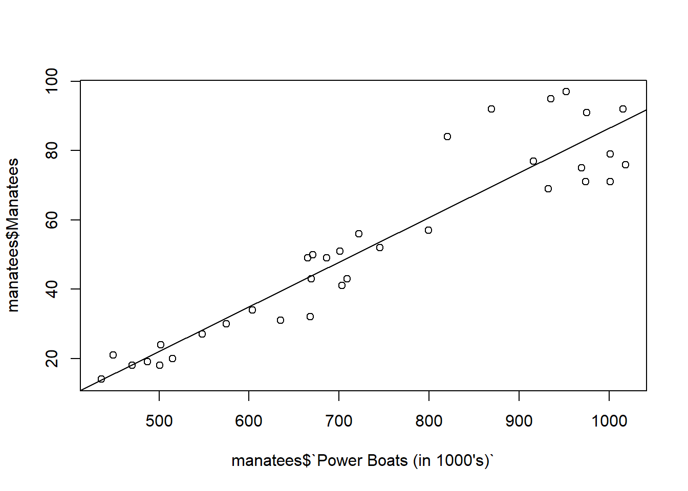{width=672}
:::

```{.r .cell-code}
summary(mlm_model)
```

::: {.cell-output .cell-output-stdout}

```

Call:
lm(formula = manatees$Manatees ~ manatees$`Power Boats (in 1000's)`)

Residuals:
    Min      1Q  Median      3Q     Max 
-15.736  -6.642  -1.239   4.374  22.309 

Coefficients:
                                     Estimate Std. Error t value Pr(>|t|)    
(Intercept)                        -42.525657   6.347072   -6.70 1.25e-07 ***
manatees$`Power Boats (in 1000's)`   0.129133   0.008334   15.49  < 2e-16 ***
---
Signif. codes:  0 '***' 0.001 '**' 0.01 '*' 0.05 '.' 0.1 ' ' 1

Residual standard error: 9.237 on 33 degrees of freedom
Multiple R-squared:  0.8792,	Adjusted R-squared:  0.8755 
F-statistic: 240.1 on 1 and 33 DF,  p-value: < 2.2e-16
```


:::
:::


__What is the slope of the regression line, and what does it mean?__
0.129133, for each boat unit, 0.129133 manatees die.

__What is the intercept and what does it mean?__

the dependent value if x is 0, in this case, the number of manatee deaths without any boats.
__What is your p-value?__
2.2e-16

__What is your conclusion?__
the p-value is significant at an alpha level of 0.05, suggesting we have enough evidence to reject the null and believe there is an correlation between Power Boats (in 1000's) and manatee deaths.

__What is the confidence interval for the slope?__


::: {.cell}

```{.r .cell-code}
confint(mlm_model)
```

::: {.cell-output .cell-output-stdout}

```
                                         2.5 %      97.5 %
(Intercept)                        -55.4388729 -29.6124417
manatees$`Power Boats (in 1000's)`   0.1121773   0.1460879
```


:::
:::


__Interpret the confidence interval:__
I am 95% confident that the true population slope is within ( 0.1121773 and 0.1460879)

## Check Model Requirements

Check the normality of the residuals:


::: {.cell}

```{.r .cell-code}
qqPlot(mlm_model$residuals)
```

::: {.cell-output-display}
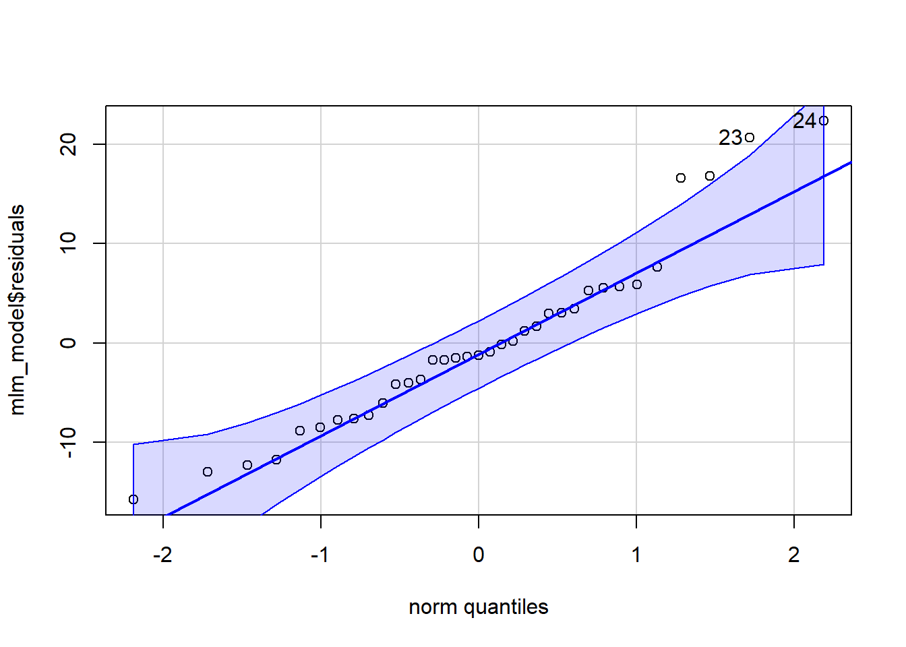{width=672}
:::

::: {.cell-output .cell-output-stdout}

```
[1] 24 23
```


:::
:::


Check for constant variance (Residual by Predicted plot):


::: {.cell}

```{.r .cell-code}
plot(mlm_model, which = 1)
```

::: {.cell-output-display}
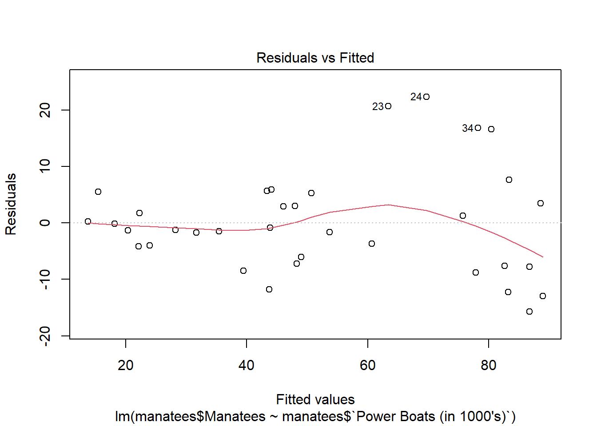{width=672}
:::
:::


# MCAT Score and GPA
<p align="center">

</p>


The MCAT is an entrance exam for medical schools.  It seems likely that there is a relationship between your undergraduate GPA and how well you do on the MCAT.  

GPA and MCAT score data were collected on 55 prospective medical students.  

Before you begin:

__What is the response/dependent variable?__
MCAT score
__What is the explanatory variable__
GPA
__What do you think is the nature of the relationship between the two?__
The higher GPA
__How strong do you think the relationship is?__


Load the data:


::: {.cell}

```{.r .cell-code}
mcat <- import('https://github.com/byuistats/Math221D_Cannon/raw/master/Data/mcat_gpa.csv')
View(mcat)
```
:::


## Plot the Data and calculate r


::: {.cell}

```{.r .cell-code}
plot(mcat$MCAT ~ mcat$GPA)
```

::: {.cell-output-display}
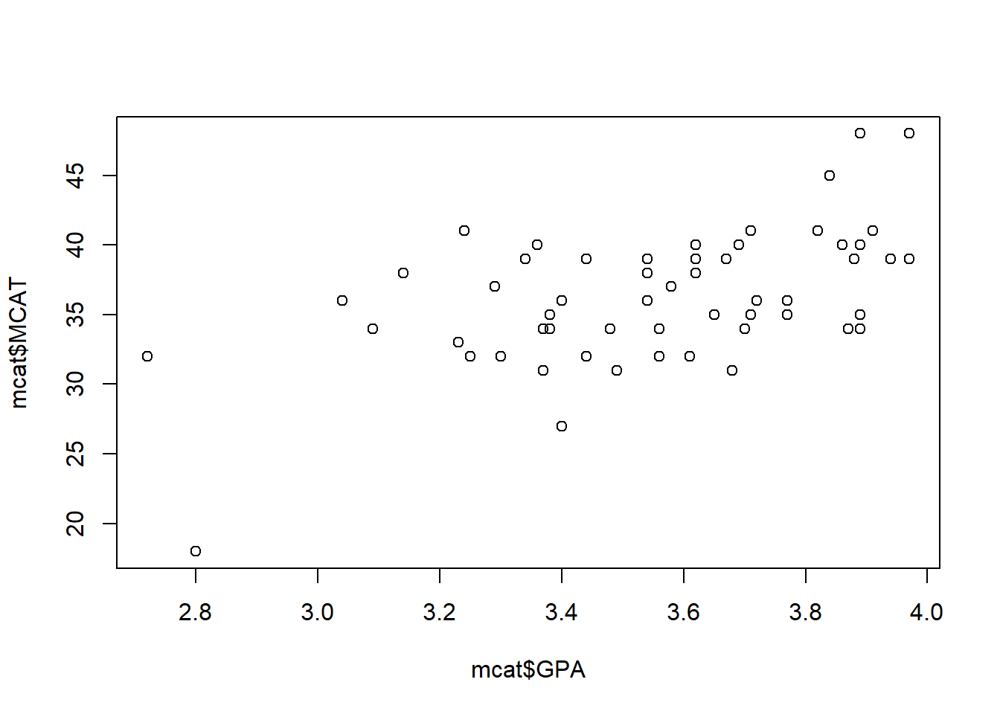{width=672}
:::

```{.r .cell-code}
cor(mcat$MCAT ~ mcat$GPA)
```

::: {.cell-output .cell-output-stdout}

```
[1] 0.5414202
```


:::
:::


__Does the relationship look linear?__

Just a little, but not too much

__What is the correlation coefficient, r?__
0.5414202

__What does this r show?__
There is a weak linear and positive relationship among the variables.

## Fit a Linear Regression Model


::: {.cell}

```{.r .cell-code}
out <- lm(mcat$MCAT ~ mcat$GPA)
```
:::


Add the regression line to your chart:


::: {.cell}

```{.r .cell-code}
# Sometimes you have to do the plot() and the abline() in one chunk and run the whole thing:

plot(mcat$MCAT ~ mcat$GPA)
abline(out)
```

::: {.cell-output-display}
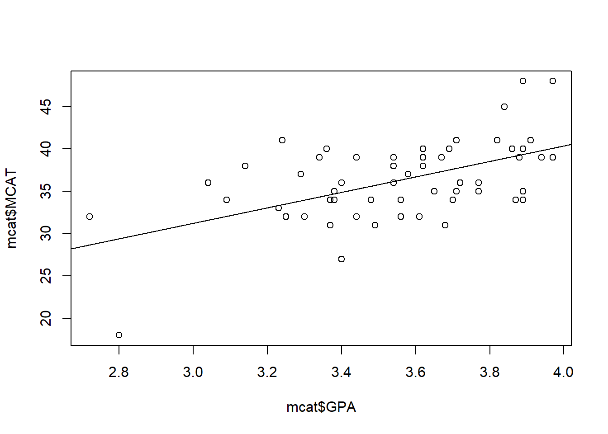{width=672}
:::
:::

::: {.cell}

```{.r .cell-code}
summary(out)
```

::: {.cell-output .cell-output-stdout}

```

Call:
lm(formula = mcat$MCAT ~ mcat$GPA)

Residuals:
     Min       1Q   Median       3Q      Max 
-11.4148  -2.5168  -0.1519   2.6653   8.6616 

Coefficients:
            Estimate Std. Error t value Pr(>|t|)    
(Intercept)    3.923      6.922   0.567    0.573    
mcat$GPA       9.104      1.942   4.688 1.97e-05 ***
---
Signif. codes:  0 '***' 0.001 '**' 0.01 '*' 0.05 '.' 0.1 ' ' 1

Residual standard error: 4.088 on 53 degrees of freedom
Multiple R-squared:  0.2931,	Adjusted R-squared:  0.2798 
F-statistic: 21.98 on 1 and 53 DF,  p-value: 1.969e-05
```


:::
:::


__What is the slope of the regression line, and what does it mean?__
9.104, for each unit of Gpa, there is an increase MCat Score by 9.104

__What is the intercept and what does it mean?__
the y value if x is 0, in context, is the MCat Score if Gpa is 0.

__What is your p-value?__
1.969e-05

__What is your conclusion?__
The p-value is smaller than 0.05 alpha, thus there is enough evidence to reject the null and believe there is a correlation between Gpa and MCat Score.

__What is the confidence interval for the slope?__


::: {.cell}

```{.r .cell-code}
confint(out, level = 0.95)
```

::: {.cell-output .cell-output-stdout}

```
                2.5 %   97.5 %
(Intercept) -9.961361 17.80724
mcat$GPA     5.209161 12.99928
```


:::
:::


__Interpret the confidence interval:__
I have 95% confidece that the true slope of the population is whitin(5.209161 and 12.99928)

## Check Model Requirements

Check the normality of the residuals:


::: {.cell}

```{.r .cell-code}
qqPlot(out$residuals)
```

::: {.cell-output-display}
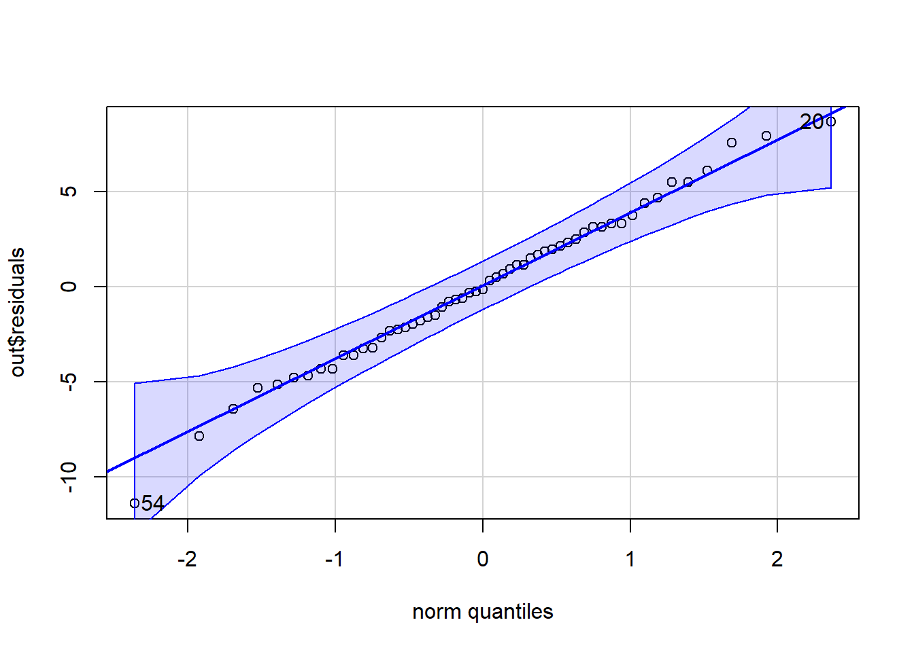{width=672}
:::

::: {.cell-output .cell-output-stdout}

```
[1] 54 20
```


:::
:::


Check for constant variance (Residual by Predicted plot):


::: {.cell}

```{.r .cell-code}
plot(out, which = 1)
```

::: {.cell-output-display}
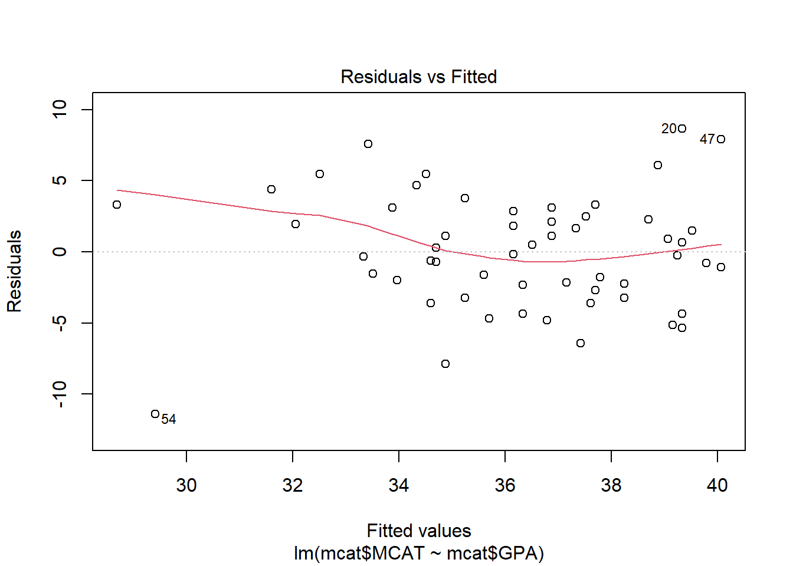{width=672}
:::
:::
