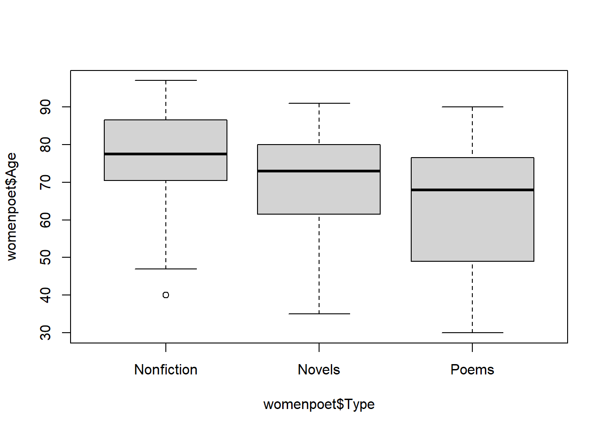
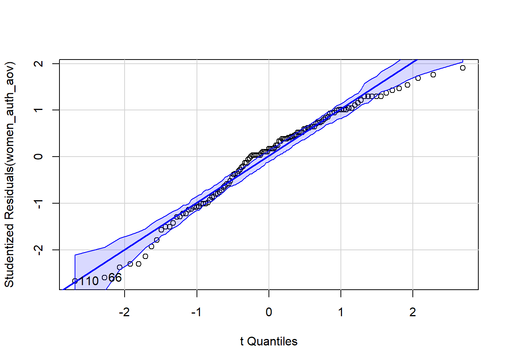
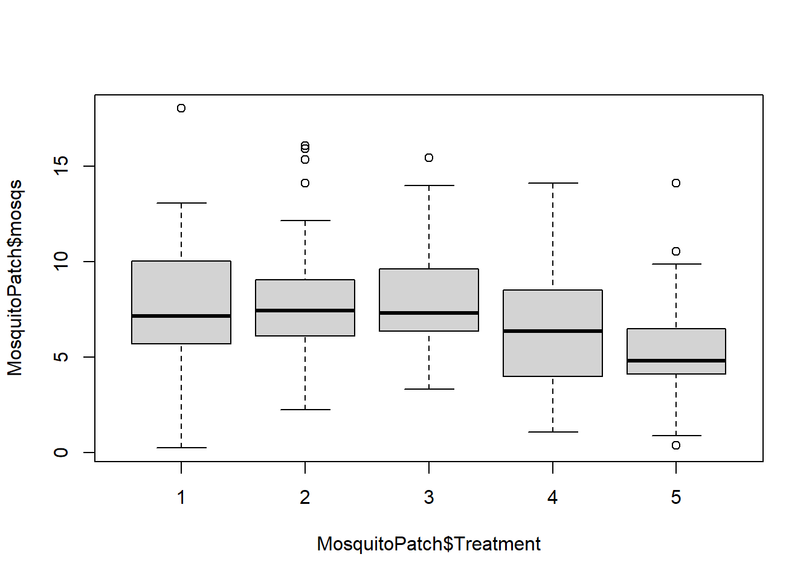
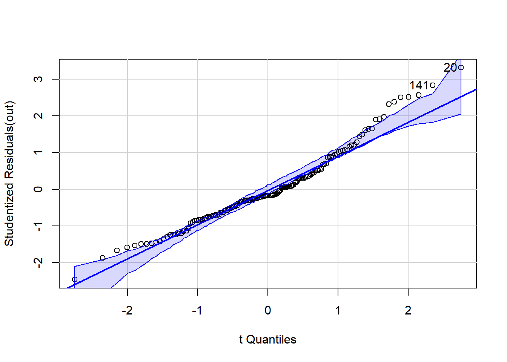

# Life Expectancy of Female Authors

## Introduction

You are curious to compare life expectancy between female poets, novelists, and non-fiction writers.  

You take  a sample of female authors from each of the three groups to test if the average age at death is different between any of the three types of authors using a level of significance of, $\alpha = 0.05$.

## Load the Data and Libraries


::: {.cell}

```{.r .cell-code}
library(rio)
library(tidyverse)
library(mosaic)
library(car)

womenpoet <- rio::import("https://byuistats.github.io/BYUI_M221_Book/Data/womenpoet.xls")
```
:::


## Explore the Data

Create a side-by-side boxplot of the age at death of each of the different author styles.

Modify the colors of each of the boxes for each group.


::: {.cell}

```{.r .cell-code}
boxplot(womenpoet$Age ~ womenpoet$Type)
```

::: {.cell-output-display}
{width=672}
:::

```{.r .cell-code}
View(womenpoet)
```
:::


Create a summary statistics table for age at death for each author type:


::: {.cell}

```{.r .cell-code}
favstats(womenpoet$Age ~ womenpoet$Type)
```

::: {.cell-output .cell-output-stdout}

```
  womenpoet$Type min    Q1 median    Q3 max     mean       sd  n missing
1     Nonfiction  40 71.75   77.5 86.25  97 76.87500 14.09691 24       0
2         Novels  35 61.50   73.0 80.00  91 71.44776 13.05151 67       0
3          Poems  30 49.50   68.0 75.75  90 63.18750 17.29710 32       0
```


:::
:::


List the mean and standard deviations of age at death for:

1. Novelists: mean : 76.87500	, sd: 14.09691 
2. Poets: mean : 	71.44776, sd: 13.05151
3. Non-fiction: mean : 63.18750, sd: 17.29710

## Perform the Appropriate Analysis

State your null and alternative hypotheses: The null is that the variance of all groups in the same, whereas the alternative is that the variance of all groups is not the same.


Perform an Analysis of Variance test including checking for the appropriateness of our analysis.


::: {.cell}

```{.r .cell-code}
sds < - favstats(womenpoet$Age ~ womenpoet$Type)$sd
```

::: {.cell-output .cell-output-error}

```
Error: object 'sds' not found
```


:::

```{.r .cell-code}
max(sds) / min(sds)
```

::: {.cell-output .cell-output-error}

```
Error: object 'sds' not found
```


:::

```{.r .cell-code}
women_auth_aov <- aov(womenpoet$Age ~ womenpoet$Type)
summary(women_auth_aov)
```

::: {.cell-output .cell-output-stdout}

```
                Df Sum Sq Mean Sq F value  Pr(>F)   
womenpoet$Type   2   2744  1372.1   6.563 0.00197 **
Residuals      120  25088   209.1                   
---
Signif. codes:  0 '***' 0.001 '**' 0.01 '*' 0.05 '.' 0.1 ' ' 1
```


:::
:::

::: {.cell}

```{.r .cell-code}
qqPlot(women_auth_aov)
```

::: {.cell-output-display}
{width=672}
:::

::: {.cell-output .cell-output-stdout}

```
[1]  66 110
```


:::
:::


__Question__:  What is the test statistic?  
__Answer__:  6.563 


__Question__:  What are the degrees of freedom for your analysis?  
  a. Numerator (between Groups) Degrees of Freedom  
  b. Denominator (within groups) Degrees of Freedom  
__Answer__:  between is 2 and within is 120  


__Question__:  What is the P-value?  
__Answer__:  0.00197 


__Question__:  Do you reject the null hypothesis?  Why?  
__Answer__:  Yes, because the p-value is less than 0.05 making the results significant.


__Question__:  State your conclusion in context of the problem.  
__Answer__:  Since the probability of the variances of women poets being the same is 0.197%, the result is significant at a 5% alpha and rejects the null hyphothesis/claim that women poet's variance is about the same.


__Question__:  Can we trust the p-value?
  a. Check for equal standard deviation (is the ratio of the largest SD / smallest SD greater than 2?)
  b. Check Normality of the residuals (`qqPlot()`)  
__Answer__:  Yes, since the the ratio of the max/min standard deviations is less than 2.


# Testing Mosquitos

## Introduction

A study was conducted to determine if different types of material can reduce the amount of mosquito human contact.  The researchers evaluated five different types of patches 1=Odomos, 2=Deltamethrin, 3=Cyfluthrin, 4=D+O, 5=C+O.  

The amount of mosquito human contact was measured to assess any differences between the five different types of material. Use a level of significance of 0.05.

## Load the Data


::: {.cell}

```{.r .cell-code}
MosquitoPatch <- rio::import("https://raw.githubusercontent.com/rdcromar/Math221D/main/MosquitoPatch.csv") %>% mutate(Treatment = factor(Treatment))
View(MosquitoPatch)
```
:::


## Review the Data

Create a side-by-side boxplot for human contact for each of the treatment groups.

Add a title and change the colors of the boxes.  


::: {.cell}

```{.r .cell-code}
boxplot(MosquitoPatch$mosqs ~ MosquitoPatch$Treatment)
```

::: {.cell-output-display}
{width=672}
:::
:::


Create a summary statistics table for human contact for each of the treatment groups:


::: {.cell}

```{.r .cell-code}
favstats(MosquitoPatch$mosqs ~ MosquitoPatch$Treatment)
```

::: {.cell-output .cell-output-stdout}

```
  MosquitoPatch$Treatment  min     Q1 median     Q3   max     mean       sd  n
1                       1 0.26 5.7375  7.140 9.9075 18.01 7.900667 3.366488 30
2                       2 2.26 6.1225  7.445 8.9050 16.07 8.133000 3.460182 30
3                       3 3.33 6.3975  7.320 9.6225 15.44 8.032667 3.010318 30
4                       4 1.10 4.0100  6.355 8.2500 14.10 6.333333 3.121368 30
5                       5 0.39 4.1500  4.825 6.4725 14.10 5.367000 3.067773 30
  missing
1       0
2       0
3       0
4       0
5       0
```


:::
:::


__Question__:  What do you observe?  
__Answer__:  the 4th and 5th treatments have variances with lower mosquitos and the rest of the other treatments.

__Question__:  What is the maximum standard deviation?  
__Answer__:  3.460182 from treatment 2

__Question__:  What is the minimum standard deviation?  
__Answer__:  3.010318 from treatment 5


## Perform the Appropriate Analysis

State your null and alternative hypotheses:

Perform an Analysis of Variance test including checking for the appropriateness of our analysis.


::: {.cell}

```{.r .cell-code}
out <- aov(MosquitoPatch$mosqs ~ MosquitoPatch$Treatment)
summary(out)
```

::: {.cell-output .cell-output-stdout}

```
                         Df Sum Sq Mean Sq F value  Pr(>F)   
MosquitoPatch$Treatment   4  184.6   46.16    4.48 0.00192 **
Residuals               145 1494.1   10.30                   
---
Signif. codes:  0 '***' 0.001 '**' 0.01 '*' 0.05 '.' 0.1 ' ' 1
```


:::
:::


__Question__:  What is the test statistic (F-value)?  
__Answer__:  4.48 

__Question__:  What are the degrees of freedom for your analysis?  

  a. Numerator (between Groups) Degrees of Freedom  
  b. Denominator (within groups) Degrees of Freedom  
__Answer__:  
a:  4
b: 145
  
__Question__:  What is the P-value?  
__Answer__:  0.00192

__Question__:  Do you reject the null hypothesis?  Why?  
__Answer__:  Yes, because the p-value is lower than a significance level of 0.05, rejecting the null. 

__Question__:  State your conclusion in context of the problem.  
__Answer__:  Since the probability of the variances of types of material being the same is 0.192%, the result is significant at a 5% alpha and rejects the null hyphothesis/claim that types of materials variance is about the same.

__Question__:  Can we trust the p-value?
  a. Check for equal standard deviation (is the ratio of the largest SD / smallest SD greater than 2?)
  b. Check Normality of the residuals (`qqPlot()`)  
__Answer__:  Yes, since the the ratio of the max/min standard deviations is less than 2, but the qqPlot shows the values to not have Normality of the residuals.


::: {.cell}

```{.r .cell-code}
sds <- favstats(MosquitoPatch$mosqs ~ MosquitoPatch$Treatment)$sd
max(sds) / min(sds)
```

::: {.cell-output .cell-output-stdout}

```
[1] 1.149441
```


:::

```{.r .cell-code}
qqPlot(out)
```

::: {.cell-output-display}
{width=672}
:::

::: {.cell-output .cell-output-stdout}

```
[1]  20 141
```


:::
:::
