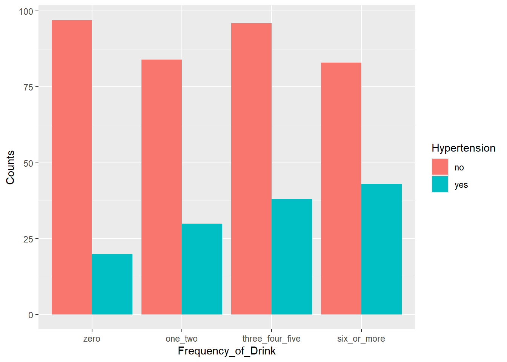

# Instructions

Complete the following questions about testing for independence between 2 categorical variables.  When completed, Render the `qmd` file and submit the `html`.


# Aussie Alcohol

A small study in Western Australia was done to determine the association between daily alcohol intake and hypertension (high blood pressure).  The data contains a hypertension indicator (0=no, 1=yes), and the number of alcoholic drinks per day.  Researchers wanted to determine if hypertension and daily alcohol intake are independent with a level of significance of 0.05.

Run the following commands to read the data into R:


::: {.cell}

```{.r .cell-code}
# This script will flip the summary data table to be easily used with geom_col()
library(rio)
library(tidyverse)
library(mosaic)
library(car)

bp_alcohol <- import("https://byuistats.github.io/M221R/Data/quiz/R/bp_alcohol.csv") 

## Note:  the following code transforms a table into a tidy dataset

bp_alcohol_graph <- bp_alcohol %>% 
  pivot_longer(cols = c( "zero", "one_two", "three_four_five", "six_or_more" ), values_to = "Counts", names_to = "Frequency_of_Drink") %>%
  mutate(Frequency_of_Drink = factor(Frequency_of_Drink, levels=c("zero", "one_two","three_four_five", "six_or_more"))) %>%
  rename("Hypertension"=V1)
```
:::


Create a side-by-side bar chart (`ggplot()`) to illustrate the counts. 


::: {.cell}

```{.r .cell-code}
ggplot(bp_alcohol_graph, aes(x = Frequency_of_Drink, y = Counts, fill = Hypertension)) +
  geom_col(position = "dodge") 
```

::: {.cell-output-display}
{width=672}
:::
:::


__Question__:  Which group appears to be most likely to have hypertension?  
__Answer__:  


State the Null and Alternative Hypotheses:

H0:  hypertension is independent of alcohol intake 
Ha:  hypertension is not independent of alcohol intake 


## Hypothesis Test

Perform the Chi-square test for independence:

__HINT__:  The way the data were imported into `bp_alcohol`, it contains a columns, V1, which is a categorical variable.  You only want to include the counts from the table.  Run `chisq.test()` dropping the first column.  Also, remember to name the output so you can easily extract information needed to check the requirements.


::: {.cell}

```{.r .cell-code}
bp_alcohol <- bp_alcohol %>% select(-V1)
View(bp_alcohol)
chisq.test(bp_alcohol)
```

::: {.cell-output .cell-output-stdout}

```

	Pearson's Chi-squared test

data:  bp_alcohol
X-squared = 9.2687, df = 3, p-value = 0.02592
```


:::
:::


__Question__:  Are the requirements satisfied for the $\chi$-square test for independence?  
__Answer__:  at least 10 expected successes and at least 10 expected failures


::: {.cell}

```{.r .cell-code}
chisq.test(bp_alcohol)$expected >= 10
```

::: {.cell-output .cell-output-stdout}

```
  zero one_two three_four_five six_or_more
1 TRUE    TRUE            TRUE        TRUE
2 TRUE    TRUE            TRUE        TRUE
```


:::
:::


__Question__:  How many degrees of freedom does this $\chi$-square test have?  
__Answer__:  3


__Question__:  What is the value of the test statistic?  
__Answer__:  9.2687

__Question__:  What is the P-value?  
__Answer__:  0.02592

State your conclusion in context of thise problem:

The P-value is smaller than a significance level of 0.05, thus there is enough evidence to conclude that hypertension is not independent of alcohol intake.


