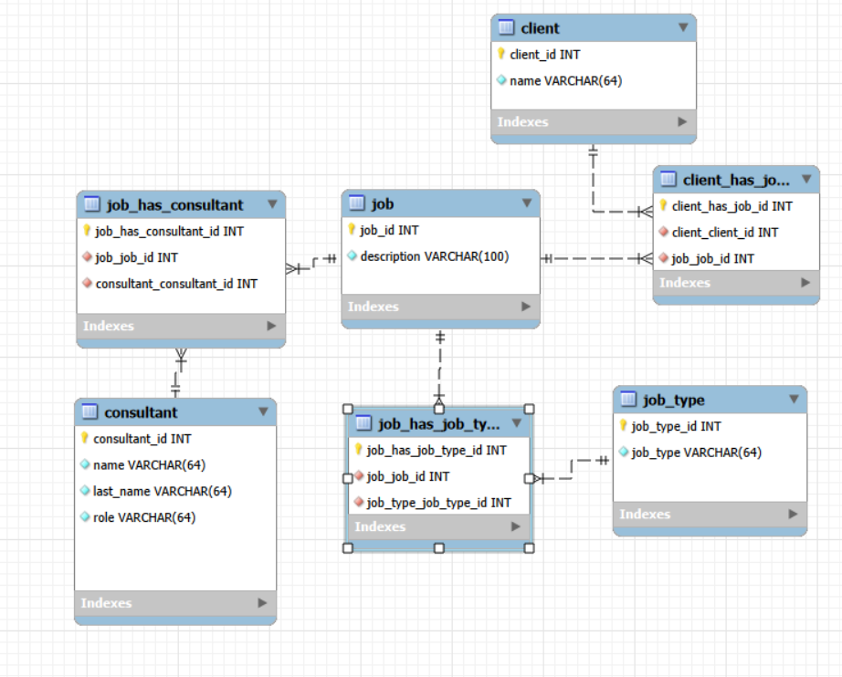
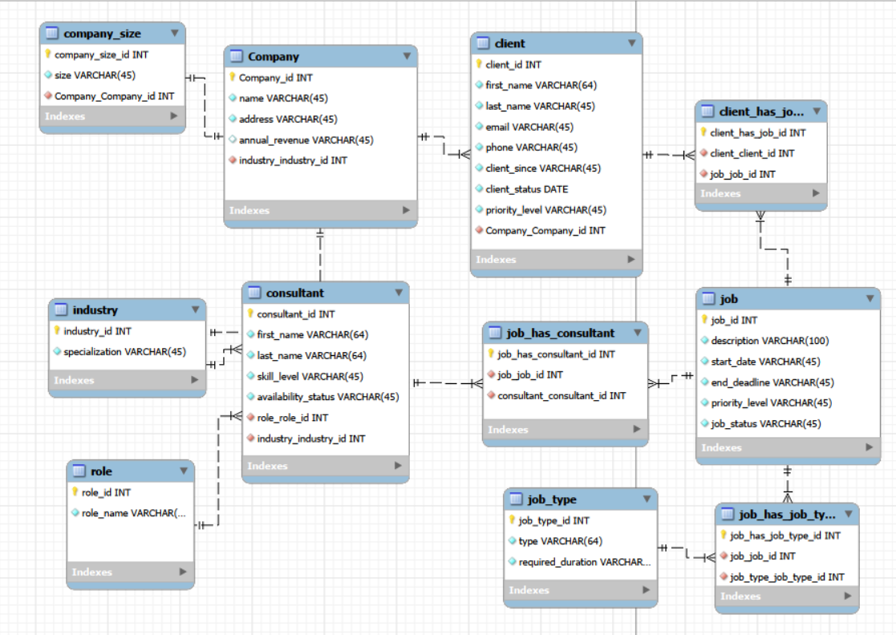

## Background

This project is a relational database for a consulting firm. The firm keeps clients, the
jobs those clients order, and the consultants who staff them. The awkward part of the brief
is that the relationships run both ways: one job usually needs several consultants, and one
consultant works several jobs at once. A client can also order many jobs over the years.

That shape cannot be stored in a single flat table without repeating information, so the
work was to design the schema in MySQL Workbench, build it, load it with sample data, and
then query it. What follows is the design as it actually happened, including the first
version that did not survive contact with the requirements.

## The first design

The first cut had seven tables. It was enough to answer the basic question of who is
working on what, and nothing more.



The tables were created like this:

```sql
create table client (
client_id INT unsigned auto_increment primary key,
name varchar(64) not null);

create table job (
job_id INT unsigned auto_increment primary key,
description varchar(100) not null);

create table consultant (
consultant_id INT unsigned auto_increment primary key,
name varchar(64) not null,
last_name varchar(64) not null,
role varchar(64) not null);

create table job_type (
job_type_id INT unsigned auto_increment primary key,
job_type varchar(64) not null);
```

The three linking tables carried the relationships:

```sql
create table client_has_job (
client_has_job_id INT unsigned auto_increment primary key,
client_client_id int unsigned not null,
job_job_id int unsigned not null,
foreign key (client_client_id) REFERENCES client(client_id),
foreign key (job_job_id) REFERENCES job(job_id));

create table job_has_consultant (
job_has_consultant_id INT unsigned auto_increment primary key,
job_job_id int unsigned not null,
consultant_consultant_id int unsigned not null,
foreign key (job_job_id) REFERENCES job(job_id),
foreign key (consultant_consultant_id) REFERENCES consultant(consultant_id));

create table job_type_has_job (
job_type_has_job_id INT unsigned auto_increment primary key,
job_job_id int unsigned not null,
job_type_job_type_id int unsigned not null,
foreign key (job_job_id) REFERENCES job(job_id),
foreign key (job_type_job_type_id) REFERENCES job_type(job_type_id));
```

## Where it broke down

Three problems showed up almost immediately once real questions were asked of the data.

The first is the role column on consultant. Storing the role as free text means the string
"Data Scientist" is retyped on every row that needs it. One typo creates a role that looks
real to a human and is invisible to a GROUP BY. Renaming a role means an UPDATE across every
consultant who holds it, and there is nowhere to hang anything else a role might need.

The second is the client table, which held nothing but a name. There was no room for contact
details, no record of when someone became a client, and no way to say which company a client
belongs to. Two people at the same firm were simply two unrelated rows.

The third problem is visible in the script itself. The bottom of the file is a run of ALTER
statements, adding columns that should have been part of the design:

```sql
ALTER TABLE consultant ADD COLUMN salary DECIMAL(10,2);
ALTER TABLE consultant ADD COLUMN hire_date DATE;
ALTER TABLE consultant ADD COLUMN email VARCHAR(100);
ALTER TABLE consultant ADD COLUMN phone VARCHAR(20);

ALTER TABLE job ADD COLUMN budget DECIMAL(12,2);
ALTER TABLE job ADD COLUMN start_date DATE;
ALTER TABLE job ADD COLUMN estimated_hours INT;
```

Every one of those is an attribute that got discovered late. Patching them on works, but a
schema that needs seven patches in its first week is telling you the entity model was too
thin.

## The normalized design

The second version grew to eleven tables. The goal was to reduce duplication, so anything
that was being retyped as text became a table of its own with a foreign key pointing at it.



Four things changed.

Role, industry, and company size each became lookup tables. A consultant now carries
role_role_id instead of a role string, so the name of a role lives in exactly one row and
renaming it is a one row update. The same applies to specialization on industry.

Company became a real entity. It has an address and annual revenue, and it points at
industry, which means the firm can now ask which industries it earns the most from. Company
size hangs off the company rather than being repeated as text.

Client was split apart. First name, last name, email, phone, the date they became a client,
their status, and their priority level are all separate columns now, and a foreign key ties
the client to their company. That single change is what makes the client table usable for
anything beyond a label.

Job gained the fields it needed from the start: a start date, an end deadline, a priority
level, and a status.

## Resolving the many-to-many relationships

Three junction tables carry the relationships that cannot be stored on either side alone.

A foreign key can only point one direction, so it can express "many jobs belong to one
client" but not "many consultants work many jobs." When both sides are many, the
relationship needs a table of its own, where each row is one pairing.

One row of job_has_consultant means this consultant is staffed on this job. Two rows sharing
a job id mean that job has two people on it. Two rows sharing a consultant id mean that
person is on two jobs. The sample data exercises both cases: job 6 is staffed by consultants
6 and 9, and consultant 1 works both job 1 and job 9.

The same reasoning gives client_has_job, which lets a client accumulate jobs over time, and
job_has_job_type, which lets a single job be tagged as both machine learning work and data
engineering work without forcing a choice.

## Loading the data

The seed script fills the lookup tables first, since everything else points at them, then
the entities, then the junction tables last. The sample companies are Mario themed, which
made the test data easier to keep straight while checking joins.

```sql
INSERT INTO role (role_id, role_name) VALUES
(NULL, 'Data Scientist'),
(NULL, 'Software Engineer'),
(NULL, 'Business Analyst'),
(NULL, 'Mathematician'),
(NULL, 'Statistician');

INSERT INTO Company (Company_id, name, address, annual_revenue, industry_industry_id) VALUES
(NULL, 'Mushroom Kingdom Gaming', '123 Castle Road', '5000000', 1),
(NULL, 'Luigi Construction Co', '456 Plumber Ave', '2500000', 5),
(NULL, 'Bowser Real Estate', '101 Dark Land Blvd', '15000000', 2);

INSERT INTO consultant (consultant_id, first_name, last_name, skill_level,
                        availability_status, role_role_id, industry_industry_id) VALUES
(NULL, 'Alex', 'Tovar', 'Senior', 'Busy', 1, 1),
(NULL, 'Michael', 'Heyes', 'Senior', 'Busy', 2, 1),
(NULL, 'Emmanuel', 'Robert', 'Mid-Level', 'Available', 3, 2);
```

Note the consultant rows: role and industry arrive as integers pointing at the lookup
tables, not as repeated text. That is the whole point of the redesign in one line.

## Querying it

Answering a question that spans a many-to-many relationship means passing through the
junction table. This one lists every data scientist with the jobs they are staffed on,
walking consultant to job_has_consultant to job:

```sql
select concat(c.name, ' ', c.last_name),
c.email,
date_format(c.hire_date, '%M %Y') as hire_date,
j.description,
j.budget
from consultant c
inner join job_has_consultant jhc on c.consultant_id = jhc.consultant_consultant_id
inner join job j on jhc.job_job_id = j.job_id
where c.role = 'Data Scientist'
order by c.last_name asc;
```

A consultant on two jobs comes back as two rows, which is the correct answer rather than a
flaw. Collapsing that into one row per consultant is a job for GROUP_CONCAT or for the
application layer.

After the redesign the same question is asked through the lookup table instead of against a
text column, which is what makes the role name safe to change:

```sql
SELECT consultant.first_name, role.role_name
FROM consultant
INNER JOIN role
ON consultant.role_role_id = role.role_id
WHERE consultant.first_name LIKE ?;
```

## What I would fix next

The design is sound but the implementation has loose ends I would clean up before calling it
finished.

The seed script inserts into a table called client_has_job1 while the diagram calls it
client_has_job. One of the two names is wrong and the mismatch would break a fresh build.

The client table stores client_status and client_since, and the seed data puts the same date
in both. Status was meant to hold something like active or dormant, so either the column is
mislabeled or the data is.

Status and priority columns are free text VARCHAR throughout. Priority holds High, Medium,
Low, and Critical, and job status holds In Progress, Completed, and Not Started. Those are
closed sets, so they belong in an ENUM or in lookup tables of their own. Leaving them as
text reintroduces exactly the problem the redesign was meant to solve, one level down.

Finally, no query written so far touches industry, Company, or company_size. Those tables
were added for good reasons, but a table nobody queries is a hypothesis rather than a
feature, and the obvious next step is revenue by industry and job volume by company size.

## Credit/References

The schema was designed and forward engineered in MySQL Workbench, and the database was
built and queried in MySQL 8. Sample data is fictional.
