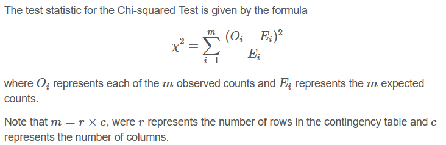

```{r, warning=FALSE,message=FALSE}
library(tidyverse)
library(mosaic)
library(ggthemes)
library(pander)

data <- read.csv("C://Users//Alex//Documents//GitHub//IntStats//Statistics-Notebook-master//Analyses//Chi Squared Tests//cars.csv")
```

## Background

In today's analysis, we'll be exploring an "Used Cars" dataset from kaggle. The author collected data from various web resources in order to explore the used cars market, The data is scraped in Belarus (western Europe) on the 2nd of December 2019, so the dataset is collected in pre-ChatGpt times to avoid any instant of the data being fabricated by AI.

## Hypothesis

Our question about the data is: Is car color associated with the manufacturer name? Aiming to find if manufacturers have tendencies to prefer a certain color for their cars.

$$
H_0:\text{Car color and manufacturer name are not associated} \\
H_1:\text{Car color and manufacturer name are associated} \\
\alpha:0.05
$$

## Analysis

For sake of simplicity and appropriateness, the data will filter only the most popular brands(Dodge, Honda, Volvo, BMW, Toyota) to have 10 observations per "combination-group". Since many companies aren't as popular and have big enough collection of cars with all colors in the market.



```{r}
data <- data %>% filter(manufacturer_name %in% c("Dodge","Honda","Volvo","BMW","Toyota"),
                        !color %in% c("orange","yellow","violet", "brown"))
x <- table(data$color , data$manufacturer_name) 
pander(x)
```

We can see our barplot shows some manufacturers have strong preferences to certain colors, such as BMW cars and the color black. However, we must run a test to get a p-value to determine if these preferences are significant.

```{r, fig.width=10, fig.height=5}
ggplot(data, mapping = aes(x=color, fill = manufacturer_name)) + 
  geom_bar(position = "dodge") +
  labs(x = "",
       y = "Count",
       title = "There is an association between car colors and manufacturer name") +
  guides(fill=guide_legend(title="Manufacturer name"))
```

Now, we will run a Chi-Squared Test to determine if we reject our null hypothesis and conclude that the Car color and manufacturer name are associated. We will also look at our expected counts to determine if our Chi-Squared Test requirements are met.

```{r}
qs <- chisq.test(x)
pander(qs)
```

```{r}
pander(qs$expected)
```

All expected counts are greater than 10, so the requirements are met. Our test results show a p-value of 1.08e-53, which is much smaller than our level of significance α=0.05, so we reject our null hypothesis and conclude that the Car color and manufacturer name are associated.

Let us look at our residuals to see how much our observed counts differ from the expected counts if our null hypothesis were true.

```{r}
pander(qs$residuals)
```

We see the greatest difference is observed among BMW cars with a difference of 6.896 more counts. This is probably what contributed most to our test statistic and resulting p-value.

## Interpretation

We can interpret that the Belarus car data recorded in 2019 has an association between car colors and manufacturer name. with significant results highlighted from BMW, implying that the BMW Manufactures tend to consistently produce cars of the same color, in this case black. Possibly due to reduce costs, simplify logistics or a branding causes tied luxury or modest colors. Due to our results showing a p-value of 1.08e-53, which is much smaller than our level of significance α=0.05, so we reject our null hypothesis and conclude that the Car color and manufacturer name are associated.

## Credit/References

This Analysis used mild assistance from ChatGpt to properly display the Graphs and filter the data.

[Kaggle Car Dataset](https://www.kaggle.com/datasets/lepchenkov/usedcarscatalog/data)

```{=html}
<!-- Directions

Come up with a chi squared test analysis of your own creation. 

* Write the Background and clearly state your question. Then collect data and perform the chi-squared test analysis in order to answer your question. Use the proper order of first, ask the question, then second, figure out the answer.

* You can use data from 
    - An R data set
    - the internet (like weather data, Facebook data, or sports data) 
    - your own experiment 
    - your own observational study
* However,     
    - Do not violate the "Human Subjects Rules" of the university: http://www.byui.edu/executive-strategy-and-planning/institutional-research/research-and-assessments/research-and-surveys

* You need a sample size large enough to meet the requirements of the chi squared test. Unfortunately, the sample size is completely dependent on the situation you select. A good rule of thumb is 10 observations per "combination-group" in your data.

-->
```
