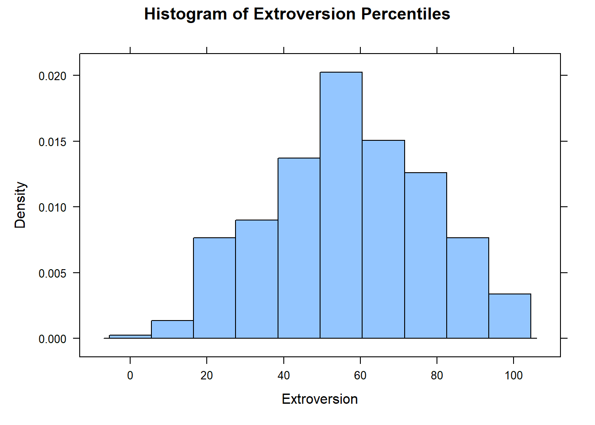
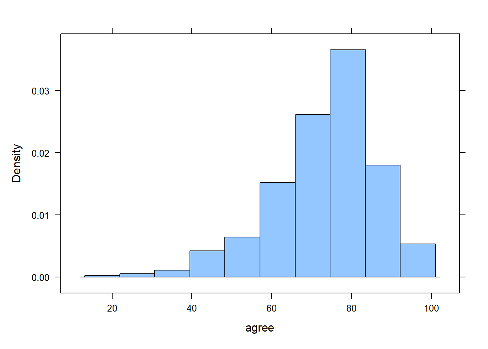
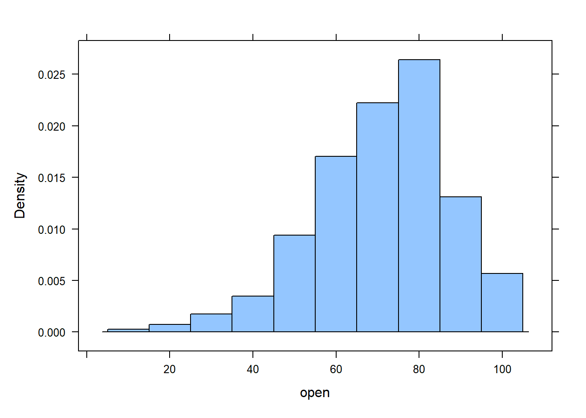
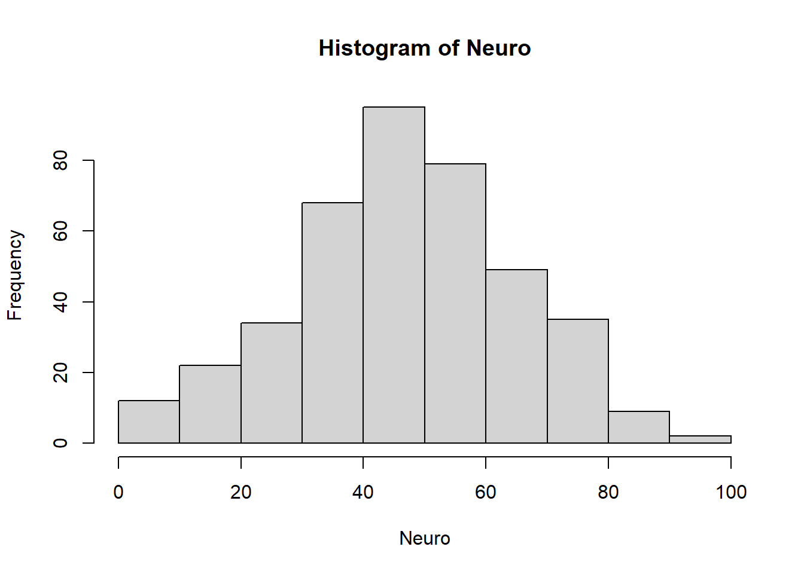
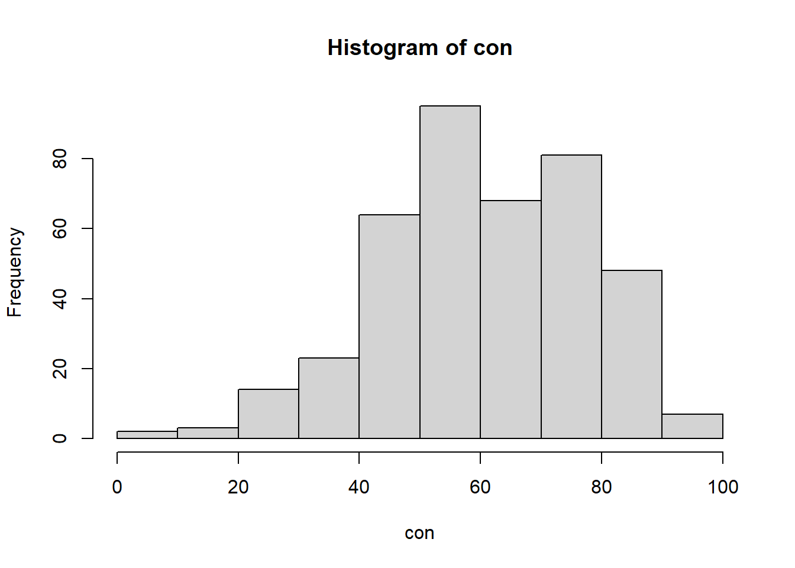

# Introduction

In this activity, you will execute statistical hypothesis tests and generate confidence intervals for each of the Big 5 personality traits using data collected from a random sample of Brother Cannon's Math 221 students.  

__Question__:  What is the population of this analysis?  
__Answer__:  Brother Cannon's Math 221 students

For each personality trait, include:

1. A statement of the null and alternative hypotheses and why you chose the alternative you did.
1. Choose alpha, $\alpha = $
1. Check that you can trust the normality of the mean (`n > 30` or `qqPlot(respons_variable)`)
1. Run the one-sample t-test and state your conclusion (technical and contextual explanation)
1. Calculate a $1-\alpha$ level confidence interval and describe in words what it means in context of the research question

Recall that we can use `favstats()` to get summary statistics, `boxplot()` and `histogram()` to get visualizations, and the `t.test()` function to get hypothesis tests and confidence intervals.  **Be sure to label your plots' axes and include a title.**  


::: {.cell}

```{.r .cell-code}
# Load Libraries

library(tidyverse)
library(mosaic)
library(rio)
library(car)


# Load Data
big5 <- import('https://raw.githubusercontent.com/byuistats/Math221D_Cannon/master/Data/All_class_combined_personality_data.csv')
```
:::


# Extroversion

State your null and alternative hypotheses:  

$$H_o:  \mu = 50$$  
$$H_a:  \mu > 50$$  

$$\alpha = 0.025 $$  
1. Create a table of summary statistics:  


::: {.cell}

```{.r .cell-code}
# Extroversion

favstats(big5$Extroversion) %>% knitr::kable()
```

::: {.cell-output-display}


|   | min| Q1| median| Q3| max|     mean|       sd|   n| missing|
|:--|---:|--:|------:|--:|---:|--------:|--------:|---:|-------:|
|   |   1| 42|     58| 73| 100| 56.98267| 21.09599| 404|       1|


:::
:::


2. Create a histogram of Extroversion:  


::: {.cell}

```{.r .cell-code}
### I'm making a single variable called "extrov" that drops the missing values.  You can do the same thing with the other traits to make analysis a little easier
extrov <- na.omit(big5$Extroversion) 

histogram(extrov, xlab = "Extroversion", main = "Histogram of Extroversion Percentiles")
```

::: {.cell-output-display}
{width=672}
:::
:::


3. Perform the one-sample t.test:  


::: {.cell}

```{.r .cell-code}
# For Hypothesis Test:
t.test(extrov, mu = 50, alternative = "greater")
```

::: {.cell-output .cell-output-stdout}

```

	One Sample t-test

data:  extrov
t = 6.6529, df = 403, p-value = 4.697e-11
alternative hypothesis: true mean is greater than 50
95 percent confidence interval:
 55.25232      Inf
sample estimates:
mean of x 
 56.98267 
```


:::
:::


4. Explain your conclusion:  

Technical:  Because the p-value is less than $\alpha$, I reject the null hypothesis.  

Contextual:  I have sufficient evidence to suggest that Brother Cannon's students are, on average, more Extroverted than the general population.  

5. Create a Confidence Interval for the average extroversion of Brother Cannon's students:  


::: {.cell}

```{.r .cell-code}
# For a Confidence Interval:
t.test(extrov, conf.level = 1-.025)$conf.int
```

::: {.cell-output .cell-output-stdout}

```
[1] 54.62135 59.34399
attr(,"conf.level")
[1] 0.975
```


:::
:::


6. Explain your confidence interval:  

I am 97.5% confident that the true average extroversion of Brother Cannon's students is somewhere between the 54.62 and 59.34 percentiles.  

# Agreeableness

State your null and alternative hypotheses.  For example, do you think Brother Cannon's students are more, less, or just different than the general population?  

$$H_o = \mu  $$  
$$H_a > \mu $$  

$$\alpha = 0.05 $$    
1. Create a table of summary statistics for Agreeableness:  


::: {.cell}

```{.r .cell-code}
agree <- big5$Agreeableness
favstats(agree)
```

::: {.cell-output .cell-output-stdout}

```
 min Q1 median Q3 max     mean       sd   n missing
  21 67     75 81 100 73.43457 13.24909 405       0
```


:::
:::


2. Create a histogram of Agreeableness:  


::: {.cell}

```{.r .cell-code}
histogram(agree)
```

::: {.cell-output-display}
{width=672}
:::
:::


3. Perform the one-sample t.test:  


::: {.cell}

```{.r .cell-code}
t.test(agree, mu = 70, alternative = "greater")
```

::: {.cell-output .cell-output-stdout}

```

	One Sample t-test

data:  agree
t = 5.2169, df = 404, p-value = 1.457e-07
alternative hypothesis: true mean is greater than 70
95 percent confidence interval:
 72.34919      Inf
sample estimates:
mean of x 
 73.43457 
```


:::
:::


4. Explain your conclusion:  

Technical: The p-value is less than 0.05 alpha, thus the test yields enough evidence to reject the null. 

Contextual: The probability of agreableness of Brother Cannon's students being the same as the mean is less than 5%. Therefore, there is enough evidence to say that Brother Cannon's students are more agreeable on average.

5. Create a Confidence Interval for the average agreeableness of Brother Cannon's students:  


::: {.cell}

```{.r .cell-code}
# For a Confidence Interval:
t.test(agree, conf.level = 0.95)$conf.int
```

::: {.cell-output .cell-output-stdout}

```
[1] 72.14034 74.72879
attr(,"conf.level")
[1] 0.95
```


:::
:::


6. Explain your confidence interval:  

I am 95% confident that the average agreeableness of Brother Cannon's students is between 72.14034 and 74.72879.

# Openness
State your null and alternative hypotheses:  

$$H_o = \mu $$  
$$H_a > \mu $$  

$$\alpha = $$  

1. Create a table of summary statistics for Openness:  


::: {.cell}

```{.r .cell-code}
open <- big5$Openness
favstats(open)
```

::: {.cell-output .cell-output-stdout}

```
 min Q1 median Q3 max     mean       sd   n missing
  10 60     73 83 100 71.81111 16.40637 405       0
```


:::
:::


2. Create a histogram of Openness:  


::: {.cell}

```{.r .cell-code}
histogram(open)
```

::: {.cell-output-display}
{width=672}
:::
:::


3. Perform the one-sample t.test:  


::: {.cell}

```{.r .cell-code}
t.test(open, mu = 68,alternative = "greater")
```

::: {.cell-output .cell-output-stdout}

```

	One Sample t-test

data:  open
t = 4.6748, df = 404, p-value = 2.008e-06
alternative hypothesis: true mean is greater than 68
95 percent confidence interval:
 70.46708      Inf
sample estimates:
mean of x 
 71.81111 
```


:::
:::


4. Explain your conclusion:  

Technical: The p-value is less than 0.05 alpha, thus the test yields enough evidence to reject the null. 

Contextual: The probability of Openness of Brother Cannon's students being the same as the mean is less than 5%. Therefore, there is enough evidence to say that Brother Cannon's students are have more Openness on average.

5. Create a Confidence Interval for the average openness of Brother Cannon's students:  


::: {.cell}

```{.r .cell-code}
# For a Confidence Interval:
t.test(open, conf.level = 0.95)$conf.int
```

::: {.cell-output .cell-output-stdout}

```
[1] 70.20847 73.41375
attr(,"conf.level")
[1] 0.95
```


:::
:::


6. Explain your confidence interval:  

I am 95% confident that the average Openness of Brother Cannon's students is between 70.20847 73.41375.

# Neuroticism

State your null and alternative hypotheses:  

$$H_o = \mu $$  
$$H_a < \mu $$  

$$\alpha =  $$  
1. Create a table of summary statistics for Neuroticism:  


::: {.cell}

```{.r .cell-code}
Neuro <- big5$Neuroticism
favstats(Neuro)
```

::: {.cell-output .cell-output-stdout}

```
 min Q1 median Q3 max     mean       sd   n missing
   0 35     48 60  92 47.39012 18.18166 405       0
```


:::
:::


2. Create a histogram of Neuroticism:  


::: {.cell}

```{.r .cell-code}
hist(Neuro)
```

::: {.cell-output-display}
{width=672}
:::
:::


3. Perform the one-sample t.test:  


::: {.cell}

```{.r .cell-code}
t.test(Neuro, mu = 55, alternative = "greater", conf.level = 0.99)
```

::: {.cell-output .cell-output-stdout}

```

	One Sample t-test

data:  Neuro
t = -8.4231, df = 404, p-value = 1
alternative hypothesis: true mean is greater than 55
99 percent confidence interval:
 45.28   Inf
sample estimates:
mean of x 
 47.39012 
```


:::
:::


4. Explain your conclusion:  

Technical: The p-value is less than 0.05 alpha, thus the test yields enough evidence to reject the null. 

Contextual: The probability of neuroticism of Brother Cannon's students being the same as the mean is less than 5%. Therefore, there is enough evidence to say that Brother Cannon's students are have more neuroticism on average.

5. Create a Confidence Interval for the average neuroticism of Brother Cannon's students:  


::: {.cell}

```{.r .cell-code}
# For a Confidence Interval:
t.test(Neuro, conf.level = 0.99)$conf.int
```

::: {.cell-output .cell-output-stdout}

```
[1] 45.05194 49.72831
attr(,"conf.level")
[1] 0.99
```


:::
:::


6. Explain your confidence interval:  

I am 99% confident that the average Openness of Brother Cannon's students is between 70.20847 73.41375.

# Conscientiousness

State your null and alternative hypotheses:  

$$H_o = 55 $$  
$$H_a < 55 $$  

$$\alpha = $$  
1. Create a table of summary statistics:  


::: {.cell}

```{.r .cell-code}
con <- big5$Conscientiousness
favstats(con)
```

::: {.cell-output .cell-output-stdout}

```
 min Q1 median Q3 max     mean       sd   n missing
   2 50     62 73  96 61.07901 16.55634 405       0
```


:::
:::


2. Create a histogram of Conscientiousness:  


::: {.cell}

```{.r .cell-code}
hist(con)
```

::: {.cell-output-display}
{width=672}
:::
:::


3. Perform the one-sample t.test:  


::: {.cell}

```{.r .cell-code}
t.test(con, mu = 55,alternative = "less")
```

::: {.cell-output .cell-output-stdout}

```

	One Sample t-test

data:  con
t = 7.3892, df = 404, p-value = 1
alternative hypothesis: true mean is less than 55
95 percent confidence interval:
     -Inf 62.43533
sample estimates:
mean of x 
 61.07901 
```


:::
:::


4. Explain your conclusion:  

Technical: The p-value is more than 0.05 alpha, thus the test doesn't yields enough evidence to reject the null. 

Contextual: The probability of neuroticism of Brother Cannon's students being the same as the mean is more than 5%. Therefore, there isn't enough evidence to say that Brother Cannon's students are have more neuroticism on average.

5. Create a Confidence Interval for the average conscientiousness of Brother Cannon's students:  


::: {.cell}

```{.r .cell-code}
# For a Confidence Interval:
t.test(con, conf.level = 0.99)$conf.int
```

::: {.cell-output .cell-output-stdout}

```
[1] 58.94984 63.20818
attr(,"conf.level")
[1] 0.99
```


:::
:::


6. Explain your confidence interval:  

I am 99% confident that the average Openness of Brother Cannon's students is between 58.94984 63.20818.

