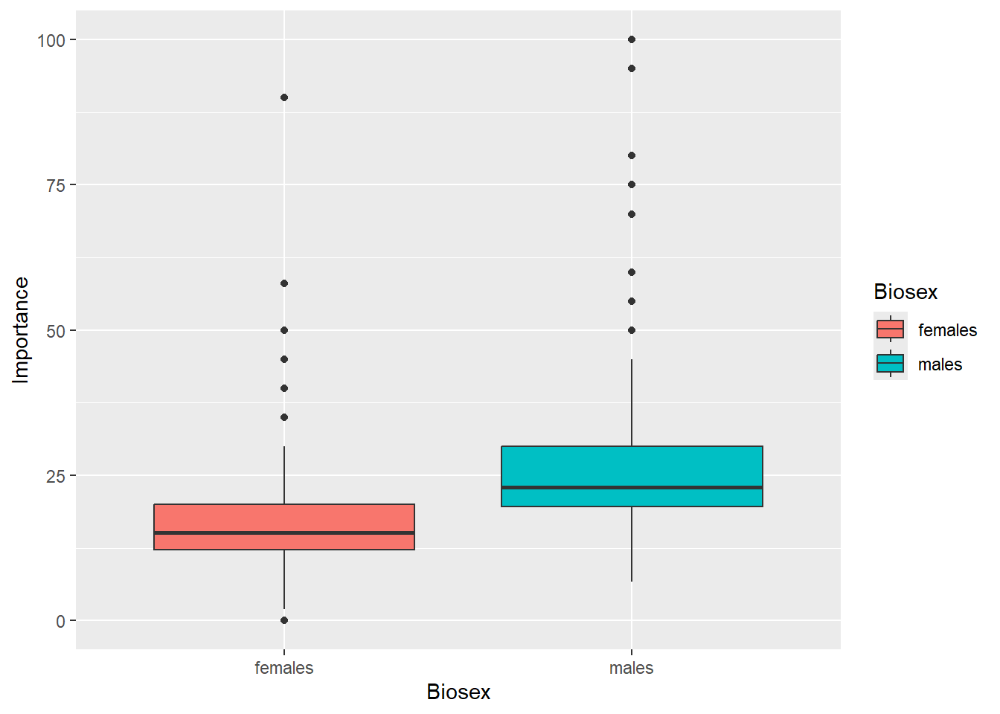
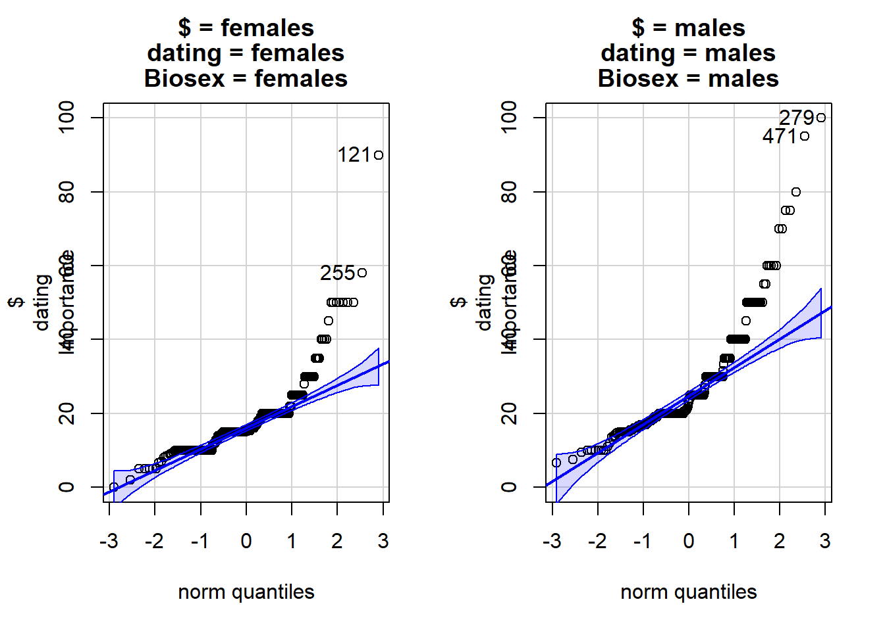
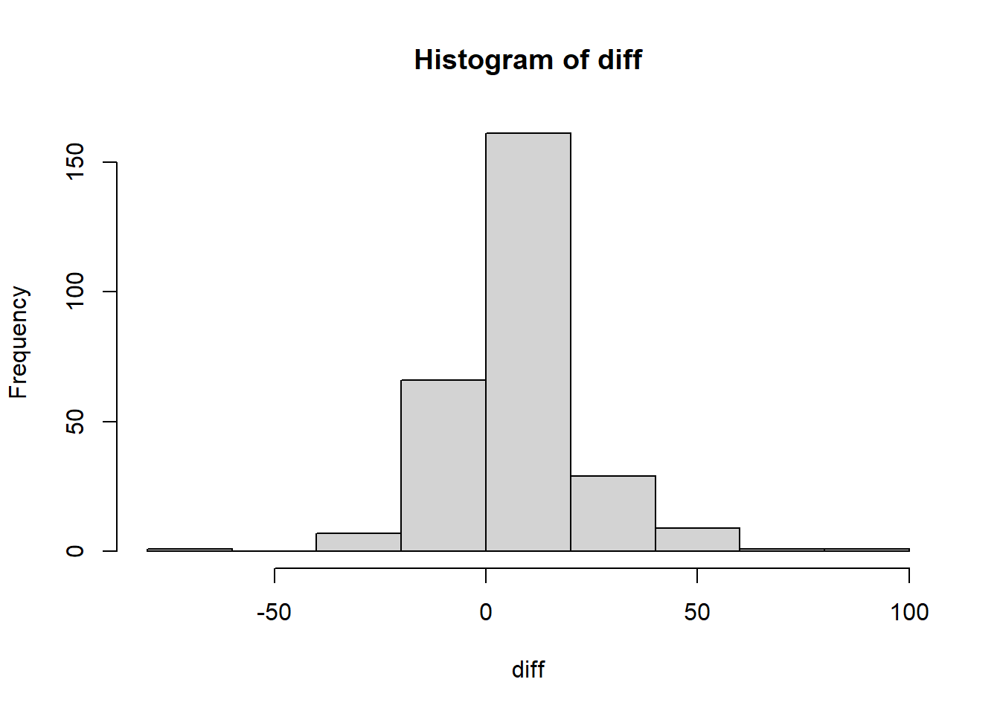
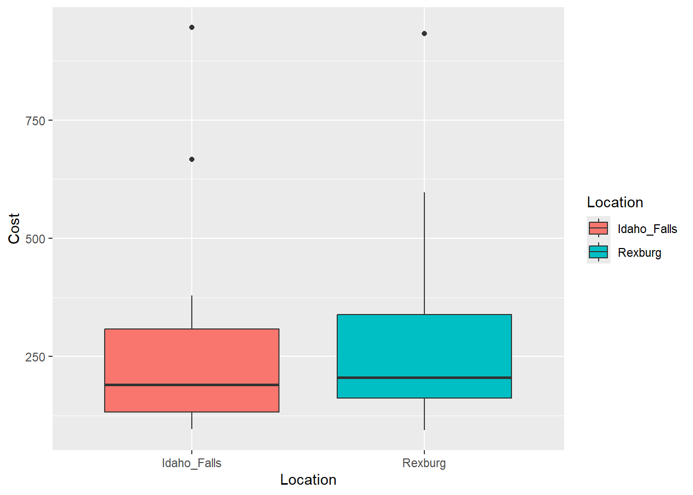
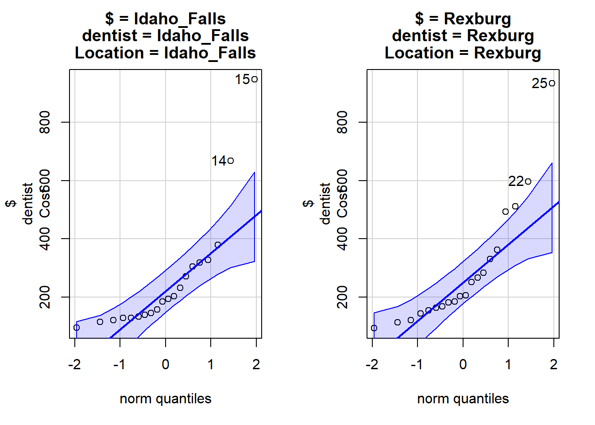
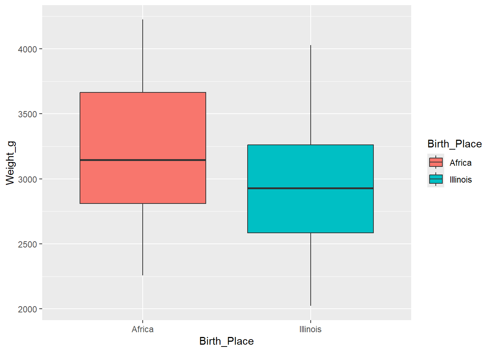
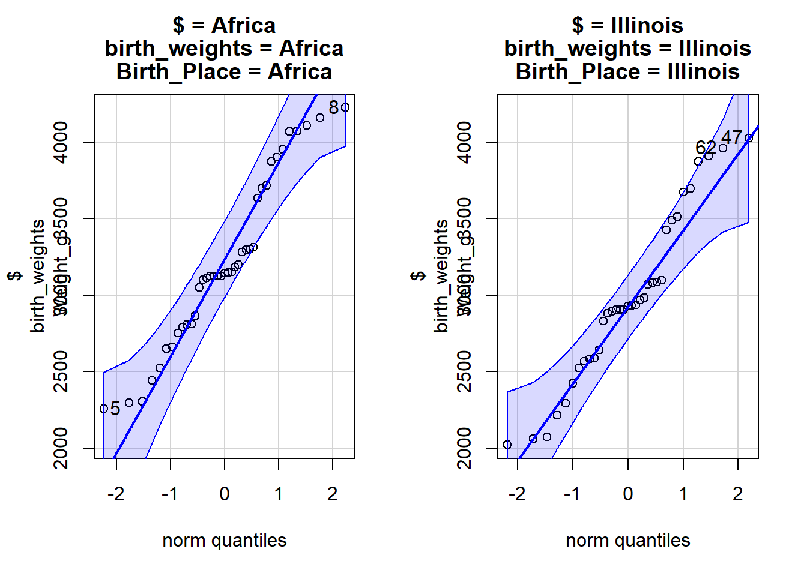

# Instructions

Here are several opportunities to practice analyzing 2-sample independent t-tests using R.  For each question, you will:

- Read in data
- Identify the Response and Independent variable
- Create data summaries (numerical and graphical)
- Statistically analyze the data
- Check for the suitability of the statistical test (CLT, Normality)
- State your hypothesis test conclusions and interpret your confidence intervals

When you finish, render this document and submit the `.html` in Canvas.  


::: {.cell}

```{.r .cell-code}
# Load the libraries

library(rio)
library(mosaic)
library(tidyverse)
library(car)
```
:::


# It's a Date!

Dating Behavior was studied in a speed dating experiment where random matching was generated and created randomization in the number of potential dates.  In a survey to each participant, one question was asked about how important attraction is when they date. The attraction value is on a scale from 0 (not important at all) to 100 (very important).  

The researchers want to determine if males report to value attractiveness more than females.  Use a level of significance of 0.05.

## Load the Data


::: {.cell}

```{.r .cell-code}
dating <- read_csv('https://github.com/byuistats/Math221D_Course/raw/main/Data/dating_attractive_longformat.csv')
View(dating)
```
:::


## Explore the Data

__Question__:  What is the *response* variable?  
__Answer__:  The response variable in this study is the attraction value

__Question__:  What is the *explanatory* variable?  
__Answer__:  The explanatory variable in this study is gender

Create a side-by-side boxplot for the amount of reported importance of attractiveness for each biosex.

Add a title and change the colors of the boxes.


::: {.cell}

```{.r .cell-code}
ggplot(dating, mapping = aes(x = Biosex, y = Importance, fill = Biosex)) + 
  geom_boxplot()
```

::: {.cell-output-display}
{width=672}
:::
:::


What do you observe?  

Create a table of summary statistics for each group (`favstats()`):  


::: {.cell}

```{.r .cell-code}
favstats(dating$Importance ~ dating$Biosex)
```

::: {.cell-output .cell-output-stdout}

```
  dating$Biosex  min    Q1 median Q3 max     mean        sd   n missing
1       females 0.00 12.24  15.09 20  90 18.02037  9.929864 269       0
2         males 6.67 19.57  23.00 30 100 27.24880 13.955701 275       0
```


:::
:::


## Hypothesis Test

State your null and alternative hypotheses (replace the ??? with the appropriate symbol):  

$$H_0:  \mu_{F}=\mu_{M}$$  

$$H_a:\mu_{F}> \mu_{M}$$

__NOTE__: The default for R is to set group order alphabetically.  This means Group 1 = Female.


Check that the samples for both groups are normally distributed


::: {.cell}

```{.r .cell-code}
qqPlot(dating$Importance~dating$Biosex)
```

::: {.cell-output-display}
{width=672}
:::
:::


Do the data for each group appear normally distributed?

Why is it OK to continue with the analysis?

Because the sample size of each group is bigger than 30

Perform a t-test.


::: {.cell}

```{.r .cell-code}
male <- dating %>% filter(Biosex %in% "males")
female <- dating %>% filter(Biosex %in% "females")
diff <- male$Importance - female$Importance
hist(diff)
```

::: {.cell-output-display}
{width=672}
:::

```{.r .cell-code}
t.test(diff,mu = 0, alternative = "greater")
```

::: {.cell-output .cell-output-stdout}

```

	One Sample t-test

data:  diff
t = 8.9372, df = 274, p-value < 2.2e-16
alternative hypothesis: true mean is greater than 0
95 percent confidence interval:
 7.414871      Inf
sample estimates:
mean of x 
 9.094327 
```


:::
:::


__Question__:  What is the value of the test statistic?  
__Answer__:  8.9372

__Question__:  How many degrees of freedom for this test?  
__Answer__:  274

__Question__:  What is the p-value?  
__Answer__:  2.2e-16

__Question__:  What do you conclude?  
__Answer__:  The p-value is significant and reject the null hyphothesis.

### Confidence Interval

Create a confidence interval for the difference of the average Importance Score between both groups:


::: {.cell}

```{.r .cell-code}
t.test(diff, conf.level = 0.95)
```

::: {.cell-output .cell-output-stdout}

```

	One Sample t-test

data:  diff
t = 8.9372, df = 274, p-value < 2.2e-16
alternative hypothesis: true mean is not equal to 0
95 percent confidence interval:
  7.09105 11.09760
sample estimates:
mean of x 
 9.094327 
```


:::
:::


# Tooth hurty

A simple random sample of dental bill costs was collected at offices in Rexburg and Idaho Falls.  Let $\mu_{IF}$ be the *population* mean of dental costs in Idaho Falls and $\mu_{R}$ be the *population* mean of dentals costs in Rexburg.  

We suspect that dental costs are higher in Rexburg because of less competition.  

Use the data imported below to answer the following questions.


::: {.cell}

```{.r .cell-code}
dentist <- read_csv('https://github.com/byuistats/Math221D_Course/raw/main/Data/DentistOfficeBills_longformat.csv')
View(dentist)
```
:::


## Review The Data

__Question__:  What is the *response* variable?  
__Answer__:  cost

__Question__:  What is the *explanatory* variable?  
__Answer__:  location


Create summary statistics tables of dental costs for each office:


::: {.cell}

```{.r .cell-code}
favstats(dentist$Cost ~dentist$Location)
```

::: {.cell-output .cell-output-stdout}

```
  dentist$Location   min       Q1  median      Q3   max    mean       sd  n
1      Idaho_Falls 96.32 132.4825 190.030 308.645 945.9 260.059 208.8755 20
2          Rexburg 94.15 162.0050 205.365 339.020 933.0 288.597 206.6373 20
  missing
1       0
2       0
```


:::
:::


Create a side-by-side boxplot for dental costs for each office.


::: {.cell}

```{.r .cell-code}
ggplot(dentist, mapping = aes(x = Location, y = Cost, fill = Location)) + 
  geom_boxplot()
```

::: {.cell-output-display}
{width=672}
:::
:::


Check the normality of each group.


::: {.cell}

```{.r .cell-code}
qqPlot(dentist$Cost ~dentist$Location)
```

::: {.cell-output-display}
{width=672}
:::
:::


__Question__: Do the samples from both groups appear to be normally distributed?  If not, is it a cause for concern for our statistical inference? 

Yes do most data points being normal.

## Hypothesis Test

State your null and alternative hypotheses (replace the question marks with the appropriate symbols):

$$H_0:  \mu_{IF}=\mu_{R}$$  

$$H_a:\mu_{IF}<\mu_{R}$$

Perform the appropriate analysis:


::: {.cell}

```{.r .cell-code}
Rex <- dentist %>% filter(Location %in% "Rexburg")
ID <- dentist %>% filter(Location %in% "Idaho_Falls")
diff <- Rex$Cost - ID$Cost
t.test(diff,mu = 0, alternative = "less")
```

::: {.cell-output .cell-output-stdout}

```

	One Sample t-test

data:  diff
t = 0.42641, df = 19, p-value = 0.6627
alternative hypothesis: true mean is less than 0
95 percent confidence interval:
     -Inf 144.2624
sample estimates:
mean of x 
   28.538 
```


:::
:::


__Question__:  What is the test statistic?  
__Answer__: 0.42641

__Question__:  What is the P-value?  
__Answer__:  0.6627

State your conclusion:  The p value is not significant, thus we fail to reject the null


## Confidence Interval

Create a confidence interval for the difference in costs between the IF and Rexburg offices:


::: {.cell}

```{.r .cell-code}
t.test(diff, conf.level = .99)
```

::: {.cell-output .cell-output-stdout}

```

	One Sample t-test

data:  diff
t = 0.42641, df = 19, p-value = 0.6746
alternative hypothesis: true mean is not equal to 0
99 percent confidence interval:
 -162.9337  220.0097
sample estimates:
mean of x 
   28.538 
```


:::
:::


Explain the confidence interval in context of the research question:  

I am 99% sure that the difference between the cost of dentist between Rexburg and Idaho Falls is between 162.93 dollars cheaper and 220 dollars more expensive.

#  Birth Weights

A study was conducted in which researchers obtained birth weights of infants born in Illinois during the same year. The birth weights are categorized based on the race and birthplace of the mother. Researchers want to know if there is a difference in mean birth weights of babies born to black women who were born in the United States and babies born to black women who were born in Africa. Values were recorded (in grams) for each infant born. The data are recorded in the file. 

Let $\mu_A$ be the *population* average of babies born to African-born mothers and $\mu_{IL}$ be the *population* mean weight of babies born to mothers in Illinois.


Use the data imported below to answer the following questions.


::: {.cell}

```{.r .cell-code}
birth_weights <- read_csv('https://github.com/byuistats/Math221D_Course/raw/main/Data/IllinoisBirthWeightsTwoVar_longformat.csv')
View(birth_weights)
```
:::


## Review The Data

__Question__:  What is the *response* variable?  
__Answer__:  birth weight 

__Question__:  What is the *explanatory* variable?  
__Answer__:  Birth place


Create summary statistics tables of birth weights for each country:


::: {.cell}

```{.r .cell-code}
favstats(birth_weights$Weight_g ~birth_weights$Birth_Place)
```

::: {.cell-output .cell-output-stdout}

```
  birth_weights$Birth_Place  min     Q1 median     Q3  max     mean       sd  n
1                    Africa 2257 2809.5   3146 3664.5 4225 3214.256 551.0440 39
2                  Illinois 2022 2585.5   2928 3261.0 4028 2970.257 550.8242 35
  missing
1       0
2       4
```


:::
:::


Create a side-by-side boxplot for birth weights for each country:


::: {.cell}

```{.r .cell-code}
ggplot(birth_weights, mapping = aes(x = Birth_Place, y = Weight_g, fill = Birth_Place)) + 
  geom_boxplot()
```

::: {.cell-output-display}
{width=672}
:::
:::


Check the normality of each group.


::: {.cell}

```{.r .cell-code}
qqPlot(birth_weights$Weight_g ~birth_weights$Birth_Place)
```

::: {.cell-output-display}
{width=672}
:::
:::


__Question__: Do the samples from both groups appear to be normally distributed?  If not, is it a cause for concern for our statistical inference?

## Hypothesis Test

State your null and alternative hypotheses (replace the question marks with the appropriate symbols):

$$H_0:  \mu_{A}=\mu_{IL}$$  

$$H_a:\mu_{A}!=\mu_{IL}$$

Perform the appropriate analysis:


::: {.cell}

```{.r .cell-code}
Illinois <- birth_weights %>% filter(Birth_Place %in% "Illinois")
Africa <- birth_weights %>% filter(Birth_Place %in% "Africa")
diff <- Illinois$Weight_g - Africa$Weight_g
t.test(diff,mu = 0, alternative = "two.sided")
```

::: {.cell-output .cell-output-stdout}

```

	One Sample t-test

data:  diff
t = -122.48, df = 34, p-value < 2.2e-16
alternative hypothesis: true mean is not equal to 0
95 percent confidence interval:
 -220.4844 -213.2870
sample estimates:
mean of x 
-216.8857 
```


:::
:::


__Question__:  What is the test statistic?  
__Answer__: -122.48

__Question__:  What is the P-value?  
__Answer__:  2.2e-16

State your conclusion:  

The p-value is significant. thus we reject the null


## Confidence Interval

Create a confidence interval for the average difference in weights between babies born to mothers in Africa and Illinois:


::: {.cell}

```{.r .cell-code}
t.test(diff, conf.level = .95)
```

::: {.cell-output .cell-output-stdout}

```

	One Sample t-test

data:  diff
t = -122.48, df = 34, p-value < 2.2e-16
alternative hypothesis: true mean is not equal to 0
95 percent confidence interval:
 -220.4844 -213.2870
sample estimates:
mean of x 
-216.8857 
```


:::
:::


Explain the confidence interval in context of the research question:  

I am 95% confident that the difference in weight between Illinois and Africa is between 220.4844 and 213.2870 grams more heavier in Illinois.

#  Miscellany

__Question__:  A financial economist is studying married couples in which both spouses work. He wants to compare the mean income earned by husbands with the mean income earned by their wives. Should he use independent sampling or dependent sampling, and why?  
 
 dependent sampling because the incomes of husbands and wives in each couple are naturally paired.


