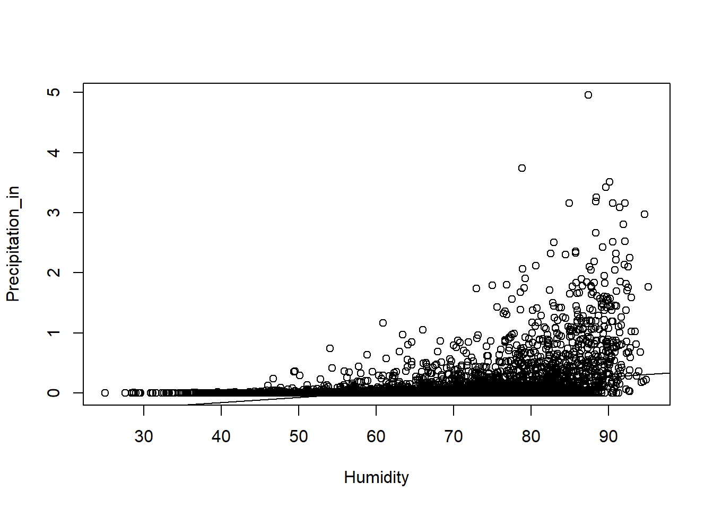
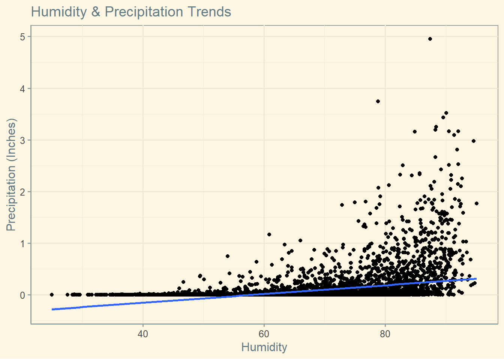
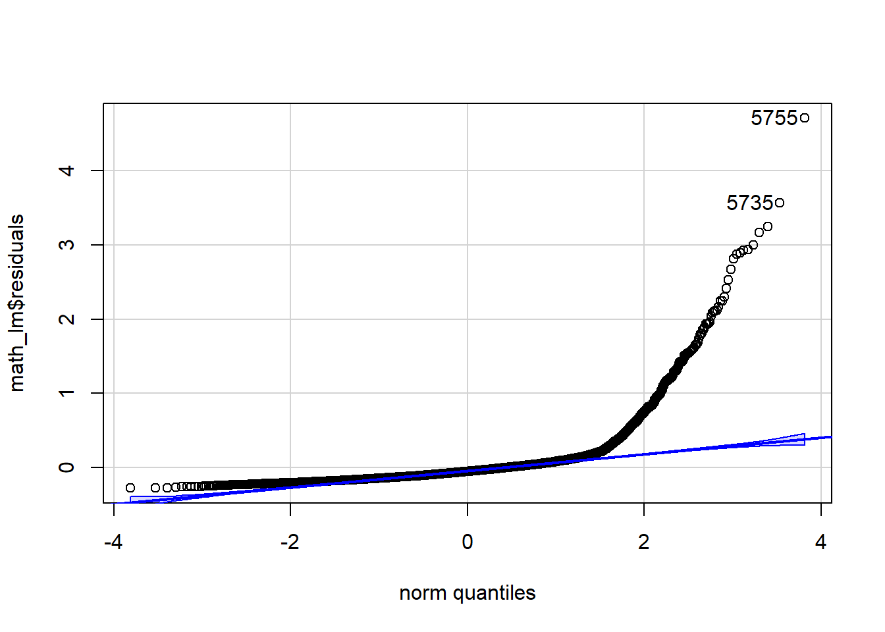
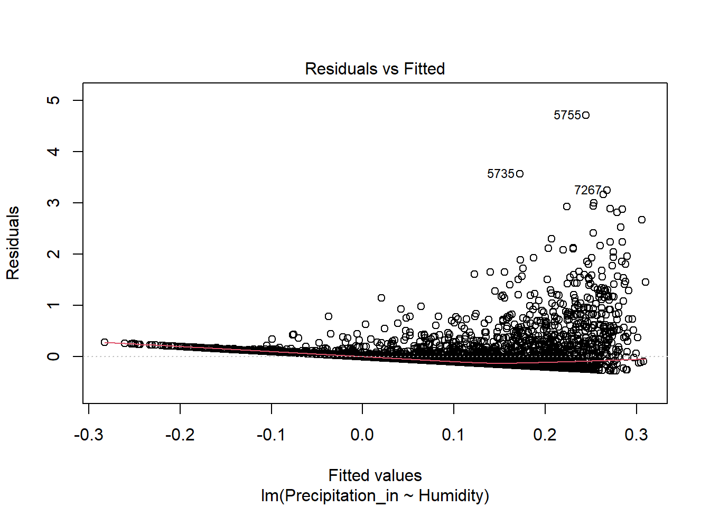

# Semester Project

Author Alex Tovar

# Introduction

I will be working with WECC's weather data from Data Science Society, to keep building insights for the company and because I'm familiarized with the data.

# Define the Problem

**What is the population of your research?** WECC wants us to investigate if there are any relationships between precipitation and humidity.

**What do you think is the nature of the relationship you hope to discover?** The more Humidity is present, the more precipitation tends to be present.

**What type of data are you looking for (quantitative? categorical?)** both quantitative

**What type of analysis are you expecting to do (t-test, regression? ANOVA? Chi-square test for independence? etc.):** linear regression

**What is the response/dependent variable?** Precipitation

**What is the explanatory variable** Humidity


::: {.cell}

```{.r .cell-code}
library(tidyverse)
```

::: {.cell-output .cell-output-stderr}

```
── Attaching core tidyverse packages ──────────────────────── tidyverse 2.0.0 ──
✔ dplyr     1.1.4     ✔ readr     2.1.5
✔ forcats   1.0.0     ✔ stringr   1.5.1
✔ ggplot2   3.5.1     ✔ tibble    3.2.1
✔ lubridate 1.9.4     ✔ tidyr     1.3.1
✔ purrr     1.0.2     
── Conflicts ────────────────────────────────────────── tidyverse_conflicts() ──
✖ dplyr::filter() masks stats::filter()
✖ dplyr::lag()    masks stats::lag()
ℹ Use the conflicted package (<http://conflicted.r-lib.org/>) to force all conflicts to become errors
```


:::

```{.r .cell-code}
library(mosaic)
```

::: {.cell-output .cell-output-stderr}

```
Registered S3 method overwritten by 'mosaic':
  method                           from   
  fortify.SpatialPolygonsDataFrame ggplot2

The 'mosaic' package masks several functions from core packages in order to add 
additional features.  The original behavior of these functions should not be affected by this.

Attaching package: 'mosaic'

The following object is masked from 'package:Matrix':

    mean

The following objects are masked from 'package:dplyr':

    count, do, tally

The following object is masked from 'package:purrr':

    cross

The following object is masked from 'package:ggplot2':

    stat

The following objects are masked from 'package:stats':

    binom.test, cor, cor.test, cov, fivenum, IQR, median, prop.test,
    quantile, sd, t.test, var

The following objects are masked from 'package:base':

    max, mean, min, prod, range, sample, sum
```


:::

```{.r .cell-code}
library(rio)
```

::: {.cell-output .cell-output-stderr}

```

Attaching package: 'rio'

The following object is masked from 'package:mosaic':

    factorize
```


:::

```{.r .cell-code}
library(car)
```

::: {.cell-output .cell-output-stderr}

```
Loading required package: carData

Attaching package: 'car'

The following objects are masked from 'package:mosaic':

    deltaMethod, logit

The following object is masked from 'package:dplyr':

    recode

The following object is masked from 'package:purrr':

    some
```


:::

```{.r .cell-code}
library(downloader)
library(ggthemes)
```

::: {.cell-output .cell-output-stderr}

```

Attaching package: 'ggthemes'

The following object is masked from 'package:mosaic':

    theme_map
```


:::
:::

::: {.cell}

```{.r .cell-code}
data <- read.csv("C:\\Users\\Alex\\Documents\\GitHub\\WECC\\2000-2020-rexburg.csv")

data <- data %>%
  rename(Temperature_f = Temperature..F.,
         Precipitation_in = Precipitation..inches.,
         Pressure_mb = Pressure..mb.,
         Wind_Speed = Wind.Speed..mph.)
```
:::

::: {.cell}

```{.r .cell-code}
math_lm <- lm(Precipitation_in ~ Humidity, data = data)
plot(Precipitation_in ~ Humidity, data = data)
abline(math_lm)
```

::: {.cell-output-display}
{width=672}
:::
:::


# Describe the Data


::: {.cell}

```{.r .cell-code}
chart1 <- ggplot(data, mapping = aes(x = Humidity, y = Precipitation_in)) + 
geom_point() +
labs(title = "Humidity & Precipitation Trends",
       y = "Precipitation (Inches)") +
theme_solarized() 
chart1 + geom_smooth(method = "lm")
```

::: {.cell-output .cell-output-stderr}

```
`geom_smooth()` using formula = 'y ~ x'
```


:::

::: {.cell-output-display}
{width=672}
:::
:::


**Does the relationship look linear?** Not Really, the relatioship looks very weak and with lots of variation at the end.

# Analyze the Data

### Requirements:


::: {.cell}

```{.r .cell-code}
qqPlot(math_lm$residuals)
```

::: {.cell-output-display}
{width=672}
:::

::: {.cell-output .cell-output-stdout}

```
[1] 5755 5735
```


:::
:::

::: {.cell}

```{.r .cell-code}
plot(math_lm, which = 1)
```

::: {.cell-output-display}
{width=672}
:::
:::


**What is the correlation coefficient, r?** 0.3468858


::: {.cell}

```{.r .cell-code}
cor(Precipitation_in ~ Humidity, data = data)
```

::: {.cell-output .cell-output-stdout}

```
[1] 0.3468858
```


:::
:::


**What does this r show?**

There is an weak positive relationship between humidity and Precipitation.

## Fit a Linear Regression Model


::: {.cell}

```{.r .cell-code}
lm_output <- lm(data$Precipitation_in ~ data$Humidity)
```
:::


HO: B1 = 0 There is no linear relationship between humidity and precipitation

HA: B1 != 0 There is linear relationship between humidity and precipitation


::: {.cell}

```{.r .cell-code}
summary(lm_output)
```

::: {.cell-output .cell-output-stdout}

```

Call:
lm(formula = data$Precipitation_in ~ data$Humidity)

Residuals:
    Min      1Q  Median      3Q     Max 
-0.2776 -0.1209 -0.0537  0.0300  4.7104 

Coefficients:
                Estimate Std. Error t value Pr(>|t|)    
(Intercept)   -0.4938394  0.0184500  -26.77   <2e-16 ***
data$Humidity  0.0084492  0.0002673   31.61   <2e-16 ***
---
Signif. codes:  0 '***' 0.001 '**' 0.01 '*' 0.05 '.' 0.1 ' ' 1

Residual standard error: 0.2671 on 7304 degrees of freedom
Multiple R-squared:  0.1203,	Adjusted R-squared:  0.1202 
F-statistic: 999.1 on 1 and 7304 DF,  p-value: < 2.2e-16
```


:::
:::


**What is your p-value?** less than 2e-16

**What is the confidence interval for the slope?**


::: {.cell}

```{.r .cell-code}
confint(lm_output, level = 0.95)
```

::: {.cell-output .cell-output-stdout}

```
                     2.5 %       97.5 %
(Intercept)   -0.530006691 -0.457672208
data$Humidity  0.007925222  0.008973219
```


:::
:::


**Interpret the confidence interval:** I have 95% confidence that the true population slope lies within (0.00792 and 0.00897)

**What is your conclusion?** Although the p-value is less than alpha, suggesting a statistically significant relationship, the requirements of linear regression (such as linearity and normally distributed residuals) are not met. Therefore, the result may not be reliable, and we must write a report to WECC that the data is unreliable to make valid inferences and answers to conclude a relationship between Humidity and Precipitation.
