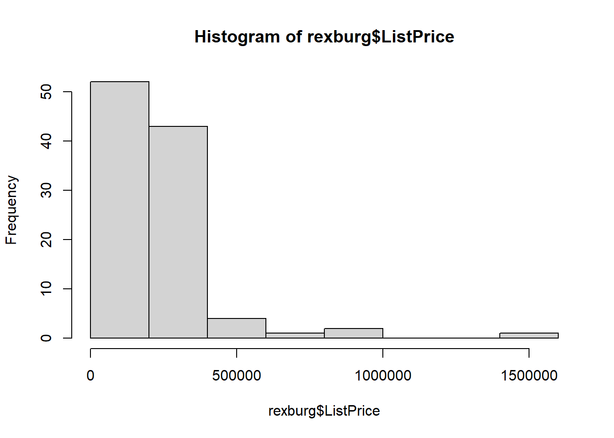
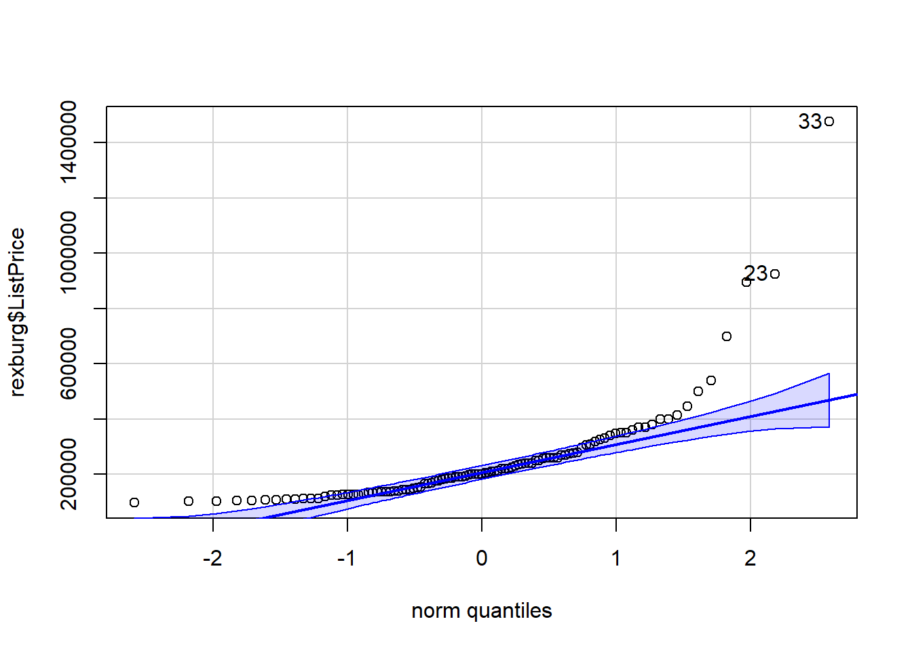
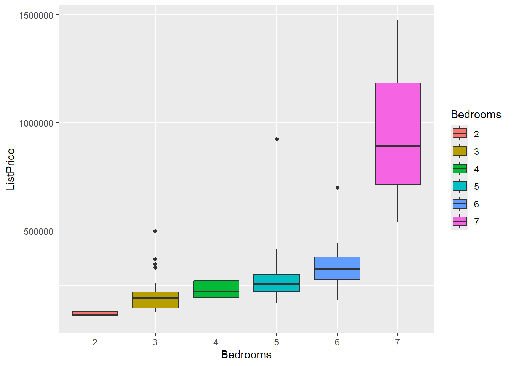

# Assessment Objectives

  * Apply the 3 rules of probability in different scenarios
  * Describe the 5 steps of the statistical process
  * Differentiate between an observational study and an experiment
  * Differentiate between a population and a sample
  * Describe the 4 random sampling schemes
  * Explain importance of random sampling
<br/>
  * Distinguish between quantitative and categorical variables
  * Create graphical summaries of data (boxplots, histograms) and be able to make conclusions based on the graphs
  * Create numerical summaries of data (mean, sd, 5 number summary, percentiles) and compare groups (centers, spreads)
  * Distinguish between a parameter and a statistic
  * Determine the 5 number summary from a boxplot
<br/>
  * State the properties of a normal distribution
  * Calculate the z-score for an individual from a normal population with mean, $\mu$, and std. dev, $\sigma$
  * Calculate probabilities (>, <, between) of certain values given $\mu$ and $\sigma$
<br/>
  * Describe the concept of a sampling distribution of the sample mean
  * State the Central Limit Theorem
  * Determine the mean of the sampling distribution of the sample mean given $\mu$ and $\sigma$
  * Determine the std. dev. of the sampling distribution of the sample mean given $\mu$ and $\sigma$
  * Determine the _shape_ of the sampling distribution given a sample size, n, and $\mu$ and $\sigma$
  * State the Law of Large Numbers
  * qqPlot for assessing normality
  
  
# Design the Study

You and a colleague are interested in studying the relationship between social media use and mental health among youth ages 18-24. You decide to use the Psychological Wellbeing Scale (PWB) developed by Stanford University as your metric for comparison (the response variable).

__QUESTION__:  List 5 factors (explanatory variables) related to social media use that might impact Wellbeing.  Include whether or not the factors are *quantitative* or *categorical* (include at least one of each):  

1. Screen Time(Quantiative)
2. Social media platform (Categorical)
3. Follower Count (Quantiative)
4. Type of content(Categorical)
5. likes receive (Quantiative)

__QUESTION__:  What is the population of the study?  
__ANSWER__:  Social media users


__QUESTION__:  Suppose you are *not* resource limited.  Briefly describe the sampling scheme you would use and why you would choose it to best represent the population:  
__ANSWER__:  
I used an stratified to represent the population at each each from 18-24, since I don't want to make conlusions factors that might influence the results.

 
__QUESTION__:  Give a brief description of the other 3 types of random sampling schemes and explain when they might be appropriate.   
__ANSWER__:  Random sampleling when the users aren't just 18-24 year old, and you want to generalize results for all the population. stratified sample to separate the users by Age, to avoid biases or factors determined by age that might skew results. systematic sampling to campture a subject from an population spread evenly. Cluster samples if you want to research quickly and efficiently the population.


__QUESTION__: 
Suppose you sent out a Facebook survey to all of your followers and asked them to respond if they are in your target demographic.  How might this impact the conclusions of your study?  
__ANSWER__:  Selection bias, facebook doesn't represent platforms such as Youtube. Non-Response bias, people that dismiss the survey won't be represented on the results. Therefore, conlusions will be skewed or even misleading if the data provided isn't up to standards.


# Describe/Summarize the Data

For this section you will program in R.  Don't forget to load the libraries first:


## Housing Prices in Rexburg

You are interested housing prices in Rexburg, Idaho.  Load and wrangle the housing data and respond to the following questions.  


::: {.cell}

```{.r .cell-code}
# Load the data:
housing <- import('https://github.com/byuistats/Math221D_Cannon/raw/master/Data/MadisonCountyRealEstate.xlsx') %>% mutate(Bedrooms=factor(Bedrooms))
View(housing)
```
:::


Create a new dataset called `rexburg` that includes:

  1. Only houses in the city of Rexburg
  2. Houses that are less than 20 years old
  3. Only the columns for List Price, City, Age and number of bedrooms


::: {.cell}

```{.r .cell-code}
table(housing$City)
```

::: {.cell-output .cell-output-stdout}

```

     MENAN    REXBURG SUGAR CITY 
         3        137          9 
```


:::

```{.r .cell-code}
rexburg <- housing %>% 
  select(ListPrice, City, Age, Bedrooms) %>%
  filter(City %in% "REXBURG",
         Age < 20)
View(rexburg)
```
:::


Create a histogram of listing price with the `rexburg` dataset. 


::: {.cell}

```{.r .cell-code}
hist(rexburg$ListPrice)
```

::: {.cell-output-display}
{width=672}
:::
:::


__QUESTION__:  Based on the histogram, what would you say is the shape of the is the shape of the distribution of list prices for homes in Rexburg?  
__ANSWER__:  The shape has an skewed left distribution of list prices for homes in Rexburg


Create a `qqPlot()` of housing prices.


::: {.cell}

```{.r .cell-code}
qqPlot(rexburg$ListPrice)
```

::: {.cell-output-display}
{width=672}
:::

::: {.cell-output .cell-output-stdout}

```
[1] 33 23
```


:::
:::


__QUESTION__:  Based on the qqPlot, would you say the data are normally distributed?  
__ANSWER__:  Not really, the data is not normally distributed because of outlier data results.

__QUESTION__:  Calculate summary statistics (`favstats()`) for housing prices in Rexburg for each number of bedrooms.  
__ANSWER__:  


::: {.cell}

```{.r .cell-code}
favstats(rexburg$ListPrice ~rexburg$Bedrooms)
```

::: {.cell-output .cell-output-stdout}

```
  rexburg$Bedrooms    min     Q1 median      Q3     max     mean        sd  n
1                2  96900 106000 111500  125950  136500 115284.2  12739.10 19
2                3 124900 142900 189900  217400  499999 199930.7  77604.73 39
3                4 169000 192000 221000  269900  369000 247411.1  74364.90  9
4                5 164900 219900 254450  298500  924500 294965.0 162580.24 20
5                6 179900 274000 324900  379000  699000 348700.0 125531.97 13
6                7 539900 717450 895000 1185000 1475000 969966.7 472036.02  3
  missing
1       0
2       0
3       0
4       0
5       0
6       0
```


:::
:::


__QUESTION__:  What is the standard deviation of prices of homes with 3 bedrooms?  
__ANSWER__:  77604.73

__QUESTION__:  Interpret the standard deviation in words.  
__ANSWER__:  The prices of homes with 3 bedrooms is on average $77604.73 away from the mean


__QUESTION__:  What is the maximum value home price for a 2 bedroom house?  
__ANSWER__:  136500


__QUESTION__:  Suppose there was a typo in the data and the maximum price for a 2 bedroom house was accidentally entered as $1,700,000.  How would the *median* change?  
__ANSWER__:  The median would be a little skewed to higher prices, but not as significally since the result is based on the position, not the magnitude.


__QUESTION__:  How would the mean change?  
__ANSWER__:  the mean of 2 bedroom would dramatically give a result skewed towards high prices.

__QUESTION__:  How would the standard deviation change?  
__ANSWER__:  the standard deviation would increase because it is based off the mean.


__QUESTION__:  Use  __*GGPLOT*__ to create a boxplot of housing prices for all the bedroom numbers.  **Modify the color scheme so that each boxplot is a different color**.  


::: {.cell}

```{.r .cell-code}
ggplot(rexburg, mapping = aes(x = Bedrooms, y = ListPrice, fill = Bedrooms)) + geom_boxplot()
```

::: {.cell-output-display}
{width=672}
:::
:::


__QUESTION__:  What trends do you notice?  
__ANSWER__:  The higher the number of bedrooms, the higher the prices tend to be.

__QUESTION__:  Why might the box plot for 7 bedroom homes look so different than the others?  
__ANSWER__:  Possibly due because the number of "7 bedroom homes" is just 3, therefore it deviates a lot in the distribution since there isn't a lot of data to be as precise and small as the others.


# Probability 

## Hair Color

Brother Cannon has been collecting hair color data about his students for the last several semesters (not really).  The proportion of students with each hair color are as follows:  
(run the following R chunk to see the table more clearly)


::: {.cell}

```{.r .cell-code}
knitr::kable(tibble(Red="???", Brown=.37, Black=.35, Blond = .22, Other=.02))
```

::: {.cell-output-display}


|Red | Brown| Black| Blond| Other|
|:---|-----:|-----:|-----:|-----:|
|??? |  0.37|  0.35|  0.22|  0.02|


:::
:::


__QUESTION__:  What percent of Brother Cannon's students have red hair?  
__ANSWER__:  4%


::: {.cell}

```{.r .cell-code}
1-(.37+.35+ .22 + .02)
```

::: {.cell-output .cell-output-stdout}

```
[1] 0.04
```


:::
:::


__QUESTION__:  What's the probability that a randomly selected student has either black or brown hair?  
__ANSWER__:  72%


::: {.cell}

```{.r .cell-code}
.37+.35
```

::: {.cell-output .cell-output-stdout}

```
[1] 0.72
```


:::
:::


## Social Media Use

The number of hours students spend on social media a week is known to be left skewed with a mean of 12 hours and a standard deviation 1.5. 

Suppose we take a random sample of 50 students and calculate the average time they spend on social media.  


__QUESTION__:  What is the mean of the distribution of sample means for this sample size?  
__ANSWER__:  12


__QUESTION__:  What is the standard deviation of sample means for this sample size?  
__ANSWER__:  0.212


::: {.cell}

```{.r .cell-code}
1.5/sqrt(50)
```

::: {.cell-output .cell-output-stdout}

```
[1] 0.212132
```


:::
:::


__QUESTION__:  What is the shape of the distribution of sample means for this sample size and why?  
__ANSWER__:  is approximately normal, because according to the central limit thereom the distribution of sample will be approximately normal when the sample is 30 or above.


## Faculty Salaries

Faculty salaries at a university are known to be normally distributed with a mean of \$108,552 and a standard deviation of \$13,277.
You randomly sample n=15 faculty members and calculate their average salary.  

__QUESTION__:  What is the mean of the distribution of sample means for this sample size?  
__ANSWER__:  $108,552

__QUESTION__:  What is the standard deviation of sample means for this sample size?  
__ANSWER__:  3428.107


::: {.cell}

```{.r .cell-code}
13277/ sqrt(15)
```

::: {.cell-output .cell-output-stdout}

```
[1] 3428.107
```


:::
:::


__QUESTION__:  What is the shape of the distribution of sample means for this sample size and why?  
__ANSWER__:  is approximately normal since the population is normally distributed


## Normal Probability Calculations

High blood pressure is strongly associated with a host of diseases and increases risk of cardiac arrest (hear attacks) in older patients.  

Suppose that systolic blood pressure in the US is normally distributed with a mean = 128 and a standard deviation of 11.  
Use the following calculator to answer the questions below: 


__QUESTION__:  What is the probability that a randomly selected person in the US has a systolic blood pressure of greater than 145?  
__ANSWER__:  6.11%


::: {.cell}

```{.r .cell-code}
1-pnorm(145, 128, 11)
```

::: {.cell-output .cell-output-stdout}

```
[1] 0.06111818
```


:::
:::


__QUESTION__:  What is the probability that a randomly selected group of 10 people in the US have an *average* blood pressure less than 130?  
__ANSWER__:  71.73%


::: {.cell}

```{.r .cell-code}
z <- (130-128) / (11/sqrt(10))
pnorm(z)
```

::: {.cell-output .cell-output-stdout}

```
[1] 0.7173407
```


:::
:::


__QUESTION__:  Your doctor says that you are in the 20th percentile for systolic blood pressure.  What does it mean that you are the 20th percentile?  
__ANSWER__:  that means that off all patients, I have a systolic blood pressure lower than 80% of the data and higher than 20%.


__QUESTION__:  If you are the 20th percentile, What is your blood pressure?  
__ANSWER__:  that you the systolic blood pressure is 118.7422


::: {.cell}

```{.r .cell-code}
qnorm(.20, 128, 11)
```

::: {.cell-output .cell-output-stdout}

```
[1] 118.7422
```


:::
:::
