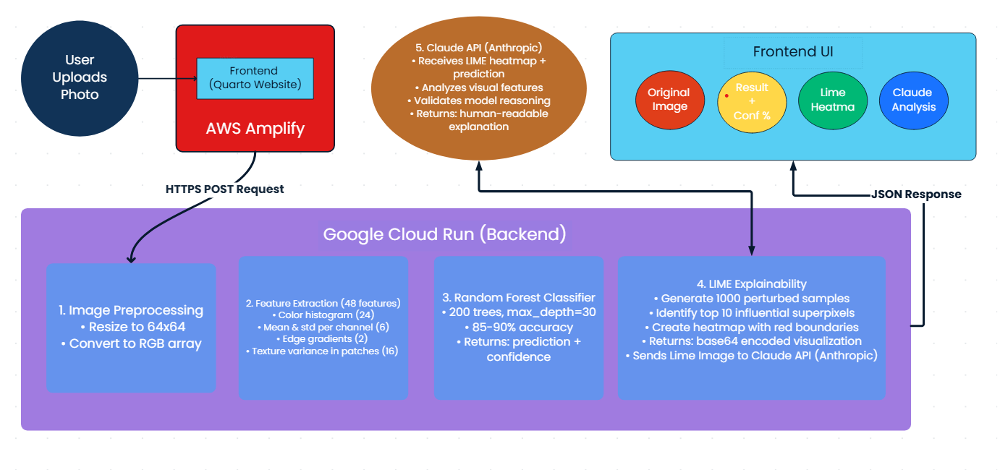

## ML-Powered Wrecked Car Detector

Upload or take a photo of a car, and our AI will analyze whether it's damaged using advanced machine learning and explainable AI techniques.

```{=html}
<div class="car-detector-app">
  <div class="upload-section">
    <div class="upload-card">
      <h3>📸 Upload Car Image</h3>
      <p>Accepts JPG and PNG formats</p>
      <input type="file" id="imageInput" accept="image/jpeg,image/jpg,image/png" />
      <button id="analyzeBtn">
        <span class="btn-icon">🔍</span>
        Analyze Car
      </button>
    </div>
  </div>
  
  <div id="preview-section" class="result-card" style="display: none;">
    <h3>📷 Original Image</h3>
    <div class="image-container">
      
    </div>
  </div>
  
  <div id="result"></div>
  
  <div id="overlay-section" class="result-card" style="display: none;">
    <h3>🎯 AI Explanation (LIME Visualization)</h3>
    <p class="card-description">Red boundaries highlight the regions that most influenced the AI's decision</p>
    <div class="image-container">
      
    </div>
  </div>
  
  <div id="summary-section" class="result-card" style="display: none;">
    <h3>🤖 Claude's Analysis</h3>
    <div id="summaryText"></div>
  </div>
</div>
```


<style>
:root {
  --primary-color: #354B5E;
  --primary-dark: #2a3b4a;
  --primary-light: #4a6179;
  --accent-color: #4a9eff;
  --success-color: #28a745;
  --warning-color: #ffc107;
  --danger-color: #dc3545;
  --light-bg: #f8f9fa;
  --white: #ffffff;
  --shadow: 0 4px 6px rgba(0, 0, 0, 0.1);
  --shadow-lg: 0 10px 25px rgba(0, 0, 0, 0.15);
}

.project-summary {
  background: linear-gradient(135deg, var(--primary-color) 0%, var(--primary-dark) 100%);
  color: white;
  padding: 30px;
  border-radius: 12px;
  margin: 30px 0;
  box-shadow: var(--shadow-lg);
}

.project-summary h3 {
  color: white;
  margin-top: 0;
  font-size: 1.8em;
  border-bottom: 2px solid var(--accent-color);
  padding-bottom: 10px;
  margin-bottom: 20px;
}

.project-summary strong {
  color: var(--accent-color);
}

.project-summary ul {
  margin: 15px 0;
  padding-left: 20px;
}

.car-detector-app {
  margin: 40px 0;
  padding: 0;
}

.upload-section {
  margin-bottom: 30px;
}

.upload-card {
  background: linear-gradient(135deg, var(--primary-color) 0%, var(--primary-light) 100%);
  padding: 40px;
  border-radius: 16px;
  text-align: center;
  box-shadow: var(--shadow-lg);
  color: white;
}

.upload-card h3 {
  margin-top: 0;
  font-size: 1.8em;
  color: white;
}

.upload-card p {
  color: rgba(255, 255, 255, 0.9);
  margin-bottom: 20px;
}

#imageInput {
  display: block;
  margin: 20px auto;
  padding: 12px 20px;
  font-size: 16px;
  border: 2px solid rgba(255, 255, 255, 0.3);
  border-radius: 8px;
  background-color: rgba(255, 255, 255, 0.95);
  color: var(--primary-color);
  cursor: pointer;
  transition: all 0.3s ease;
  max-width: 400px;
}

#imageInput:hover {
  background-color: white;
  border-color: var(--accent-color);
  transform: translateY(-2px);
  box-shadow: 0 4px 12px rgba(0, 0, 0, 0.15);
}

#analyzeBtn {
  padding: 15px 40px;
  font-size: 18px;
  background: linear-gradient(135deg, var(--accent-color) 0%, #357ae8 100%);
  color: white;
  border: none;
  border-radius: 50px;
  cursor: pointer;
  font-weight: bold;
  transition: all 0.3s ease;
  box-shadow: 0 4px 15px rgba(74, 158, 255, 0.4);
  display: inline-flex;
  align-items: center;
  gap: 10px;
  margin-top: 10px;
}

#analyzeBtn:hover {
  transform: translateY(-2px);
  box-shadow: 0 6px 20px rgba(74, 158, 255, 0.5);
}

#analyzeBtn:active {
  transform: translateY(0);
}

#analyzeBtn:disabled {
  background: linear-gradient(135deg, #ccc 0%, #999 100%);
  cursor: not-allowed;
  box-shadow: none;
  transform: none;
}

.btn-icon {
  font-size: 1.2em;
}

.result-card {
  background: white;
  padding: 30px;
  border-radius: 16px;
  margin: 25px 0;
  box-shadow: var(--shadow);
  border-left: 5px solid var(--primary-color);
  transition: all 0.3s ease;
}

.result-card:hover {
  box-shadow: var(--shadow-lg);
  transform: translateY(-2px);
}

.result-card h3 {
  color: var(--primary-color);
  margin-top: 0;
  font-size: 1.5em;
  margin-bottom: 15px;
}

.card-description {
  color: #666;
  font-style: italic;
  margin-bottom: 20px;
  padding: 10px;
  background-color: var(--light-bg);
  border-radius: 6px;
}

.image-container {
  border-radius: 12px;
  overflow: hidden;
  box-shadow: 0 2px 8px rgba(0, 0, 0, 0.1);
  background: var(--light-bg);
  padding: 10px;
}

.image-container img {
  width: 100%;
  height: auto;
  max-height: 500px;
  object-fit: contain;
  display: block;
  border-radius: 8px;
}

#result {
  margin: 25px 0;
  padding: 25px;
  border-radius: 16px;
  min-height: 60px;
  font-size: 18px;
  transition: all 0.3s ease;
}

.result-crashed {
  background: linear-gradient(135deg, #f8d7da 0%, #f5c6cb 100%);
  border: 3px solid var(--danger-color);
  color: #721c24;
  box-shadow: 0 4px 15px rgba(220, 53, 69, 0.2);
}

.result-not-crashed {
  background: linear-gradient(135deg, #d4edda 0%, #c3e6cb 100%);
  border: 3px solid var(--success-color);
  color: #155724;
  box-shadow: 0 4px 15px rgba(40, 167, 69, 0.2);
}

.result-error {
  background: linear-gradient(135deg, #f8d7da 0%, #f5c6cb 100%);
  border: 3px solid var(--danger-color);
  color: #721c24;
  box-shadow: 0 4px 15px rgba(220, 53, 69, 0.2);
}

.result-loading {
  background: linear-gradient(135deg, #d1ecf1 0%, #bee5eb 100%);
  border: 3px solid #17a2b8;
  color: #0c5460;
  box-shadow: 0 4px 15px rgba(23, 162, 184, 0.2);
  animation: pulse 2s ease-in-out infinite;
}

@keyframes pulse {
  0%, 100% {
    opacity: 1;
  }
  50% {
    opacity: 0.8;
  }
}

#summaryText {
  padding: 20px;
  background: linear-gradient(135deg, var(--light-bg) 0%, #e9ecef 100%);
  border-left: 4px solid var(--accent-color);
  border-radius: 8px;
  line-height: 1.8;
  font-size: 16px;
  color: #333;
}

.confidence-section {
  margin-top: 20px;
  padding-top: 20px;
  border-top: 2px solid rgba(0, 0, 0, 0.1);
  font-size: 16px;
}

.confidence-section strong {
  display: block;
  margin-bottom: 10px;
  color: var(--primary-color);
  font-size: 1.1em;
}

.confidence-bar {
  width: 100%;
  height: 30px;
  background-color: rgba(0, 0, 0, 0.1);
  border-radius: 15px;
  overflow: hidden;
  margin-top: 10px;
}

.confidence-fill {
  height: 100%;
  background: linear-gradient(90deg, var(--accent-color) 0%, var(--primary-color) 100%);
  transition: width 1s ease-out;
  display: flex;
  align-items: center;
  justify-content: flex-end;
  padding-right: 15px;
  color: white;
  font-weight: bold;
}

/* Responsive design */
@media (max-width: 768px) {
  .upload-card {
    padding: 25px 20px;
  }
  
  .result-card {
    padding: 20px;
  }
  
  #analyzeBtn {
    width: 100%;
    margin-top: 15px;
  }
  
  #imageInput {
    width: 100%;
  }
}
</style>

<script>
// API endpoint
const API_URL = 'https://car-crash-detector-800819952729.us-central1.run.app/predict';

let selectedImage = null;

// Handle image selection
document.getElementById('imageInput').addEventListener('change', (e) => {
  const file = e.target.files[0];
  if (file) {
    const reader = new FileReader();
    reader.onload = (event) => {
      selectedImage = event.target.result;
      document.getElementById('imagePreview').src = selectedImage;
      document.getElementById('preview-section').style.display = 'block';
      document.getElementById('result').innerHTML = '';
      document.getElementById('overlay-section').style.display = 'none';
      document.getElementById('summary-section').style.display = 'none';
      
      // Smooth scroll to preview
      document.getElementById('preview-section').scrollIntoView({ behavior: 'smooth', block: 'nearest' });
    };
    reader.readAsDataURL(file);
  }
});

// Handle analyze button click
document.getElementById('analyzeBtn').addEventListener('click', async () => {
  const resultDiv = document.getElementById('result');
  const analyzeBtn = document.getElementById('analyzeBtn');
  const overlaySection = document.getElementById('overlay-section');
  const summarySection = document.getElementById('summary-section');
  
  if (!selectedImage) {
    resultDiv.className = 'result-error';
    resultDiv.innerHTML = '❌ Please select an image first';
    return;
  }
  
  // Show loading state
  analyzeBtn.disabled = true;
  analyzeBtn.innerHTML = '<span class="btn-icon">⏳</span> Analyzing...';
  resultDiv.className = 'result-loading';
  resultDiv.innerHTML = `
    <div style="text-align: center;">
      <div style="font-size: 2em; margin-bottom: 15px;">🔍</div>
      <strong>Analyzing your car image with AI...</strong>
      <p style="margin-top: 10px; opacity: 0.8;">This may take 1-2 Minutes as we:</p>
      <ul style="text-align: left; max-width: 500px; margin: 15px auto; opacity: 0.8;">
        <li>Extract 48 features from your image</li>
        <li>Run Random Forest prediction</li>
        <li>Generate LIME explanation heatmap</li>
        <li>Analyze results with Claude AI</li>
      </ul>
    </div>
  `;
  overlaySection.style.display = 'none';
  summarySection.style.display = 'none';
  
  // Scroll to result
  resultDiv.scrollIntoView({ behavior: 'smooth', block: 'nearest' });
  
  try {
    const response = await fetch(API_URL, {
      method: 'POST',
      headers: {
        'Content-Type': 'application/json',
      },
      body: JSON.stringify({ 
        image: selectedImage 
      })
    });
    
    const data = await response.json();
    
    if (response.ok) {
      let className = '';
      let icon = '';
      
      if (data.status === 'crashed') {
        className = 'result-crashed';
        icon = '⚠️';
      } else if (data.status === 'not_crashed') {
        className = 'result-not-crashed';
        icon = '✅';
      }
      
      resultDiv.className = className;
      
      let html = `
        <div style="text-align: center; font-size: 2.5em; margin-bottom: 15px;">${icon}</div>
        <strong style="font-size: 1.3em;">${data.message}</strong>
      `;
      
      if (data.confidence) {
        html += `
          <div class="confidence-section">
            <strong>🎯 Model Confidence</strong>
            <div class="confidence-bar">
              <div class="confidence-fill" style="width: ${data.confidence}%;">
                ${data.confidence.toFixed(1)}%
              </div>
            </div>
          </div>
        `;
      }
      
      resultDiv.innerHTML = html;
      
      // Show heatmap image if available
      if (data.heatmap_image) {
        document.getElementById('overlayImage').src = data.heatmap_image;
        overlaySection.style.display = 'block';
        
        // Smooth scroll to heatmap after a brief delay
        setTimeout(() => {
          overlaySection.scrollIntoView({ behavior: 'smooth', block: 'nearest' });
        }, 500);
      }
      
      // Show Claude's summary if available
      if (data.claude_summary) {
        document.getElementById('summaryText').textContent = data.claude_summary;
        summarySection.style.display = 'block';
        
        // Smooth scroll to summary after heatmap
        setTimeout(() => {
          summarySection.scrollIntoView({ behavior: 'smooth', block: 'nearest' });
        }, 1000);
      }
      
    } else {
      resultDiv.className = 'result-error';
      resultDiv.innerHTML = `
        <div style="text-align: center; font-size: 2em; margin-bottom: 15px;">❌</div>
        <strong>Error</strong>
        <p style="margin-top: 10px;">${data.error || 'Unknown error occurred'}</p>
      `;
    }
  } catch (error) {
    resultDiv.className = 'result-error';
    resultDiv.innerHTML = `
      <div style="text-align: center; font-size: 2em; margin-bottom: 15px;">❌</div>
      <strong>Connection Error</strong>
      <p style="margin-top: 10px;">${error.message}</p>
    `;
  } finally {
    analyzeBtn.disabled = false;
    analyzeBtn.innerHTML = '<span class="btn-icon">🔍</span> Analyze Car';
  }
});
</script>

---

## 🚗 How This Project Was Built

This car crash detector was built using a modern tech stack combining **machine learning**, **explainable AI**, and **cloud infrastructure**:

### System Architecture & Workflow



**Frontend & Hosting:**

- Built with **Quarto** - a scientific publishing system that converts Markdown to beautiful HTML
- Hosted on **AWS Amplify** with automatic deployments from GitHub
- Responsive design for desktop and mobile viewing

**Machine Learning Pipeline:**

- **Random Forest Classifier** trained on 5,000 car images
- Achieves ~85-90% accuracy in detecting vehicle damage
- Extracts 48 features: color histograms, edge gradients, and texture patterns
- Model size: 9.3 MB, inference time: <1 second

**Explainability Layer:**

- **LIME** (Local Interpretable Model-agnostic Explanations) generates visual explanations
- Highlights image regions that most influenced the AI's decision
- Red boundaries show what the model was "looking at" when making predictions

**AI Analysis:**

- **Claude API** (Anthropic) analyzes the LIME visualization
- Provides human-readable explanations of the model's reasoning
- Validates predictions and identifies potential issues

**Backend Infrastructure:**

- Deployed on **Google Cloud Run** (serverless container platform)
- Handles image preprocessing, prediction, and LIME generation
- Auto-scales based on demand with 2GB memory, 2 CPU cores

**Complete workflow:** User uploads image → Cloud Run processes → Random Forest predicts → LIME explains → Claude analyzes → Results displayed with visual heatmap and AI commentary.
